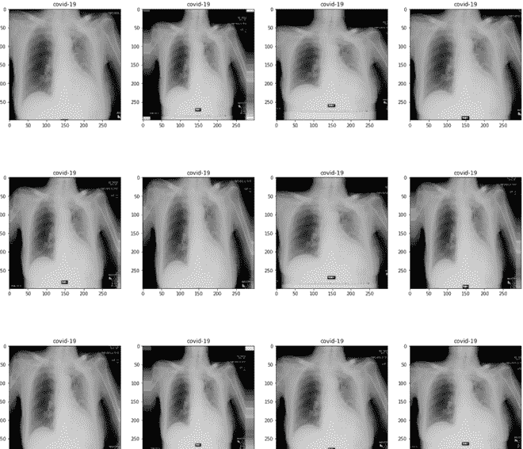
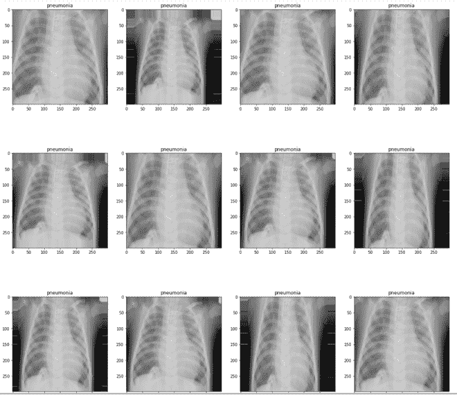

# 用胸部 x 光检测新冠肺炎

> 原文:[https://www . geeksforgeeks . org/检测-胸部 x 光新冠肺炎/](https://www.geeksforgeeks.org/detecting-covid-19-with-chest-x-ray/)

新冠肺炎·疫情是目前医疗系统面临的最大挑战之一。这是一种影响我们肺部的呼吸系统疾病，会对肺部造成持久的损害，导致呼吸困难等症状，在某些情况下还会导致肺炎和呼吸衰竭。在本文中，我们将使用肺正常和 COVID 阳性患者的 x 光数据，并训练一个模型来区分它们。

**使用的数据集和模型:**

本文中使用的数据集是 Kaggle 社区奖的获得者。该数据集由来自卡塔尔和孟加拉国的研究人员收集。该数据集包含 3 种类型的图像:

*   新冠肺炎正面(219 张图片)
*   病毒性肺炎(1341 张图片)
*   普通 x 光(1345 张图像)

这些图像有大小(1024，1024)和 3 个颜色通道。数据集的作者还训练了一个 ResNet -34 模型，获得了 98%的准确率，在 ResNet-34 模型上获得了 98.5%的准确率。

**实施:**

*   在本文中，我们将在 Keras API 的帮助下使用异常模型。该模型获得了 79%的 ImageNet top-1 精度和 95%的 top-5 精度。
*   首先，我们需要导入必要的模块。

## 蟒蛇 3

```py
import numpy as np

import matplotlib.pyplot as plt

import tensorflow as tf
from tensorflow.keras import Sequential
from keras.preprocessing.image import ImageDataGenerator
from tensorflow.keras.applications import InceptionResNetV2
from tensorflow.keras.preprocessing.image import ImageDataGenerator
from tensorflow.keras.applications.xception import Xception
from tensorflow.keras.layers import Dense,Flatten,  Input, Dropout
```

*   现在，我们将使用 Kaggle API 将数据集下载到系统中。首先，我们需要 API 密钥，要做到这一点，只需导航到 Kaggle 上的配置文件部分，下载一个包含我们的 API 详细信息的 JSON 文件，然后将它上传到 colab 或本地 jupyter 环境中。

## 蟒蛇 3

```py
# code
"""
Kaggle API setup
Credits: https://www.kaggle.com/general/74235
"""
# Install Kaggle module
!pip install kaggle

# Upload API details json file to colab
from google.colab import files
files.upload()
# create a Kaggle directory and move json files to there
! mkdir ~/.kaggle
! cp kaggle.json ~/.kaggle/
# change permissions of kaggle json file
! chmod 600 ~/.kaggle/kaggle.json
# Now we download our dataset with following command format :
"""
! kaggle datasets download -d user/dataset
 or
! kaggle competitions download -c 'name-of-competition' 
"""
! kaggle datasets download -d tawsifurrahman/covid19-radiography-database
```

*   现在，我们将数据集解压缩到所需的文件夹中。

## 蟒蛇 3

```py
! unzip covid19-radiography-database.zip -d /content/data
```

*   现在我们对数据集进行预处理，我们将图像大小从(1024，1024)减少到(299，299)[Xception 模型接受的最大大小]，并将其划分为 16 个批处理大小。

## 蟒蛇 3

```py
# Load Xception model
base = Xception(weights="imagenet", input_shape =(299,299,3),include_top= False)
# set base model trainable to false
for layers in base.layers:
    layers.trainable=False

base.summary()
```

```py
Downloading data from 
https://storage.googleapis.com/tensorflow/keras-applications/xception/
xception_weights_tf_dim_ordering_tf_kernels_notop.h5
83689472/83683744 [==============================] - 1s 0us/step
Model: "xception"
__________________________________________________________________________________________________
Layer (type)                    Output Shape         Param #     Connected to                     
==================================================================================================
input_1 (InputLayer)            [(None, 299, 299, 3) 0                                            
__________________________________________________________________________________________________
block1_conv1 (Conv2D)           (None, 149, 149, 32) 864         input_1[0][0]                    
__________________________________________________________________________________________________
block1_conv1_bn (BatchNormaliza (None, 149, 149, 32) 128         block1_conv1[0][0]               
__________________________________________________________________________________________________
block1_conv1_act (Activation)   (None, 149, 149, 32) 0           block1_conv1_bn[0][0]            
__________________________________________________________________________________________________
block1_conv2 (Conv2D)           (None, 147, 147, 64) 18432       block1_conv1_act[0][0]           
__________________________________________________________________________________________________
block1_conv2_bn (BatchNormaliza (None, 147, 147, 64) 256         block1_conv2[0][0]               
__________________________________________________________________________________________________
block1_conv2_act (Activation)   (None, 147, 147, 64) 0           block1_conv2_bn[0][0]            
__________________________________________________________________________________________________
block2_sepconv1 (SeparableConv2 (None, 147, 147, 128 8768        block1_conv2_act[0][0]           
__________________________________________________________________________________________________
block2_sepconv1_bn (BatchNormal (None, 147, 147, 128 512         block2_sepconv1[0][0]            
__________________________________________________________________________________________________
block2_sepconv2_act (Activation (None, 147, 147, 128 0           block2_sepconv1_bn[0][0]         
__________________________________________________________________________________________________
block2_sepconv2 (SeparableConv2 (None, 147, 147, 128 17536       block2_sepconv2_act[0][0]        
__________________________________________________________________________________________________
block2_sepconv2_bn (BatchNormal (None, 147, 147, 128 512         block2_sepconv2[0][0]            
__________________________________________________________________________________________________
conv2d (Conv2D)                 (None, 74, 74, 128)  8192        block1_conv2_act[0][0]           
__________________________________________________________________________________________________
block2_pool (MaxPooling2D)      (None, 74, 74, 128)  0           block2_sepconv2_bn[0][0]         
__________________________________________________________________________________________________
batch_normalization (BatchNorma (None, 74, 74, 128)  512         conv2d[0][0]                     
__________________________________________________________________________________________________
add (Add)                       (None, 74, 74, 128)  0           block2_pool[0][0]                
                                                                 batch_normalization[0][0]        
__________________________________________________________________________________________________
block3_sepconv1_act (Activation (None, 74, 74, 128)  0           add[0][0]                        
__________________________________________________________________________________________________
block3_sepconv1 (SeparableConv2 (None, 74, 74, 256)  33920       block3_sepconv1_act[0][0]        
__________________________________________________________________________________________________
block3_sepconv1_bn (BatchNormal (None, 74, 74, 256)  1024        block3_sepconv1[0][0]            
__________________________________________________________________________________________________
block3_sepconv2_act (Activation (None, 74, 74, 256)  0           block3_sepconv1_bn[0][0]         
__________________________________________________________________________________________________
block3_sepconv2 (SeparableConv2 (None, 74, 74, 256)  67840       block3_sepconv2_act[0][0]        
__________________________________________________________________________________________________
block3_sepconv2_bn (BatchNormal (None, 74, 74, 256)  1024        block3_sepconv2[0][0]            
__________________________________________________________________________________________________
conv2d_1 (Conv2D)               (None, 37, 37, 256)  32768       add[0][0]                        
__________________________________________________________________________________________________
block3_pool (MaxPooling2D)      (None, 37, 37, 256)  0           block3_sepconv2_bn[0][0]         
__________________________________________________________________________________________________
batch_normalization_1 (BatchNor (None, 37, 37, 256)  1024        conv2d_1[0][0]                   
__________________________________________________________________________________________________
.............

(Trimmed model Summary)

==================================================================================================
Total params: 20,861,480
Trainable params: 0
Non-trainable params: 20,861,480
________________________________________________________________________
```

*   现在，我们在数据集上应用一些数据增强，并为训练做准备。之后，我们绘制一些训练图像。我们将以这样的方式分割数据集，即 75%的数据用于训练，25%用于测试/验证。

## 蟒蛇 3

```py
# Define augmentation
train_datagen = ImageDataGenerator(
        rescale=1./255,
        shear_range=0.2,
        zoom_range=0.2,
        validation_split=0.25,
        horizontal_flip =True
        )

# apply augmentations on dataset
train =train_datagen.flow_from_directory(
    "data/",
    target_size=(299, 299),
    batch_size=batch_size,
    class_mode='categorical',
    subset='training')
val =train_datagen.flow_from_directory(
    "data/",
    target_size=(299, 299),
    batch_size=batch_size,
    class_mode='categorical',
    subset='validation')
class_names=['covid-19','normal','pneumonia']

# code to plot images
def plotImages(images_arr, labels):
    fig, axes = plt.subplots(12, 4, figsize=(20,80))
    axes = axes.flatten()
    label=0
    for img, ax in zip( images_arr, axes):
        ax.imshow(img)
        ax.set_title(class_names[np.argmax(labels[label])])
        label=label+1
    plt.show()

# append a batch of images from each category (COVID-19, Normal, Viral_Pneumonia)
images = [train[34][0][0] for i in range(16)]
images = images + [train[5][0][0] for i in range(16)]
images = images + [train[0][0][0] for i in range(16)]

# append the batch of labels
labels=[]
labels = [train[34][1][0] for i in range(16)]
labels=  labels + [train[5][1][0] for i in range(16)]
labels=  labels + [train[0][1][0] for i in range(16)]

# plot images with labels
plotImages(images,labels)
```


正常肺 x 光片



新冠肺炎(+)肺部 x 光片



病毒性肺炎肺部 x 光片

*   现在，我们定义我们的模型，首先，我们将在我们的顺序模型中导入我们的基础模型，即异常(我们使用 imagenet 训练的权重)，展平权重，并应用密集层(完全连接的层)和 softmax 分类层。为了防止模型过度拟合，我们还添加了一些脱落层

## 蟒蛇 3

```py
# Define our complete models
model = Sequential()
model.add(Input(shape =(299,299,3)))
model.add(base)
model.add(Dropout(0.2))
model.add(Flatten())
model.add(Dropout(0.2))
model.add(Dense(16))
model.add(Dense(3,activation='softmax'))
model.summary()
```

```py
Model: "sequential"
_________________________________________________________________
Layer (type)                 Output Shape              Param #   
=================================================================
xception (Functional)        (None, 10, 10, 2048)      20861480  
_________________________________________________________________
dropout (Dropout)            (None, 10, 10, 2048)      0         
_________________________________________________________________
flatten (Flatten)            (None, 204800)            0         
_________________________________________________________________
dropout_1 (Dropout)          (None, 204800)            0         
_________________________________________________________________
dense (Dense)                (None, 16)                3276816   
_________________________________________________________________
dense_1 (Dense)              (None, 3)                 51        
=================================================================
Total params: 24,138,347
Trainable params: 3,276,867
Non-trainable params: 20,861,480
_________________________________________________________________
```

*   现在我们将编译和训练模型，我们使用学习率为 0.001 的 Adam Optimizer。我们将为 30 个时代训练这个模型。

## 蟒蛇 3

```py
# import adam optimizer
from tensorflow.keras.optimizers import Adam
# compile model(define metrics and loss)
model.compile(
    optimizer=Adam(learning_rate=1e-3),
    loss="categorical_crossentropy",
    metrics=["accuracy"],
)
# train model for 30 epoch
model.fit_generator(train,epochs=30,validation_data=val)

# save model
model.save('epoch_30.h5')
```

```py
Epoch 1/30
137/137 [==============================] - 121s 886ms/step - 
loss: 5.7757 - accuracy: 0.8528 - val_loss: 3.4022 - val_accuracy: 0.8966
Epoch 2/30
137/137 [==============================] - 119s 867ms/step - 
loss: 3.3137 - accuracy: 0.9028 - val_loss: 2.0748 - val_accuracy: 0.9228
Epoch 3/30
137/137 [==============================] - 119s 866ms/step - 
loss: 2.2811 - accuracy: 0.9161 - val_loss: 2.2661 - val_accuracy: 0.9186
Epoch 4/30
137/137 [==============================] - 119s 867ms/step - 
loss: 1.6122 - accuracy: 0.9339 - val_loss: 3.8654 - val_accuracy: 0.8648
Epoch 5/30
137/137 [==============================] - 120s 877ms/step - 
loss: 1.0704 - accuracy: 0.9440 - val_loss: 1.6559 - val_accuracy: 0.9214
Epoch 6/30
137/137 [==============================] - 120s 875ms/step - 
loss: 0.7675 - accuracy: 0.9509 - val_loss: 1.3920 - val_accuracy: 0.9255
Epoch 7/30
137/137 [==============================] - 120s 872ms/step - 
loss: 0.5744 - accuracy: 0.9509 - val_loss: 1.2669 - val_accuracy: 0.9021
Epoch 8/30
137/137 [==============================] - 119s 872ms/step - 
loss: 0.4065 - accuracy: 0.9528 - val_loss: 1.1800 - val_accuracy: 0.9145
Epoch 9/30
137/137 [==============================] - 118s 864ms/step - 
loss: 0.2160 - accuracy: 0.9638 - val_loss: 0.7624 - val_accuracy: 0.9379
Epoch 10/30
137/137 [==============================] - 119s 865ms/step - 
loss: 0.2552 - accuracy: 0.9606 - val_loss: 0.4897 - val_accuracy: 0.9421
Epoch 11/30
137/137 [==============================] - 118s 864ms/step - 
loss: 0.2015 - accuracy: 0.9651 - val_loss: 0.4510 - val_accuracy: 0.9476
Epoch 12/30
137/137 [==============================] - 121s 880ms/step - 
loss: 0.1473 - accuracy: 0.9725 - val_loss: 0.3458 - val_accuracy: 0.9352
Epoch 13/30
137/137 [==============================] - 121s 880ms/step - 
loss: 0.1534 - accuracy: 0.9656 - val_loss: 0.5945 - val_accuracy: 0.9297
Epoch 14/30
137/137 [==============================] - 120s 876ms/step - 
loss: 0.1315 - accuracy: 0.9734 - val_loss: 0.4655 - val_accuracy: 0.9407
Epoch 15/30
137/137 [==============================] - 121s 882ms/step - 
loss: 0.1127 - accuracy: 0.9661 - val_loss: 0.3728 - val_accuracy: 0.9186
Epoch 16/30
137/137 [==============================] - 121s 882ms/step - 
loss: 0.1198 - accuracy: 0.9716 - val_loss: 0.4312 - val_accuracy: 0.9476
Epoch 17/30
137/137 [==============================] - 120s 875ms/step - 
loss: 0.1046 - accuracy: 0.9771 - val_loss: 0.4035 - val_accuracy: 0.9393
Epoch 18/30
137/137 [==============================] - 119s 870ms/step - 
loss: 0.0872 - accuracy: 0.9761 - val_loss: 0.8248 - val_accuracy: 0.9145
Epoch 19/30
137/137 [==============================] - 120s 874ms/step - 
loss: 0.1116 - accuracy: 0.9752 - val_loss: 0.3309 - val_accuracy: 0.9393
Epoch 20/30
137/137 [==============================] - 120s 877ms/step - 
loss: 0.1261 - accuracy: 0.9729 - val_loss: 0.5384 - val_accuracy: 0.8924
Epoch 21/30
137/137 [==============================] - 119s 869ms/step - 
loss: 0.0840 - accuracy: 0.9748 - val_loss: 0.5690 - val_accuracy: 0.9366
Epoch 22/30
137/137 [==============================] - 119s 868ms/step - 
loss: 0.0942 - accuracy: 0.9761 - val_loss: 0.3517 - val_accuracy: 0.9448
Epoch 23/30
137/137 [==============================] - 120s 876ms/step - 
loss: 0.1207 - accuracy: 0.9656 - val_loss: 0.2871 - val_accuracy: 0.9434
Epoch 24/30
137/137 [==============================] - 118s 864ms/step - 
loss: 0.0959 - accuracy: 0.9729 - val_loss: 0.4589 - val_accuracy: 0.9366
Epoch 25/30
137/137 [==============================] - 119s 867ms/step - 
loss: 0.0945 - accuracy: 0.9748 - val_loss: 0.3964 - val_accuracy: 0.9490
Epoch 26/30
137/137 [==============================] - 119s 871ms/step - 
loss: 0.1039 - accuracy: 0.9761 - val_loss: 0.3048 - val_accuracy: 0.9393
Epoch 27/30
137/137 [==============================] - 119s 866ms/step - 
loss: 0.0905 - accuracy: 0.9739 - val_loss: 0.3308 - val_accuracy: 0.9407
Epoch 28/30
137/137 [==============================] - 120s 873ms/step - 
loss: 0.0757 - accuracy: 0.9766 - val_loss: 0.1871 - val_accuracy: 0.9517
Epoch 29/30
137/137 [==============================] - 119s 871ms/step - 
loss: 0.1012 - accuracy: 0.9688 - val_loss: 0.7361 - val_accuracy: 0.9297
Epoch 30/30
137/137 [==============================] - 120s 874ms/step - 
loss: 0.0713 - accuracy: 0.9780 - val_loss: 0.3497 - val_accuracy: 0.9434

```

**结果与结论:**

我们在训练上获得了 97.8%的准确率，在例外模型上仅 30 个时期的训练下获得了 94.3%的准确率，接近论文作者报道的 98.3%的准确率。

**参考文献:**

*   [纸张链接](https://arxiv.org/abs/2003.13145)
*   [卡格尔数据集链接](https://www.kaggle.com/tawsifurrahman/covid19-radiography-database)