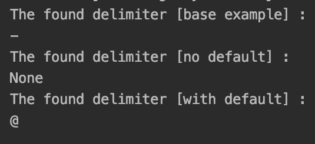
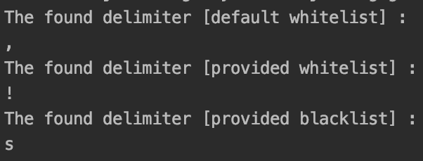

# 使用 Python 中的 detect_delimiter 检测文本中的分隔符

> 原文:[https://www . geesforgeks . org/detecting-delimiter-in-text-use-detect _ delimiter-in-python/](https://www.geeksforgeeks.org/detecting-delimiter-in-text-using-detect_delimiter-in-python/)

有时，在处理大量文本时，我们会遇到一个问题，即我们试图找到哪个字符充当分隔符。在处理大量数据和判断分隔符时，这可能是一个有趣且有用的工具。本文讨论了使用 Python 库的 detect_delimiter 来解决这个问题的方法。

## 装置

要安装此模块，请在终端中键入以下命令。

> pip 安装检测分隔符

第一步是检查输入文本中是否存在所有白名单字符，如果找到，则这些字符将被计算为大多数频率，最多返回一个，忽略黑名单列表中的所有字符(如果提供)。如果白名单中没有分隔符，则计算避开黑名单字符的字符的最大频率，如果找到，则该字符作为分隔符返回。如果仍然找不到分隔符，则返回默认值作为分隔符(如果提供的话)，否则返回无。

> **语法:**检测(文本:字符串，文本:字符串，默认值=无，白名单=['，'，'；'，':'，' | '，' \t']，黑名单=无)
> **文本:**要测试分隔符的输入字符串。
> **默认值:**未找到有效分隔符时输出的默认值。
> **白名单:**要检查分隔符的第一组字符，如果找到这些字符，它们将被视为分隔符。在知道哪些分隔符是可能的情况下很有用。默认为['，'，'；'，':'，' | '，' \t']。
> **黑名单:**默认情况下，所有数字、字母和句号都不被视为黑名单，如果需要更多的值来避免被标记为分隔符，这些将在检查中避免。

**示例 1:使用检测()和默认**

在本文中，除了使用默认值之外，还展示了一些检测分隔符的示例。

## 蟒蛇 3

```py
from detect_delimiter import detect

# simple example
print("The found delimiter [base example] : ")
print(detect("Geeksforgeeks-is-best-for-geeks"))

# simple example without default and no delimiter
# . is not considered as delim
print("The found delimiter [no default] : ")
print(detect("Geeksforgeeks.is.best.for.geeks"))

# simple example with default
# . is not considered as delim
# No delim is found, hence, default is printed
print("The found delimiter [with default] : ")
print(detect("Geeksforgeeks.is.best.for.geeks", default='@'))
```

**输出:**



使用检测()和默认值

**例 2:使用黑名单和白名单参数**

提供白名单参数会优先考虑任何特定的分隔符，即使它的频率低于非白名单的 delim。黑名单参数有助于忽略任何分隔符。

## 蟒蛇 3

```py
from detect_delimiter import detect
from string import ascii_letters

# simple example
# check for , as whitelist picked from default
# - [',', ';', ':', '|', '\t']
print("The found delimiter [default whitelist] : ")
print(detect("Geeksforgeeks$is-best,for-geeks"))

# simple example with whitelist
# ! priotitized
print("The found delimiter [provided whitelist] : ")
print(detect("Geeksforgeeks-is-best-for!geeks",
             whitelist=['@', "!"]))

# simple example with blacklist
# default blacklist overridden
print("The found delimiter [provided blacklist] : ")
print(detect("Geeksforgeeks-is-best-for!geeks",
             blacklist=['@', "-", 'e']))
```

**输出:**



黑名单和白名单参数示例。