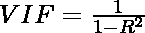

# 用 VIF-Python 检测多重共线性

> 原文:[https://www . geesforgeks . org/detecting-多重共线性-with-vif-python/](https://www.geeksforgeeks.org/detecting-multicollinearity-with-vif-python/)

当多元回归模型中有两个或两个以上的自变量，且它们之间具有高度相关性时，就会出现多重共线性。当某些特征高度相关时，我们可能难以区分它们对因变量的个体影响。多重共线性可以使用各种技术来检测，其中一种技术是**方差膨胀因子** ( **VIF** )。

在 VIF 方法中，我们选择每个特征，并将其与所有其他特征进行回归。对于每次回归，因子的计算公式如下:



其中， [R 平方](https://www.geeksforgeeks.org/ml-r-squared-in-regression-analysis/)是线性回归中的决定系数。它的值介于 0 和 1 之间。

正如我们从公式中看到的，R 平方的值越大，VIF 就越大。因此，更大的 VIF 意味着更大的相关性。这与更高的 R 平方值表示更强的共线性的事实是一致的。通常，VIF 值高于 5 表示多重共线性高。

**使用 statsmodels 实现 VIF:**

*statsmodels* 提供了一个名为**方差 _ 通货膨胀系数()**的函数来计算 VIF。

> **语法:** statsmodels.stats .离群值 _ 影响力.方差 _ 通货膨胀 _ 因子(exog，exog_idx)
> 
> **参数:**
> 
> *   exog:包含执行线性回归的特征的数组。
> *   exog_idx:要测量其对其他特征的影响的附加特征的索引。

让我们看一个在[这个](https://drive.google.com/file/d/1I-jM0C_PXxblbOyX6K-65b8YChHN_SRz/view?usp=sharing)数据集上实现方法的例子。

**数据集:**

以下示例中使用的数据集包含 500 人的身高、体重、性别和体重指数。这里因变量是*指数*。

## 蟒蛇 3

```
import pandas as pd 

# the dataset
data = pd.read_csv('BMI.csv')

# printing first few rows
print(data.head())
```

**输出:**

```
   Gender  Height  Weight  Index
0    Male     174      96      4
1    Male     189      87      2
2  Female     185     110      4
3  Female     195     104      3
4    Male     149      61      3
```

**进场:**

*   每个特征指数被传递到*方差 _ 膨胀因子()*以找到相应的 VIF。
*   这些值以*熊猫*数据帧的形式存储。

## 蟒蛇 3

```
from statsmodels.stats.outliers_influence import variance_inflation_factor

# creating dummies for gender
data['Gender'] = data['Gender'].map({'Male':0, 'Female':1})

# the independent variables set
X = data[['Gender', 'Height', 'Weight']]

# VIF dataframe
vif_data = pd.DataFrame()
vif_data["feature"] = X.columns

# calculating VIF for each feature
vif_data["VIF"] = [variance_inflation_factor(X.values, i)
                          for i in range(len(X.columns))]

print(vif_data)
```

**输出:**

```
  feature        VIF
0  Gender   2.028864
1  Height  11.623103
2  Weight  10.688377
```

我们可以看到，身高和体重都有很高的 VIF 值，说明这两个变量高度相关。这是意料之中的，因为一个人的身高确实会影响他们的体重。因此，将这两个特征放在一起考虑会得到一个具有高度多重共线性的模型。