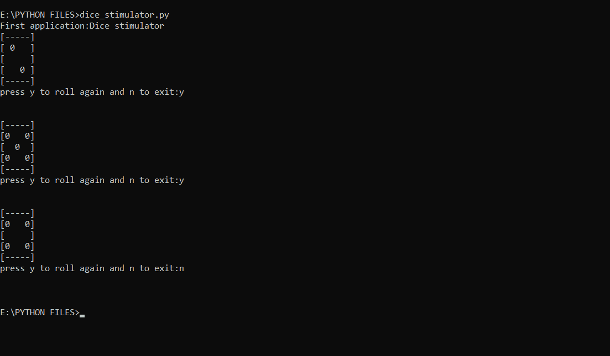

# 使用 Python 的骰子滚动模拟器-随机

> 原文:[https://www . geesforgeks . org/骰子-滚动-模拟器-使用-python-random/](https://www.geeksforgeeks.org/dice-rolling-simulator-using-python-random/)

在本文中，我们将借助 Python 的基本知识创建一个经典的滚动骰子模拟器。这里，我们将使用随机模块，因为我们为随机输出随机化骰子模拟器。

**使用的功能:**

**1)[random . randint()](https://www.geeksforgeeks.org/python-randint-function/):**此函数生成给定范围内的随机数。

下面是实现。

```py
import random

x = "y"

while x == "y":

    # Gnenerates a random number
    # between 1 and 6 (including
    # both 1 and 6)
    no = random.randint(1,6)

    if no == 1:
        print("[-----]")
        print("[     ]")
        print("[  0  ]")
        print("[     ]")
        print("[-----]")
    if no == 2:
        print("[-----]")
        print("[ 0   ]")
        print("[     ]")
        print("[   0 ]")
        print("[-----]")
    if no == 3:
        print("[-----]")
        print("[     ]")
        print("[0 0 0]")
        print("[     ]")
        print("[-----]")
    if no == 4:
        print("[-----]")
        print("[0   0]")
        print("[     ]")
        print("[0   0]")
        print("[-----]")
    if no == 5:
        print("[-----]")
        print("[0   0]")
        print("[  0  ]")
        print("[0   0]")
        print("[-----]")
    if no == 6:
        print("[-----]")
        print("[0 0 0]")
        print("[     ]")
        print("[0 0 0]")
        print("[-----]")

    x=input("press y to roll again and n to exit:")
    print("\n")
```

**输出:**
