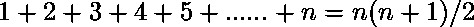

# Python 中“+”和“追加”的区别

> 原文:[https://www . geesforgeks . org/python 中的区别和追加/](https://www.geeksforgeeks.org/difference-between-and-append-in-python/)

**在 Python 中使用“+”运算符在列表中添加元素:**使用“+”运算符会导致 Python 访问第一个列表的每个元素。当使用“+”时，会创建一个新列表，并为一个元素留出空间。那么旧列表中的所有元素必须被复制到新列表中，并且新元素被添加到该列表的末尾。

**示例:**

```
sample_list =[]
n = 10

for i in range(n):

    # i refers to new element
    sample_list = sample_list+[i]

print(sample_list)
```

**输出:**

```
[0, 1, 2, 3, 4, 5, 6, 7, 8, 9]
```

*   “+”运算符引用[取值方法](https://www.geeksforgeeks.org/accessor-and-mutator-methods-in-python/)，不修改原始列表。
*   在这种情况下，sample_list 本身不会改变。sample_list 中元素的这种添加类型会从两个列表中的元素创建一个新列表。
*   将 sample_list 分配给这个新列表会更新 PythonList 对象，因此它现在引用新列表。

#### 添加 n 个元素的复杂性

你有没有想过，随着 Python 列表的增长，它是如何工作的？让我们看看解释。

对于每一次迭代，必须从原始列表中复制 I 个元素来形成一个新列表。考虑到从列表中访问一个元素所花费的时间是恒定的。因此，将 n 个元素添加到 Python List(即 sample_list)的复杂性或时间量，我们必须将所有的列表访问加起来，再乘以访问一个列表元素的时间加上存储一个列表元素的时间。为了计算访问和存储操作的总数，我们必须从第一次添加元素时复制列表的访问和存储操作的数量开始。这是复制的一个元素。第二次追加需要两次复制操作。第三次追加需要三次复制操作。因此，我们复制了以下数量的列表元素。

因此，时间复杂度=O( )

**使用[。追加()方法](https://www.geeksforgeeks.org/append-extend-python/)即一种有效的方法:**的。列表上的 append()方法更改代码，使用[变异器方法](https://www.geeksforgeeks.org/accessor-and-mutator-methods-in-python/)通过仅追加一个元素来更改列表。

**示例:**

```
sample_list =[]
n = 10

for i in range(n):
    # i refers to new element
    sample_list.append(i) 

print(sample_list)
```

**输出:**

```
[0, 1, 2, 3, 4, 5, 6, 7, 8, 9]

```

事实证明，在 Python 中，向已经存在的列表中再添加一个元素是非常有效的。事实上，向列表中添加新项目是一个 O(1)操作。

所以附加 n 个元素的总体复杂性是

```
1+.....(n-2) times...+1=O(n)
```

**注:**会计方法求追加的[摊余复杂度](https://www.geeksforgeeks.org/analysis-algorithm-set-5-amortized-analysis-introduction/)给出`.append()`法有 O(1)复杂度增加新元素的证明。

### “+”和“追加”之间的图形比较

