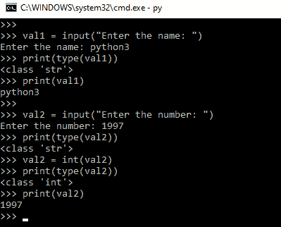
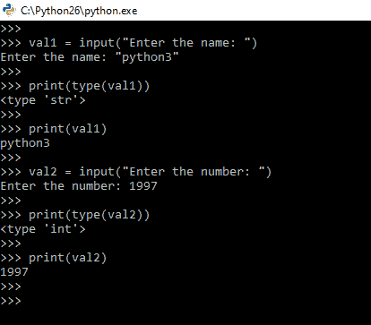
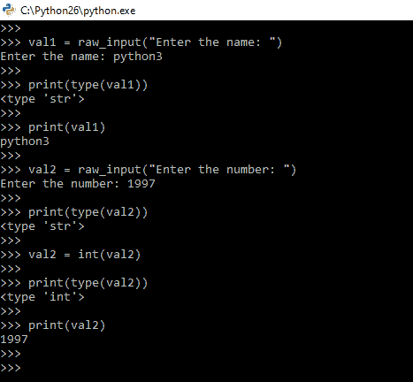

# Python 中 input()和 raw_input()函数的区别

> 原文:[https://www . geesforgeks . org/input-and-raw _ input-functions-in-python/](https://www.geeksforgeeks.org/difference-between-input-and-raw_input-functions-in-python/)

开发人员经常需要与用户进行交互，要么获取数据，要么提供某种结果。如今，大多数程序使用对话框来要求用户提供某种类型的输入。而 Python 为我们提供了两个从键盘读取输入的内置功能。

*   [输入(提示)](#input)
*   [raw_input(提示)](#raw)

## 输入()函数

Python `input()` 函数用于从用户那里获取值。调用该函数是为了告诉程序停止并等待用户输入值。这是一个内置函数。`input()` 函数在 Python 2.x 和 Python 3.x 版本中都有使用，在 Python 3.x 中，输入函数显式地将您给出的输入转换为类型字符串。但是 Python 2.x 输入函数接受您输入的值和类型，而不修改类型。

**python 3 中的示例程序**

```py
# Python program to demonstrate
# input() function in Python3.x

val1 = input("Enter the name: ")

# print the type of input value
print(type(val1))
print(val1)

val2 = input("Enter the number: ")
print(type(val2))

val2 = int(val2)
print(type(val2))
print(val2)
```

**输入输出**


这里，值“python3”从用户那里获取，并将其存储在 **val1** 变量中。存储的值的类型始终是字符串，仅用于 Python 3.x 的输入函数。值“1997”从用户处获取，并将其存储在变量 **val2** 中。现在，变量 val2 的类型是字符串，我们必须使用`int()`函数将类型转换为整数。val2 变量将值“1997”存储为整数类型。

**python 2 中的示例程序**

```py
# Python program to demonstrate
# input() function in Python2.x

val1 = input("Enter the name: ")
print(type(val1))
print(val1)

val2 = input("Enter the number: ")
print(type(val2))
print(val2)
```

**输入输出**


这里，值“python3”从用户那里获取，并将其存储在 **val1** 变量中。该函数接受输入的值和类型，而不修改类型。val1 中的值类型是字符串类型。值“1997”取自用户，并将其存储在变量 **val2** 中。现在，变量 val2 的类型是整数类型。我们不需要显式更改变量类型。

## 原始输入()函数

Python raw_input 函数用于从用户处获取值。我们调用这个函数来告诉程序停止并等待用户输入值。这是一个内置函数。输入功能为**仅在 Python 2.x** 版本中使用。Python 2.x 有两个函数可以从用户那里获取值。第一个是输入功能，另一个是`raw_input()` 功能。`raw_input()` 函数类似于 Python 3.x 中的`input()` 函数，建议开发者在 Python 2.x 中使用 raw_input 函数，因为 Python 2.x 版本中输入函数存在[漏洞。](https://www.geeksforgeeks.org/vulnerability-input-function-python-2-x/)

**python 2 中的示例程序**

```py
# Python program to demonstrate
# input() function in Python2.x

val1 = raw_input("Enter the name: ")
print(type(val1))
print(val1)

val2 = raw_input("Enter the number: ")
print(type(val2))
val2 = int(val2)
print(type(val2))
print(val2)
```

**输入输出**


这里，值“python3”从用户那里获取，并将其存储在 **val1** 变量中。对于 raw_input 函数，存储的值的类型始终是字符串。值“1997”取自用户，并将其存储在变量 val2 中。现在，变量 **val2** 的类型是一个字符串，我们必须使用 `int()`函数将类型转换为整数。val2 变量将值“1997”存储为整数类型。