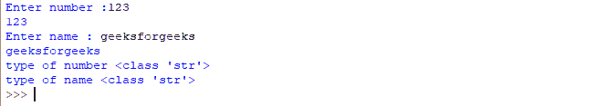
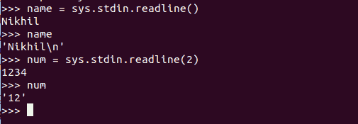

# 输入()和 sys.stdin.readline()之间的差异

> 原文:[https://www . geesforgeks . org/input-and-sys-stdin-readline 之差/](https://www.geeksforgeeks.org/difference-between-input-and-sys-stdin-readline/)

Python 是一种广泛使用的通用语言，可以用于许多目的。对人类来说，接受任何语言的输入都和呼吸一样重要。Python 提供了各种获取输入的方法。然而，我们都可能对每种方法的不同之处感到困惑。在本文中，我们将讨论两种这样的方法，即`input()`和`sys.stdin.readline()`。

**注意:**更多信息请参考 [Python 教程](https://www.geeksforgeeks.org/python-tutorial/)

## 输入()

这个函数首先接受用户的输入，然后计算表达式，这意味着 Python 会自动识别用户输入的是字符串还是数字或列表。如果提供的输入不正确，则 Python 会引发语法错误或异常。

**Python 中输入函数的工作原理:**

*   当`input()`功能执行时，程序流程将停止，直到用户给出输入。
*   输出屏幕上要求用户输入输入值的文本或消息显示是可选的，即屏幕上打印的提示是可选的。
*   无论您输入什么作为输入，输入函数都会将其转换为字符串。如果输入一个整数值，input()函数会将其转换为字符串。您需要在代码中使用类型转换将其显式转换为整数。

**示例:**

```py
# Program to check input  
# type in Python 

num = input ("Enter number :") 
print(num) 
name1 = input("Enter name : ") 
print(name1) 

# Printing type of input value 
print ("type of number", type(num)) 
print ("type of name", type(name1))
```

**输出:**



## sys . STD . readline()方法

Stdin 代表标准输入，即程序从中读取输入数据的流。此方法与 input()方法略有不同，因为它还读取用户输入的转义字符。此外，该方法还提供了大小参数，即一次可以读取多少个字符。

**示例:**

```py
# Python program to demonstrate
# sys.stdin.readline()

import sys

name = sys.stdin.readline()
print(name)

num = sys.stdin.readline(2)
print(num)
```

**输出:**



#### Input 和 sys.stdin.readline()函数的区别。

| 输入() | sys . STD . readline()方法 |
| 输入接受用户的输入，但不读取转义字符。 | readline()也接受用户的输入，但也读取转义字符。 |
| 它有一个提示，表示用户输入前的默认值。 | Readline 有一个名为 size 的参数，它是非负数，它实际上定义了要读取的字节。 |