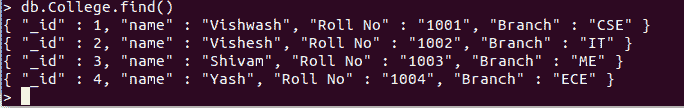
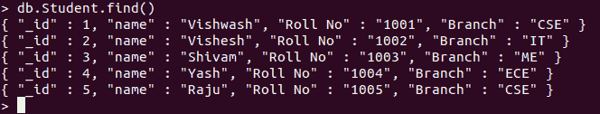
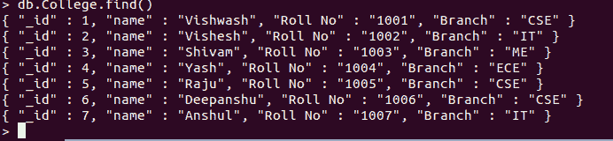

# Pymongo 中 insert()、insertOne()和 insert multi()的区别

> 原文:[https://www . geeksforgeeks . org/insert-insert one-and-insert multi-in-pymongo/](https://www.geeksforgeeks.org/difference-between-insert-insertone-and-insertmany-in-pymongo/)

**[MongoDB](https://www.geeksforgeeks.org/mongodb-and-python/)** 是一个 NoSql 数据库，可以用来存储不同应用需要的数据。Python 可以用来访问 MongoDB 数据库。Python 需要一个驱动程序来访问数据库。PyMongo 支持从 Python 应用程序与 MongoDB 数据库交互。pymongo 包充当 MongoDB 的本机 Python 驱动程序。Pymongo 提供了可在 Python 应用程序中使用的命令，以在 MongoDB 上执行所需的操作。MongoDB 提供了三种将记录或文档插入数据库的方法，如下所示:

1.  **insert() :** Used to insert a document or documents into a collection. If the collection does not exist, then insert() will create the collection and then insert the specified documents.

    > **语法**
    > db . collection . insert(<文档或文档数组>，
    > {
    > write contact:<文档>，
    > ordered: <布尔型>
    > }
    > )
    > 
    > **参数**
    > 
    > *   **<文档> :** 要存储在数据库中的文档或记录
    > *   **写关注:**可选。
    > *   **ordered:** Optional. Can be set to true or false.
    >     
    >     **返回值:**分别用于单次或批量插入的 WriteResult 对象或 BulkWriteResult 对象。

    **示例:**

    ```py
    # importing Mongoclient from pymongo 
    from pymongo import MongoClient  

    myclient = MongoClient("mongodb://localhost:27017/") 

    # database  
    db = myclient["GFG"] 

    # Created or Switched to collection  
    # names: College 
    collection = db["College"] 

    mylist = [ 
      { "_id": 1, "name": "Vishwash", "Roll No": "1001", "Branch":"CSE"}, 
      { "_id": 2, "name": "Vishesh", "Roll No": "1002", "Branch":"IT"}, 
      { "_id": 3, "name": "Shivam", "Roll No": "1003", "Branch":"ME"}, 
      { "_id": 4, "name": "Yash", "Roll No": "1004", "Branch":"ECE"}, 
    ] 

    # Inseting the entire list in the collection 
    collection.insert(mylist) 
    ```

    **输出:**

    

2.  **insertOne() :** Used to insert a single document or record into the database. If the collection does not exist, then insertOne() method creates the collection first and then inserts the specified document.

    > **语法**
    > db . collection . insertone(<文档>、
    > {
    > write concert:<文档>
    > }
    > )
    > 
    > **参数**
    > 
    > *   **<文档>** 要存储在数据库中的文档或记录
    > *   **写关注:**可选。
    > 
    > **返回值:**返回插入数据库的文档的 _id。

    **注意:【insertOne()的 Pymongo 命令是 insert_one()
    **示例:****

    ```py
    # importing Mongoclient from pymongo
    from pymongo import MongoClient 

    # Making Connection
    myclient = MongoClient("mongodb://localhost:27017/") 

    # database 
    db = myclient["GFG"]

    # Created or Switched to collection 
    # names: GeeksForGeeks
    collection = db["Student"]

    # Creating Dictionary of records to be 
    # inserted
    record = { "_id": 5,
              "name": "Raju",
              "Roll No": "1005",
              "Branch": "CSE"}

    # Inserting the record1 in the collection 
    # by using collection.insert_one()
    rec_id1 = collection.insert_one(record)
    ```

    **输出:**

    

3.  **insertMany()**

    > **语法**
    > db . collection . insertmany([<文档 1 >，<文档 2 >，… ]，
    > {
    > write concert:<文档>，
    > ordered: <布尔>
    > }
    > )
    > 
    > **参数**
    > 
    > *   **<文档>** 要存储在数据库中的文档或记录
    > *   **写关注:**可选。
    > *   **有序:**可选。可以设置为真或假。
    > 
    > **返回值:**返回插入数据库的文档的 _ ids。

    **注意:**insertmulti()的 Pymongo 命令是 insert _ multi()
    **示例:**

    ```py
    # importing Mongoclient from pymongo 
    from pymongo import MongoClient  

    myclient = MongoClient("mongodb://localhost:27017/") 

    # database  
    db = myclient["GFG"] 

    # Created or Switched to collection  
    # names: GeeksForGeeks 
    collection = db["College"] 

    mylist = [ 
      { "_id": 6, "name": "Deepanshu", "Roll No": "1006", "Branch":"CSE"}, 
      { "_id": 7, "name": "Anshul", "Roll No": "1007", "Branch":"IT"}
    ] 

    # Inseting the entire list in the collection 
    collection.insert_many(mylist) 
    ```

    **输出:**

    

| 插入() | 插入一个() | 插入许多() |
| Pymongo 等效命令是 insert() | Pymongo 等效命令是 insert_one() | Pymongo 的等效命令是 insert _ multi() |
| 在 mongo 引擎的较新版本中已弃用 | 用于较新版本的 mongo 引擎 | 用于较新版本的 mongo 引擎 |
| 分别为写关注错误和非写关注错误引发 WriteResult.writeConcernError 和 WriteResult.writeError | 引发 writeError 或 writeConcernError 异常。 | 引发 BulkWriteError 异常。 |
| 与 db.collection.explain()兼容 | 与 db.collection.explain()不兼容 | 与 db.collection.explain()不兼容 |
| 如果 ordered 设置为 true，并且任何文档都报告错误，则不会插入其余文档。如果 ordered 设置为 false，则即使出现错误，也会插入剩余的文档。 | 如果报告了文档的错误，则不会将其插入数据库 | 如果 ordered 设置为 true，并且任何文档都报告错误，则不会插入其余文档。如果 ordered 设置为 false，则即使出现错误，也会插入剩余的文档。 |
| 返回包含操作状态的对象。 | 返回插入文档的 insert_id | 返回插入文档的 insert _ ids |