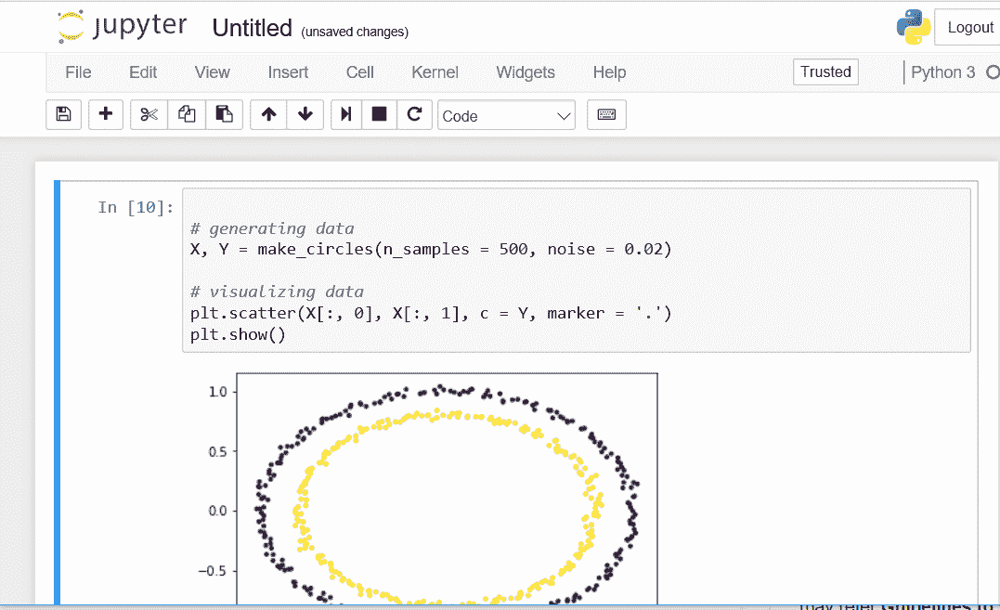
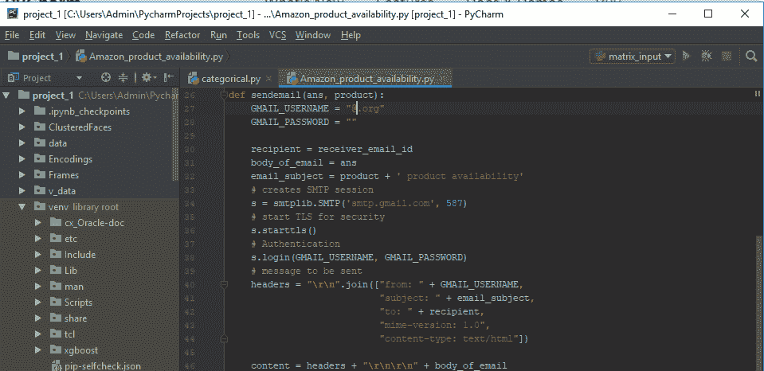

# 【Jupyter 和 Pycharm 的区别

> 原文:[https://www . geeksforgeeks . org/jupyter 和-pycharm 的区别/](https://www.geeksforgeeks.org/difference-between-jupyter-and-pycharm/)

[**Jupyter 笔记本**](https://jupyter.org/) 是一个开源 IDE，用来创建 Jupyter 文档，可以用实时代码创建和共享。此外，它是一个基于网络的交互式计算环境。Jupyter 笔记本可以支持数据科学中流行的各种语言，如 Python、Julia、Scala、R 等。

[**【py charm】**](https://www.jetbrains.com/pycharm/)是由 JetBrains 开发的一款 IDE，专门为 Python 打造。它具有代码分析、集成单元测试器、集成 Python 调试器、支持 web 框架等多种功能。Pycharm 在机器学习中特别有用，因为它支持 Pandas、Matplotlib、Scikit-Learn、NumPy 等库。

**下面是 Jupyter 和 Pycharm** 的差异表

<figure class="table">

| 没有。 | 朱皮特 | Pycharm |
| --- | --- | --- |
| one | Jupyter 笔记本是一个基于网络的交互式计算平台。 | Pycharm 是一个聪明的代码编辑器。 |
| Two | 笔记本结合了实时代码、方程式、叙事文本、可视化、交互式仪表盘和其他媒体。 | 编辑器为 Python、JavaScript、CoffeeScript、TypeScript、CSS、流行模板语言等提供一流的支持。利用语言感知的代码完成、错误检测和动态代码修复！ |
| three | 它可以归类为“数据科学笔记本”中的一个工具 | PyCharm 归入“集成开发环境(IDE)”下。 |
| four | 使用块提供内嵌代码执行。 | 提供智能自动完成。 |
| five | 提供在线绘图支持。 | 提供智能代码分析。 |
| six | 它可以是主题的，支持内核和乳胶。 | 它是强大的重构、virtualenv 集成和 Git 集成 |
| seven | 与 pycharm 相比，它非常灵活。 | 与 jupyter 和慢启动相比，它不是很灵活。 |
| eight | 像 GitHub、Python、Dropbox、Scala、TensorFlow 等工具。与 jupyter 融为一体。 | Python、Django、Anaconda、Wakatime、Kite 等工具。与 Pycharm 融为一体。 |
| nine | 像 Ruangguru、Delivery Hero SE、trivago、Intuit、Hepsiburada 等公司。正在使用 Jupyter | 像 Lyft、Bepro 公司、trivago、Hepsiburada、野餐技术等公司都在使用 Pycharm。 |

</figure>