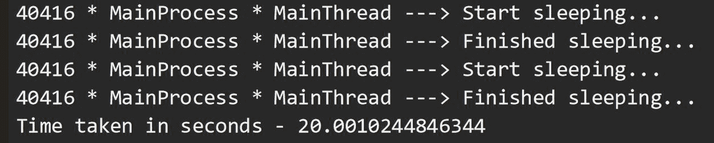
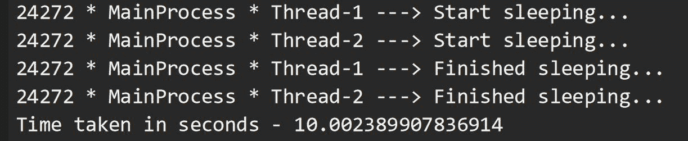
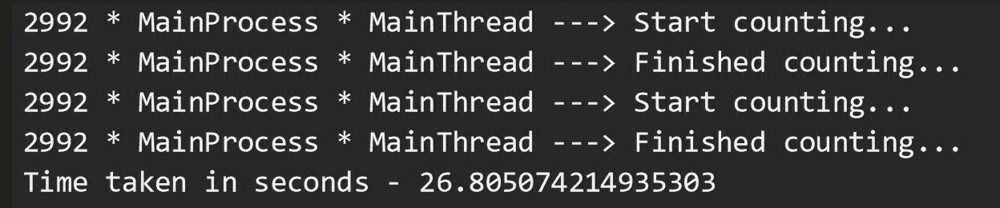
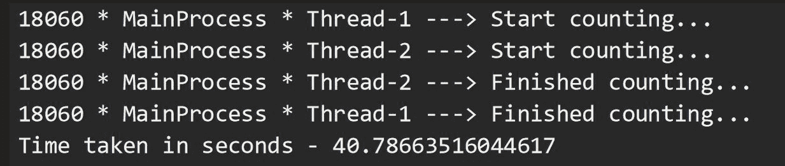
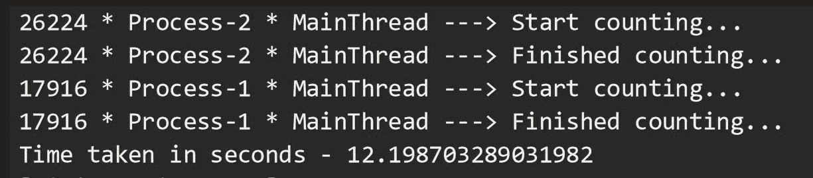
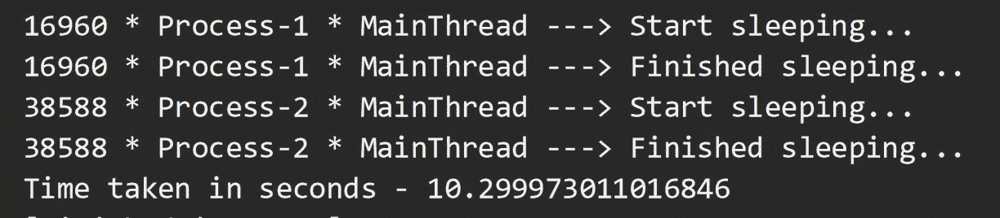
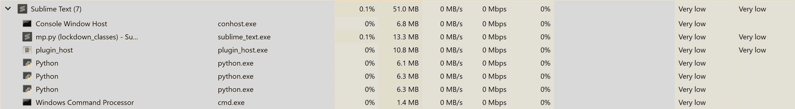

# Python 中多线程和多处理的区别

> 原文:[https://www . geeksforgeeks . org/python 中多线程与多处理的区别/](https://www.geeksforgeeks.org/difference-between-multithreading-vs-multiprocessing-in-python/)

在本文中，我们将学习 Python 中多线程和多处理的内容、原因和方式。在我们深入研究代码之前，让我们理解这些术语的含义。

*   一个**程序**是一个可执行文件，由一组执行某项任务的指令组成，通常存储在你电脑的磁盘上。
*   一个**进程**就是我们所说的一个程序，这个程序已经和它需要运行的所有资源一起被加载到内存中。它有自己的记忆空间。
*   一个**线程**是一个进程内的执行单位。一个进程可以有多个线程作为它的一部分运行，其中每个线程使用该进程的内存空间，并与其他线程共享它。
*   **多线程**是一种技术，其中一个进程产生多个线程来执行不同的任务，大约在同一时间，一个接一个。这给你一种错觉，以为线程是并行运行的，但实际上它们是以并发方式运行的。在 Python 中，全局解释器锁(GIL)防止线程同时运行。
*   **多处理**是一种以最真实的形式实现并行的技术。多个进程跨多个 CPU 内核运行，它们之间不共享资源。每个进程可以有许多线程在自己的内存空间中运行。在 Python 中，每个进程都有自己的 Python 解释器实例来执行指令。

现在，让我们跳到程序中，尝试以六种不同的方式执行两种不同类型的函数: **IO 绑定的**和 **CPU 绑定的**。在输入输出限制函数中，我们要求中央处理器闲置以打发时间，而在中央处理器限制函数中，中央处理器将忙于产生一些数字。

**要求:**

*   一台 Windows 电脑(我的机器有 6 个内核)。
*   安装了 Python 3.x。
*   任何编写 Python 程序的文本编辑器/IDE(我在这里使用的是崇高文本)。

**注:**下面是我们程序的结构，这将在所有六个部分中通用。在提到的地方`# YOUR CODE SNIPPET HERE`，边走边用各部分的代码片段替换。

```
import time, os
from threading import Thread, current_thread
from multiprocessing import Process, current_process

COUNT = 200000000
SLEEP = 10

def io_bound(sec):

    pid = os.getpid()
    threadName = current_thread().name
    processName = current_process().name

    print(f"{pid} * {processName} * {threadName} \
        ---> Start sleeping...")
    time.sleep(sec)
    print(f"{pid} * {processName} * {threadName} \
        ---> Finished sleeping...")

def cpu_bound(n):

    pid = os.getpid()
    threadName = current_thread().name
    processName = current_process().name

    print(f"{pid} * {processName} * {threadName} \
        ---> Start counting...")

    while n>0:
        n -= 1

    print(f"{pid} * {processName} * {threadName} \
        ---> Finished counting...")

if __name__=="__main__":
    start = time.time()

    # YOUR CODE SNIPPET HERE

    end = time.time()
    print('Time taken in seconds -', end - start)
```

**第 1 部分:运行 IO 绑定任务两次，一个接一个……**

```
# Code snippet for Part 1
io_bound(SLEEP)
io_bound(SLEEP)
```

这里，我们要求我们的 CPU 执行函数 io_bound()，该函数接受一个整数(这里是 10)作为参数，并要求 CPU 休眠这么长时间。这个执行总共需要 20 秒，因为每个函数执行需要 10 秒才能完成。请注意，是同一个 MainProcess 调用了我们的函数两次，一次接一次，使用它的默认线程 MainThread。



**第 2 部分:使用线程运行 IO 绑定的任务……**

```
# Code snippet for Part 2
t1 = Thread(target = io_bound, args =(SLEEP, ))
t2 = Thread(target = io_bound, args =(SLEEP, ))
t1.start()
t2.start()
t1.join()
t2.join()
```

这里，让我们使用 Python 中的线程来加速函数的执行。线程线程 1 和线程 2 由我们的主进程启动，每个主进程几乎同时调用我们的函数。这两个线程同时完成睡眠 10 秒的工作。这将整个程序的总执行时间显著减少了 50%。因此，多线程是执行任务的最佳解决方案，我们的中央处理器的空闲时间可以用来执行其他任务。因此，通过利用等待时间来节省时间。



**第 3 部分:运行两次受 CPU 限制的任务，一个接一个……**

```
# Code snippet for Part 3
cpu_bound(COUNT)
cpu_bound(COUNT)
```

在这里，我们将调用我们的函数`cpu_bound()`，它接受一个大数字`(200000000, here)`作为参数，并在每一步递减它，直到它为零。我们的中央处理器被要求在每次函数调用时进行倒计时，大约需要 12 秒(这个数字可能因您的机器而异)。因此，整个程序的执行花费了我大约 26 秒的时间来完成。请注意，这又是我们的 MainProcess 在其默认线程 MainThread 中一个接一个地调用该函数两次。



**第 4 部分:线程化能加速我们的 CPU 限制任务吗？**

```
# Code snippet for Part 4
t1 = Thread(target = cpu_bound, args =(COUNT, ))
t2 = Thread(target = cpu_bound, args =(COUNT, ))
t1.start()
t2.start()
t1.join()
t2.join()
```

好了，我们刚刚证明了线程对于多个 IO 限制的任务非常有效。让我们使用相同的方法来执行受 CPU 限制的任务。最初，它确实同时启动了我们的线程，但是最终，我们看到整个程序的执行花费了大约 40 秒钟！刚刚发生了什么？这是因为当线程 1 启动时，它获得了全局解释器锁(GIL)，这阻止了线程 2 使用中央处理器。因此，线程 2 必须等待线程 1 完成它的任务并释放锁，这样它才能获得锁并执行它的任务。锁的获取和释放增加了总执行时间的开销。因此，我们可以有把握地说，对于需要 CPU 处理某件事情的任务来说，线程化并不是一个理想的解决方案。



**第 5 部分:那么，将任务拆分为单独的流程是否可行？**

```
# Code snippet for Part 5
p1 = Process(target = cpu_bound, args =(COUNT, ))
p2 = Process(target = cpu_bound, args =(COUNT, ))
p1.start()
p2.start()
p1.join()
p2.join()
```

我们开门见山吧。多重处理是答案。在这里，主进程旋转两个子进程，具有不同的 PID，每一个都执行将数字减为零的任务。每个进程并行运行，利用独立的 CPU 内核和自己的 Python 解释器实例，因此整个程序执行只需 12 秒。请注意，输出可能会以无序的方式打印，因为过程是相互独立的。每个进程在自己的默认线程 MainThread 中执行该函数。在程序执行期间打开任务管理器。您可以看到 Python 解释器的 3 个实例，主进程、进程 1 和进程 2 各一个。您还可以看到，在程序执行过程中，两个子进程的功耗为“非常高”，因为它们正在执行的任务实际上正在消耗它们自己的 CPU 内核，如 CPU 性能图中的峰值所示。




**第 6 部分:嘿，让我们使用多处理来处理我们的 IO 限制任务……**

```
# Code snippet for Part 6
p1 = Process(target = io_bound, args =(SLEEP, ))
p2 = Process(target = io_bound, args =(SLEEP, ))
p1.start()
p2.start()
p1.join()
p2.join()
```

现在，我们已经对多处理帮助我们实现并行性有了一个合理的想法，我们将尝试使用这种技术来运行我们的输入输出受限任务。我们确实观察到结果非同寻常，就像多线程的情况一样。由于进程进程 1 和进程进程 2 执行的任务是让它们自己的中央处理器内核闲置几秒钟，所以我们没有发现高功耗。但是进程的创建本身是一项 CPU 繁重的任务，比线程的创建需要更多的时间。此外，进程比线程需要更多的资源。因此，将多处理作为 IO 绑定任务的第二种选择总是更好，多线程是第一种。





嗯，那真是一段旅程。我们看到了六种不同的方法来执行一项任务，根据任务对中央处理器的影响是轻还是重，大约需要 10 秒钟。

**底线:**IO 绑定任务的多线程。用于受 CPU 限制的任务的多处理。