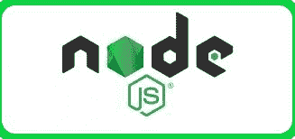

# node . js 和 Python 的区别

> 原文:[https://www . geesforgeks . org/node-js-and-python 之间的差异/](https://www.geeksforgeeks.org/difference-between-node-js-and-python/)

不同的项目有各种不同的需求需要满足。选择更好的技术主要取决于开发人员的偏好，其中一个他或她感到舒适。宣布其中任何一个更坏或无用都是不相关或不实际的。但是我在这里只是区分一下 **Python** 和 **Node.js** ，让你在看完这篇文章后总结和选择更好的。

## Node.js:



这是一个开源的、跨平台的、服务器端的 JavaScript 运行时环境(Framework)，构建在 Chrome 的 V8 JavaScript 引擎上，在网络浏览器之外执行 JavaScript 代码。它是由瑞安·达尔在 2009 年开发的。它允许开发人员使用 JavaScript 编写命令行工具和可扩展的网络应用程序(服务器端脚本——在服务器端运行脚本)在页面发送到用户的网络浏览器之前生成动态网页内容。它允许开发者创建跨分布式系统运行的实时网络应用，如(Linux，微软视窗，Os x)。它的应用程序是用 JavaScript 编写的。它也是用有用的 JavaScript 丰富库来装饰的，这非常容易简化基于 web 的开发过程。

```
Node.js = JavaScript library + Runtime framework (Environment)

```

**以下是其为开发者提供最佳服务的领域:**

*   数据流应用
*   输入/输出绑定的应用程序
*   数据密集型实时应用
*   单页应用程序
*   基于 JSON 的应用程序接口
*   制作一个 REST 应用编程接口服务器
*   网络应用程序(如网络服务器，类似于 PHP、Java 或 ASP.NET<u>)</u>

## Node.js 的特点:

*   **异步和事件驱动:**node . js 库的所有 API 都是异步的，也就是非阻塞的。这意味着基于 Node.js 的服务器从不等待 API 返回数据。服务器在调用下一个应用编程接口后会移动到下一个应用编程接口，Node.js 的事件通知机制有助于服务器从上一个应用编程接口调用中获得响应。
*   **非常快:**它建立在谷歌 Chrome 的 V8 JavaScript 引擎上，这就是为什么 **Node.js** 库的代码执行速度非常快。
*   **带事件循环的单线程:**事件机制有助于服务器以非阻塞方式做出响应，并使服务器具有高度可伸缩性，这与创建有限线程来处理请求的传统服务器不同。
*   **无缓冲:**在 **Node.js** 中没有缓冲，因为应用程序输出的数据是分段的**。**

## Python:


Python 是吉多·范·罗苏姆发明的，它是一种解释的、面向对象的高级语言，具有动态语义、简单语法，还支持函数式和结构化编程。

**强烈推荐在:**

*   科学应用，
*   数据科学，机器学习，
*   大数据解决方案，
*   用 Python 框架创建网络应用程序，比如 Django 和 Flask，
*   处理数据库及其数据。

## Python 的特性:

*   简单
*   轻便
*   嵌入属性(可以很容易地与 C、C++、COM、ActiveX、CORBA 和 Java 集成)
*   解释(Python 源代码逐行编译，使调试更容易)
*   丰富的库支持
*   糟糕的编程

## Node.js 和 Python 的主要区别:

<figure class="table">

| **序列号** | **Node.js** |   | **蟒蛇** |
| --- | --- | --- | --- |
| 1. | Node.js 是异步编程的最佳选择 |   | Python 不是异步编程的最佳选择。 |
| 2. | 它最适合于需要较少脚本的小型项目。 |   | 如果你正在开发更大的项目，Python 是最好的选择。 |
| 3. | Node.js 最适合内存密集型活动。 |   | 不建议用于内存密集型活动。 |
| 4. | 如果您的重点完全放在 web 应用程序和网站开发上，Node.js 是一个更好的选择。 |   | 但是，Python 是全能的，可以执行多种任务，如网络应用程序、与后端应用程序的集成、数值计算、机器学习和网络编程。 |
| 5. | Node.js 是目前处理实时 web 应用程序的一个理想且充满活力的平台。 |   | Python 不是处理实时网络应用程序的理想平台。 |
| 6. | 最快的速度和出色的性能很大程度上归功于 Node.js 基于 Chrome 的 V8，这是一个非常快速和强大的引擎。 |   | Python 比 Node.js 慢，因为 Node.js 基于快速强大的 Chrome 的 V8 引擎 Node。 |
| 7. | Node.js 利用了 JavaScript 解释器。 |   | Python 使用 PyPy 作为解释器。 |
| 8. | 在错误处理和调试 Python beats Node.js 的情况下 |   | python 中的错误处理花费的时间非常少，与 Node.js 相比，Python 中的调试也非常容易 |

</figure>