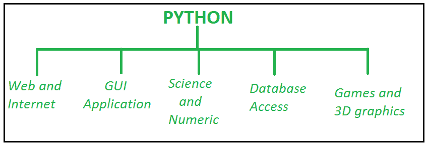
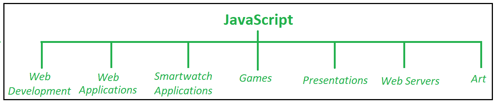

# Python 和 JavaScript 的区别

> 原文:[https://www . geesforgeks . org/python 和 javascript 的区别/](https://www.geeksforgeeks.org/difference-between-python-and-javascript/)

在本文中，我们将了解 Javascript 和 Python，它们的用途，以及它们之间的区别。

[Python:](https://www.geeksforgeeks.org/python-programming-language) Python 是一种高级通用编程语言，开发它是为了强调代码的可读性，并允许它们快速高效地工作。Python 用于网络应用、游戏开发、机器学习和人工智能。

**示例:**这是一个打印“Hello World”的简单 Python 程序。

## 蟒蛇 3

```
# Python program to print 'Hello world'
print("Hello World")
```

**输出:**

```
Hello World
```



Python 在不同领域的使用

**Python 的好处:**

1.  它是一种高级面向对象语言，具有用户友好的数据结构。
2.  开源和社区发展。
3.  它用途广泛，易于阅读、学习和写作。
4.  它支持广泛的库(用于数值计算的 NumPy、用于数据分析的 Pandas 等)。
5.  这是一种动态类型的语言。，没有必要提及基于赋值的数据类型，它需要数据类型。
6.  原型的理想选择–用更少的编码提供更多的功能
7.  高效(Python 干净的面向对象设计提供了增强的过程控制，语言配备了优秀的文本处理和集成能力，以及自己的单元测试框架，使其效率更高。)

[**JavaScript**:](https://www.geeksforgeeks.org/javascript-tutorial/)JavaScript 是一种符合 ECMAScript 规范的编程语言。它是网景公司推出的一种高级脚本语言，运行在网络浏览器的客户端。它可以将动态文本插入到 HTML 中。JavaScript 也被称为浏览器的语言。

**示例:**这是一个简单的程序，将使用 Javascript 打印“Hello World”。

## java 描述语言

```
// JavaScript program to print 'Hello world'

<script> 
console.log('Hello World'); 
</script>
```

**输出:**

```
"Hello World"
```



Javascript 在不同领域的使用

**Javascript 的好处:**

1.  JavaScript 有能力支持所有现代浏览器并产生同等的结果。
2.  全球性公司通过创建重要的项目来支持社区发展。一个例子是谷歌(创建了 Angular 框架)或脸书(创建了 React.js 框架)。
3.  无论您在哪里托管 JavaScript，它总是在客户端环境中执行，以节省大量带宽并加快执行过程。
4.  在 JavaScript 中，XMLHttpRequest 是微软设计的一个重要对象。XMLHttpRequest 作为异步 HTTP 请求向服务器发出的对象调用，以便在不重新加载页面的情况下将数据传输到两端。

**Python 和 JavaScript 的区别:**两者有显著的区别，下面讨论:

<figure class="table">

| 

#### No.

 | 

#### computer programming language

 | [T0】 java description language |
| --- | --- | --- |
| 1. | Python 是一种高级通用解释编程语言，旨在强调代码可读性。 | JavaScript 是一种符合 ECMAScript 规范的编程语言。

 |
| 2. | 它是一种用于开发桌面和网络应用程序的脚本语言。 | 它是一种客户端脚本语言。 |
| 3. | 它使用基于类的继承模型。 | 它使用基于原型的继承模型。 |
| 4. | 在这种情况下，当使用错误的参数调用函数时，会引发异常。 | 它不关心是否用正确的参数调用函数。 |
| 5. | List、set 和 dict 是可变的，而 int、tuple、bool 和 Unicode 在 python 中是不可变的。 | 在 JavaScript 中，只有对象和数组是可变的。 |
| 6. | 它使用类似于 C、C++和 Java 的更保守的编程范式。 | 它是网络浏览器的一种语言，也是最容易使用的语言之一。 |
| 7. | 它有一个全面的标准库。 | 它有一组有限的实用程序对象。 |

</figure>