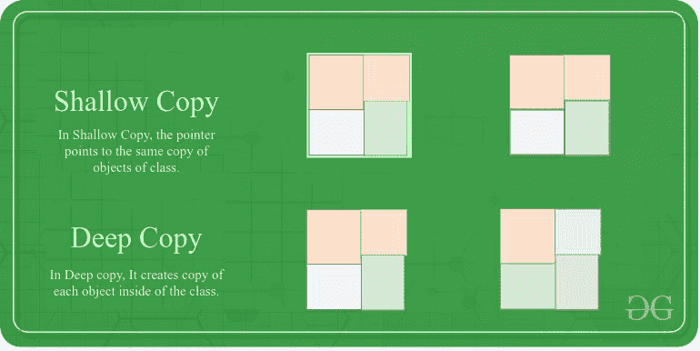

# 一个类的浅拷贝和深拷贝的区别

> 原文:[https://www . geeksforgeeks . org/浅复制类和深复制类的区别/](https://www.geeksforgeeks.org/difference-between-shallow-and-deep-copy-of-a-class/)

**<u>浅复制:</u>** 浅重复更快。然而，它处理指针和引用是“懒惰的”。它不是创建指针指向的特定知识的当代副本，而是简单地复制指针价格。因此，每一个第一个副本和副本都可以有引用常量底层知识的指针。

**<u>深度复制:</u>** 深度重复真正克隆底层数据。它不会在第一个副本和第二个副本之间共享。



下面是浅拷贝和深拷贝之间的表格差异:

<figure class="table">

| 浅拷贝 | 深度复制 |
| --- | --- |
| 浅拷贝存储对象对原始内存地址的引用。 | 深度复制存储对象值的副本。 |
| 浅复制反映了对原始对象中新的/复制的对象所做的更改。 | 深度复制不会反映对原始对象中的新/复制对象所做的更改。 |
| 浅复制存储原始对象的副本，并将引用指向对象。 | 深度复制存储原始对象的副本，并递归复制对象。 |
| 浅拷贝更快。 | 深度复制相对较慢。 |

</figure>

下面是讲解浅抄和深抄的程序。

## 蟒蛇 3

```
# Python3 implementation of the Deep
# copy and Shallow Copy
from copy import copy, deepcopy

# Class of Car
class Car:
  def __init__(self, name, colors):

     self.name = name
     self.colors = colors

honda = Car("Honda", ["Red", "Blue"])

# Deepcopy of Honda
deepcopy_honda = deepcopy(honda)
deepcopy_honda.colors.append("Green")
print(deepcopy_honda.colors, \
      honda.colors)

# Shallow Copy of Honda
copy_honda = copy(honda)

copy_honda.colors.append("Green")
print(copy_honda.colors, \
      honda.colors)
```

**Output:** 

```
['Red', 'Blue', 'Green'] ['Red', 'Blue']
['Red', 'Blue', 'Green'] ['Red', 'Blue', 'Green']

```