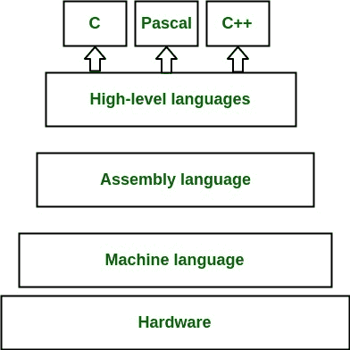
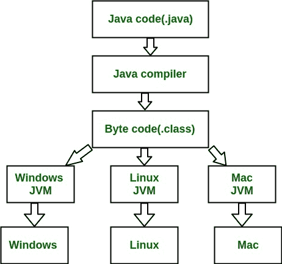
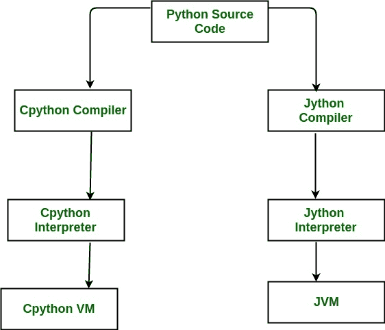
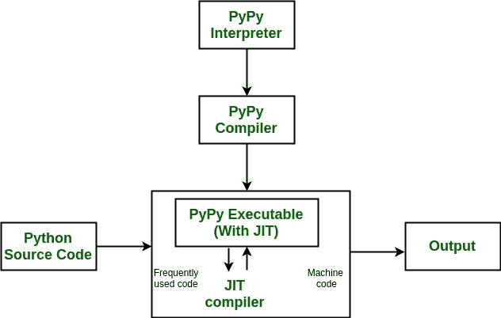

# Python 各种实现的区别

> 原文:[https://www . geesforgeks . org/difference-各种-实现-python/](https://www.geeksforgeeks.org/difference-various-implementations-python/)

当我们谈到 [Python](https://www.geeksforgeeks.org/python/) 时，我们通常指的不仅仅是语言，还有实现。Python 实际上是一种语言的规范，可以用许多不同的方式来实现。

**背景**
*在继续之前，让我们进一步了解一下字节码和机器码(原生码)的区别。*
**机器码(*又名原生码* )**
机器码是由中央处理器直接执行的指令集。每条指令都执行一个非常独特的任务，比如对 CPU 内存中的数据进行加载或逻辑操作。几乎所有的高级语言，如 C 语言，都在编译器、加载器和链接器的帮助下，将源代码翻译成可执行的机器代码。每个处理器或处理器家族都有自己的机器代码指令集。
 
**字节码**
字节码也是虚拟机执行的二进制表示(不是由 CPU 直接执行)。虚拟机(针对不同的机器编写不同的虚拟机)将二进制指令转换为特定的机器指令。使用字节码概念的语言之一是 Java。

*与字节码相比，机器代码要快得多，但是与机器代码相比，字节码是可移植和安全的。*

**Python 的实现**
**Cpython**
Python 编程语言的默认实现是 Cpython。顾名思义，Cpython 是用 [C 语言](https://www.geeksforgeeks.org/c/)编写的。Cpython 将 python 源代码编译成中间字节码，由 Cpython 虚拟机执行。CPython 分布着一个用 C 和 Python 混合编写的大型标准库。CPython 提供了与 Python 包和 C 扩展模块的最高级别的兼容性。Python 语言的所有版本都是用 C 实现的，因为 CPython 是引用实现。
基于 CPython 运行时核心但在某些方面具有扩展行为或特性的一些实现有 Stackless Python、wpython、MicroPython。
[无堆栈 Python](https://wiki.python.org/moin/StacklessPython)–CPython 强调使用小任务和通道的并发性(dspython 在任天堂 DS 中使用)

**其他实现**
Python 语言也有一些其他的实现。已知唯一与该语言的给定版本兼容的实现是**IronPython****Jython**和**pypypy**。

**Jython**
Jython 是可以在 Java 平台上运行的 Python 编程语言的实现。Jython 程序使用 Java 类而不是 Python 模块。Jython 编译成 Java 字节码，然后可以由 Java 虚拟机运行。Jython 支持使用 Python 程序中的 Java 类库函数。Jython 与 CPython 相比速度较慢，缺乏与 Cpython 库的兼容性。

**IronPython**
一个用 C#编写的针对微软的 Python 实现。NET 框架。与 Jython 类似，它使用。网络虚拟机，即[公共语言运行时](https://en.wikipedia.org/wiki/Common_Language_Runtime)。IronPython 可以使用。NET 框架和 Python 库等。NET 语言可以非常高效地使用 Python 代码。IronPython 在使用线程或多核的 Python 程序中表现更好，因为它有 JIT，也因为它没有[全局解释器锁](https://en.wikipedia.org/wiki/Global_interpreter_lock)。

**pypypy**
*“如果你想让你的代码运行得更快，你可能应该只使用 PyPy。”—吉多·范·罗苏姆(Python 的创造者)*
Python 是动态编程语言。据说 Python 很慢，因为默认的 CPython 实现以字节码形式编译 Python 源代码，与机器代码(本机代码)相比速度很慢。PyPy 进来了。
PyPy 是用 Python 编写的 Python 编程语言的实现。解释器是用 RPython(Python 的一个子集)编写的。

PyPy 使用([即时编译](https://en.wikipedia.org/wiki/Just-in-time_compilation))。简而言之，JIT 使用编译方法来提高解释器系统的效率和速度。所以基本上 JIT 使得将源代码编译成本机代码成为可能，这使得它非常快。
pypypy 也默认支持无堆叠模式，提供微线程实现大规模并发。*据说 Python 比 Cpython 快约 7.5 倍。*

Python 的其他一些实现有 **CLPython** 、**派斯顿**、 **Psyco** 、**cynthon**、 **IPython** 。

**参考文献:**

*   [https://wiki . python . org/moin/python 实施](https://wiki.python.org/moin/PythonImplementations)
*   [http://py . org/](http://pypy.org/)
*   [https://wiki . python . org/moin/iron python](https://wiki.python.org/moin/IronPython)
*   [http://www.jython.org/](http://www.jython.org/)

本文由 **[绍拉布·达利亚](https://www.facebook.com/saurabh.daalia)** 供稿。如果你喜欢 GeeksforGeeks 并想投稿，你也可以使用[contribute.geeksforgeeks.org](http://www.contribute.geeksforgeeks.org)写一篇文章或者把你的文章邮寄到 contribute@geeksforgeeks.org。看到你的文章出现在极客博客主页上，帮助其他极客。

如果你发现任何不正确的地方，或者你想分享更多关于上面讨论的话题的信息，请写评论。