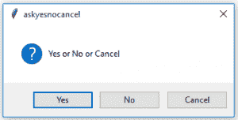
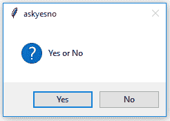
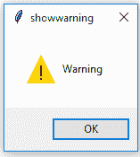
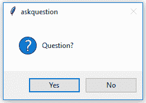
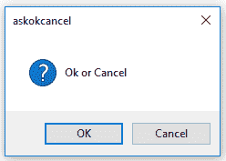
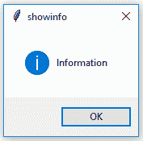
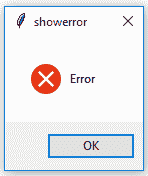
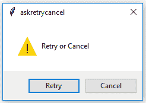

# Tkinter | Python 中的不同消息

> 原文:[https://www . geesforgeks . org/different-messages-in-tkinter-python/](https://www.geeksforgeeks.org/different-messages-in-tkinter-python/)

[Tkinter](https://www.geeksforgeeks.org/python-creating-a-button-in-tkinter/) 提供了一个**消息框**类，可以显示各种消息，用户可以根据这些消息进行响应。消息，如确认消息、错误消息、警告消息等。
要使用该类，必须导入该类，如下所示:

```
# import all the functions and constants of this class.
from tkinter.messagebox import *
```

**该类不同功能的语法和用法–**

```
# Ask if operation should proceed; 
# return true if the answer is ok.

# Ask a question.

# Ask if operation should be retried;
# return true if the answer is yes.

# Ask a question; return true
# if the answer is yes.

# Ask a question; return true
# if the answer is yes, None if cancelled.

# Show an error message.

# Show an info message.

# Show a warning message.
```

演示各种信息的程序:

## 蟒蛇 3

```
# importing messagebox class
from tkinter.messagebox import *

# Showing various messages

print(askokcancel("askokcancel", "Ok or Cancel"))

print(askquestion("askquestion", "Question?"))

print(askretrycancel("askretrycancel", "Retry or Cancel"))

print(askyesno("askyesno", "Yes or No"))

print(askyesnocancel("askyesnocancel", "Yes or No or Cancel"))

print(showerror("showerror", "Error"))

print(showinfo("showinfo", "Information"))

print(showwarning("showwarning", "Warning"))

# print statement is used so that we can
# print the returned value by the function
```

**输出:**

















**注意:**注意，在上面的程序中，我们不必导入 [Tkinter](https://www.geeksforgeeks.org/python-creating-a-button-in-tkinter/) 模块，只需 **messagebox** molude/class 就足够了，因为这些函数的定义在 **messagebox** class 中。