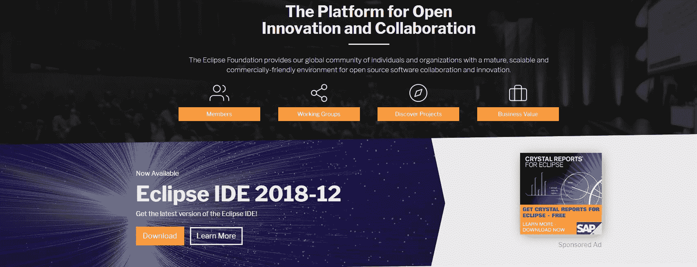
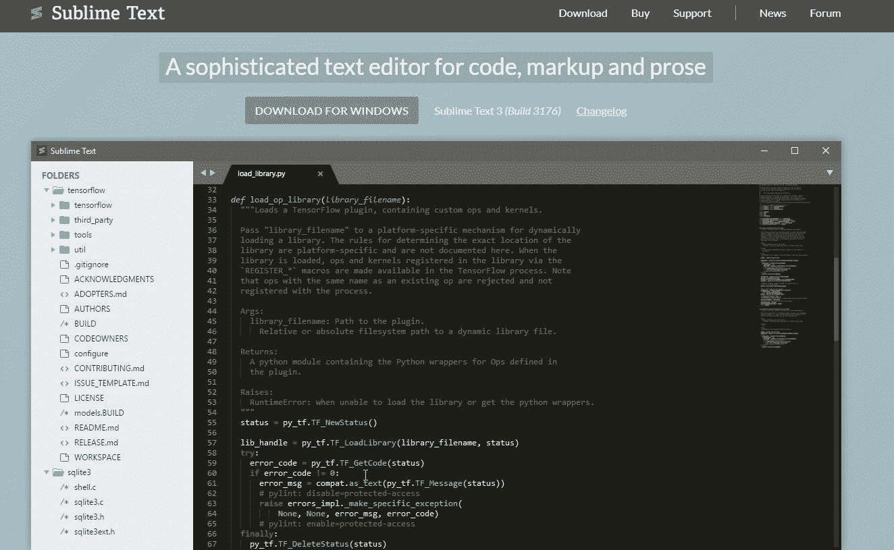
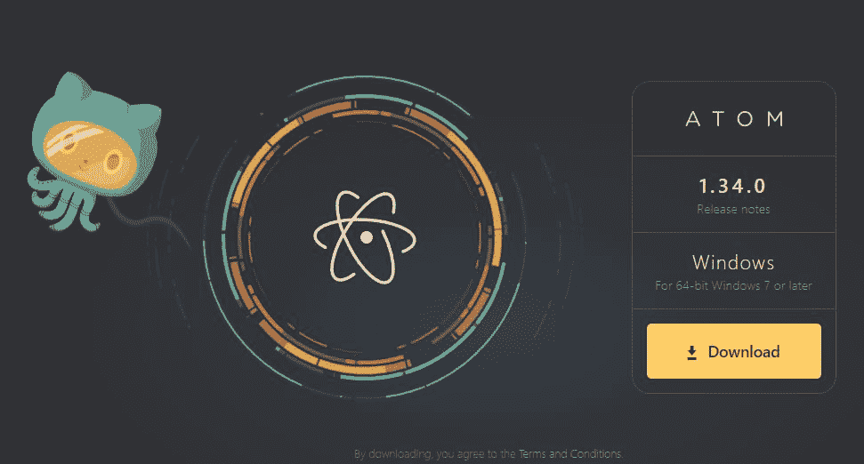
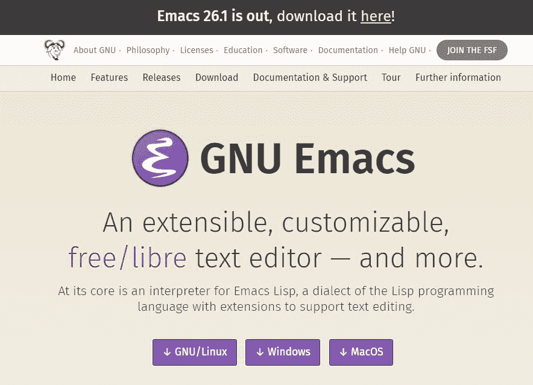
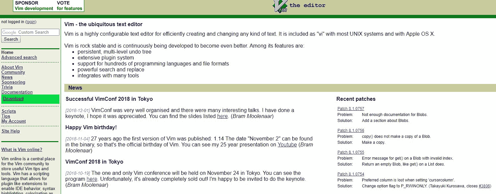
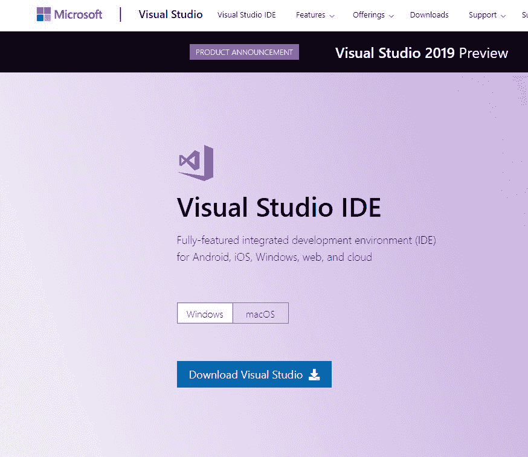
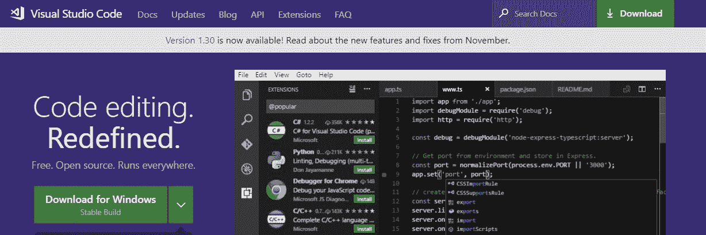
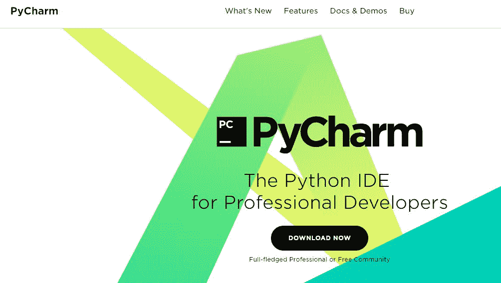
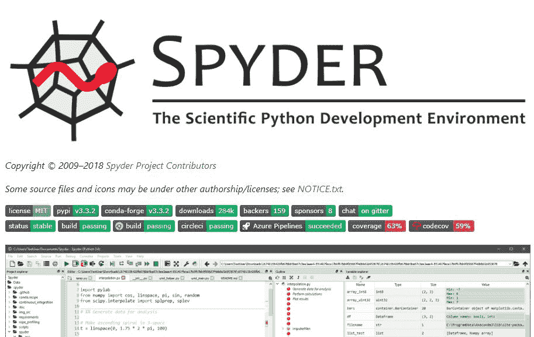
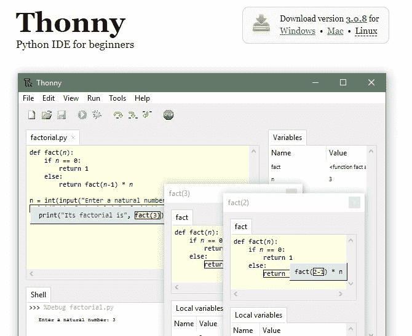

# 不同的 Python IDEs 和代码编辑器

> 原文:[https://www . geesforgeks . org/different-python-ides-and-code-editors/](https://www.geeksforgeeks.org/different-python-ides-and-code-editors/)

**什么是 IDE 和代码编辑器:**
IDE 是帮助软件开发的工具组合。IDE 使编码变得更加容易。顾名思义，集成开发环境(IDE)，它是一组组合或集成在一起的工具，用于轻松建立软件开发。工具的组合包括，

*   有助于语言语法的代码编辑器。
*   代码格式化、执行和调试器环境。
*   源代码和版本控制环境。

然而，代码编辑器只是一个编写计算机程序的独立文本编辑器应用程序。它是编码的基本工具。这些可以与集成开发环境集成，以执行额外的编程核心功能。
市面上有不同的 Python IDEs 和代码编辑器。它们有两种类型。第一种是专门为 Python 开发而构建的，第二种是通用的，它与您可能也用于 Python 的所有语言开发兼容。

**对良好 Python 编码环境的要求:**

*   **保存和检索代码文件:**一个 IDE 或编辑器，允许你多次保存你的工作和撤销你代码的所有内容。
*   **从环境内部执行代码:**显然，您必须在与编写代码相同的平台上运行代码。
*   **调试帮手:**排除杂事，突出出错的台词，真是悲痛中的帮手。
*   **语法高亮:**识别代码中的关键词、变量和符号，让阅读、书写和理解代码变得更好。
*   **自动代码格式化:**缩进和格式化对于干净的代码来说是一个很好的工具，可以更容易地掌握东西，对于 sphinx 来说也是一个文档化的工具。

### 通用编辑器和 IDEs

## Python Eclipse + PyDev:

**TYPE:**IDE
**URL:**[www.eclipse.org](https://www.eclipse.org/)
版本:免费。
Python 工具和软件包:PyDev，https://marketplace.eclipse.org/node/114 www.pydev.org
Eclipse 是一个开源 IDE，您可以在其中安装 PyDev 进行专有的 Python 开发，支持 Python 调试、代码完成和交互式 Python 控制台。将 PyDev 安装到 Eclipse 中很容易:从 Eclipse 中，选择帮助，然后选择 Eclipse 市场，然后搜索 PyDev。如果需要更改受影响，请单击安装并重新启动 Eclipse。

## 升华文本:

**类型:**代码编辑器
**URL:**[http://www.sublimetext.com](http://www.sublimetext.com/)
版本:非免费。
崇高文本是由谷歌工程师开发的代码编辑器，专门用 Python 编写，因此它附带了许多丰富的 Python 包，有助于 Python 开发的丰富功能。它兼容所有平台。

## 原子:

**类型:**代码编辑器
**URL:**[https://atom.io/](https://atom.io/)
**版本:** Free
Atom 是一款开源代码编辑器，其本身宣称是“面向 21 世纪的可黑客文本编辑器。”在 Atom 中安装的基于社区的 Python 扩展的帮助下，您可以将其用于您的 Python 开发。也许应该找到社区提供的插件来调试和构建支持。

## GNU Emacs:

**类型:**代码编辑器
**URL:**[https://www.gnu.org/software/emacs/](https://www.gnu.org/software/emacs/)
**版本:** Free
这是一种非常常规的代码编辑器形式，它使用一种功能强大的独特 Lisp 编程语言进行专属的个人规范和修改。它拥有大量用于 Python 开发目的的定制脚本。在选择 GNU Emacs 作为你的编辑器之前，你必须了解 Lisp 编程的脚本。

## VI / VIM:

**类型:**代码编辑器
**URL:**[https://www.vim.org/](https://www.vim.org/)
**版本:**免费
它是 UNIX 环境中自带的一种基于模式的代码编辑器。你应该在使用的时候了解 VIMScripts。这个模态编辑器有专门用于 Python 开发任务的 VIMScripts。

## Visual Studio:

**类型:**IDE
**URL:**[https://www.visualstudio.com/vs/](https://visualstudio.microsoft.com/vs/)
**Python 工具:**Visual Studio 的 Python 工具，@ PTVS
**版本:**免费(社区)和付费(专业和企业)版本
Visual Studio 是微软的 IDE，功能齐全，包包。人们可以很容易地安装 python 扩展进行开发。Visual Studio 对于 Python 编程来说是一个很高的下载量。此外，如果你对 Linux 感兴趣，你就完了:Linux 平台没有 Visual Studio 安装。

## Visual Studio 代码:

**类型:**代码编辑器
**URL:**[https://code.visualstudio.com/](https://code.visualstudio.com/)
T8】Python 工具:https://marketplace.visualstudio.com/items?item name = ms-python . python
**版本:** Free
它是一个像 Atom 一样的开源代码编辑器，兼容 Linux、Mac OS X、Windows 平台等不同的操作系统环境。它是软件开发的全功能包。您可以添加 Python 工具来启用 Python 编码。

### 特定于 Python 的编辑器和 IDEs:

### PyCharm

**类型:**IDE
**URL:**[https://www.jetbrains.com/pycharm/](https://www.jetbrains.com/pycharm/)
**版本:**免费(社区)和付费(专业和企业)版本
是 python 开发最好的也是唯一一个全功能包的 IDE。它配有编辑器、调试器和源代码控制，并带有大量支持系统，可以轻松运行 Python。

## 斯派德

**类型:**IDE
**URL:**[https://github.com/spyder-ide/spyder](https://github.com/spyder-ide/spyder)
**官网:**https://www.spyder-ide.org/
**版本:** Free
Spyder 是专为数据科学工作流定制的开源 Python IDE。它很容易与 SciPy、NumPy、Matplotlib 等科学图书馆集成。它拥有便于数据可视化的变量浏览器。它不仅仅是一个专门为 Python 设计的集成开发环境。这个工具的独特优势在于它是兼容的，并且可以在 Windows、macOS 和 Linux 上免费获得，并且是完全开源的软件。

## Thonny

**类型:**IDE
**URL:**[http://thonny.org/](https://thonny.org/)
**版本:**免费
它作为 Python IDE 的基础版本出现，初学者程序员会觉得它更有用。支持所有 Python 包。

**哪种 Python IDE 适合你:**
根据个人程序员的要求，选择合适的工具使用 Python 进行软件开发是自己的选择。新的 Python 开发人员应该尝试定制尽可能少的解决方案。阻碍越少越好。