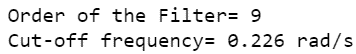
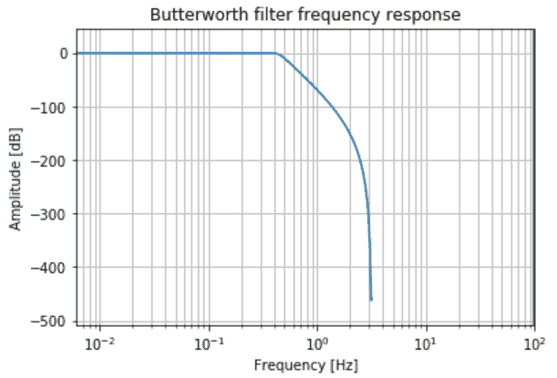
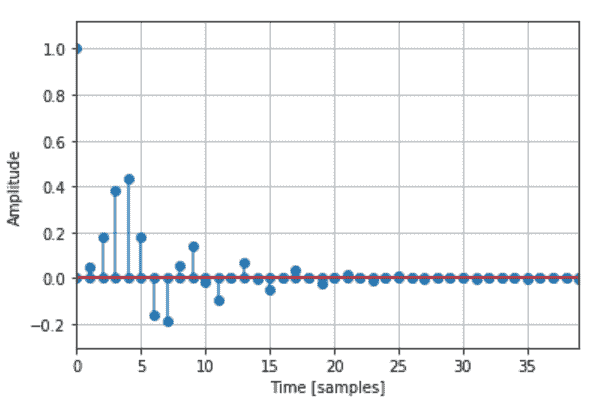
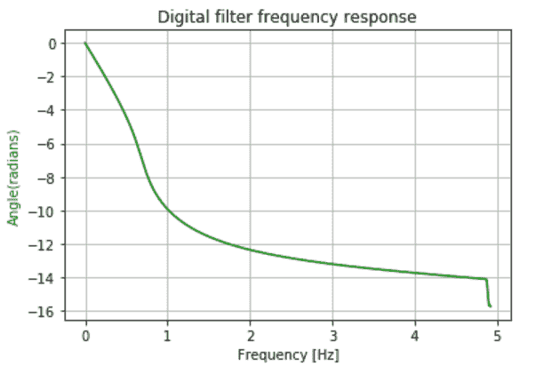

# Python 中的数字低通巴特沃斯滤波器

> 原文:[https://www . geeksforgeeks . org/digital-低通-butterworth-python 中的滤波器/](https://www.geeksforgeeks.org/digital-low-pass-butterworth-filter-in-python/)

在本文中，我们将讨论如何使用 Python 设计数字低通巴特沃斯滤波器。巴特沃斯滤波器是一种信号处理滤波器，设计为在通带内具有尽可能平坦的频率响应。让我们采用以下规格来设计滤波器，并观察数字巴特沃兹滤波器的幅度、相位和脉冲响应。

**规格如下:**

*   采样速率为 40 千赫
*   4 千赫的通带边缘频率
*   8 千赫的阻带边缘频率
*   0.5 分贝的通带纹波
*   最小阻带衰减为 40 分贝

我们将绘制滤波器的幅度、相位和脉冲响应。

### 逐步方法:

**步骤 1:** 导入所有必需的库。

## 蟒蛇 3

```py
# import required modules
import numpy as np
import matplotlib.pyplot as plt
from scipy import signal
import math
```

**步骤 2:** 用给定的过滤器规格定义变量。

## 蟒蛇 3

```py
# Specifications of Filter

 # sampling frequency
f_sample = 40000 

# pass band frequency
f_pass = 4000  

# stop band frequency
f_stop = 8000  

# pass band ripple
fs = 0.5

# pass band freq in radian
wp = f_pass/(f_sample/2)  

# stop band freq in radian
ws = f_stop/(f_sample/2) 

# Sampling Time
Td = 1  

 # pass band ripple
g_pass = 0.5 

# stop band attenuation
g_stop = 40  
```

**步骤 3:** 使用*信号按钮*功能构建滤波器。

## 蟒蛇 3

```py
# Conversion to prewrapped analog frequency
omega_p = (2/Td)*np.tan(wp/2)
omega_s = (2/Td)*np.tan(ws/2)

# Design of Filter using signal.buttord function
N, Wn = signal.buttord(omega_p, omega_s, g_pass, g_stop, analog=True)

# Printing the values of order & cut-off frequency!
print("Order of the Filter=", N)  # N is the order
# Wn is the cut-off freq of the filter
print("Cut-off frequency= {:.3f} rad/s ".format(Wn))

# Conversion in Z-domain

# b is the numerator of the filter & a is the denominator
b, a = signal.butter(N, Wn, 'low', True)
z, p = signal.bilinear(b, a, fs)
# w is the freq in z-domain & h is the magnitude in z-domain
w, h = signal.freqz(z, p, 512)
```

**输出:**



**第 4 步:**绘制震级响应。

## 蟒蛇 3

```py
# Magnitude Response
plt.semilogx(w, 20*np.log10(abs(h)))
plt.xscale('log')
plt.title('Butterworth filter frequency response')
plt.xlabel('Frequency [Hz]')
plt.ylabel('Amplitude [dB]')
plt.margins(0, 0.1)
plt.grid(which='both', axis='both')
plt.axvline(100, color='green')
plt.show()
```

**输出:**



**步骤 5:** 绘制脉冲响应。

## 蟒蛇 3

```py
# Impulse Response
imp = signal.unit_impulse(40)
c, d = signal.butter(N, 0.5)
response = signal.lfilter(c, d, imp)

plt.stem(np.arange(0, 40), imp, use_line_collection=True)
plt.stem(np.arange(0, 40), response, use_line_collection=True)
plt.margins(0, 0.1)

plt.xlabel('Time [samples]')
plt.ylabel('Amplitude')
plt.grid(True)
plt.show()
```

**输出:**



**第 6 步:**绘制相位响应。

## 蟒蛇 3

```py
# Phase Response
fig, ax1 = plt.subplots()

ax1.set_title('Digital filter frequency response')
ax1.set_ylabel('Angle(radians)', color='g')
ax1.set_xlabel('Frequency [Hz]')

angles = np.unwrap(np.angle(h))

ax1.plot(w/2*np.pi, angles, 'g')
ax1.grid()
ax1.axis('tight')
plt.show()
```

**输出:**



**以下是基于上述方法的完整程序:**

## 计算机编程语言

```py
# import required modules
import numpy as np
import matplotlib.pyplot as plt
from scipy import signal
import math

# Specifications of Filter

 # sampling frequency
f_sample = 40000 

# pass band frequency
f_pass = 4000  

# stop band frequency
f_stop = 8000  

# pass band ripple
fs = 0.5

# pass band freq in radian
wp = f_pass/(f_sample/2)  

# stop band freq in radian
ws = f_stop/(f_sample/2) 

# Sampling Time
Td = 1  

 # pass band ripple
g_pass = 0.5 

# stop band attenuation
g_stop = 40  

# Conversion to prewrapped analog frequency
omega_p = (2/Td)*np.tan(wp/2)
omega_s = (2/Td)*np.tan(ws/2)

# Design of Filter using signal.buttord function
N, Wn = signal.buttord(omega_p, omega_s, g_pass, g_stop, analog=True)

# Printing the values of order & cut-off frequency!
print("Order of the Filter=", N)  # N is the order
# Wn is the cut-off freq of the filter
print("Cut-off frequency= {:.3f} rad/s ".format(Wn))

# Conversion in Z-domain

# b is the numerator of the filter & a is the denominator
b, a = signal.butter(N, Wn, 'low', True)
z, p = signal.bilinear(b, a, fs)
# w is the freq in z-domain & h is the magnitude in z-domain
w, h = signal.freqz(z, p, 512)

# Magnitude Response
plt.semilogx(w, 20*np.log10(abs(h)))
plt.xscale('log')
plt.title('Butterworth filter frequency response')
plt.xlabel('Frequency [Hz]')
plt.ylabel('Amplitude [dB]')
plt.margins(0, 0.1)
plt.grid(which='both', axis='both')
plt.axvline(100, color='green')
plt.show()

# Impulse Response
imp = signal.unit_impulse(40)
c, d = signal.butter(N, 0.5)
response = signal.lfilter(c, d, imp)
plt.stem(np.arange(0, 40), imp, use_line_collection=True)
plt.stem(np.arange(0, 40), response, use_line_collection=True)
plt.margins(0, 0.1)
plt.xlabel('Time [samples]')
plt.ylabel('Amplitude')
plt.grid(True)
plt.show()

# Phase Response
fig, ax1 = plt.subplots()
ax1.set_title('Digital filter frequency response')
ax1.set_ylabel('Angle(radians)', color='g')
ax1.set_xlabel('Frequency [Hz]')
angles = np.unwrap(np.angle(h))
ax1.plot(w/2*np.pi, angles, 'g')
ax1.grid()
ax1.axis('tight')
plt.show()
```

**输出:**

   