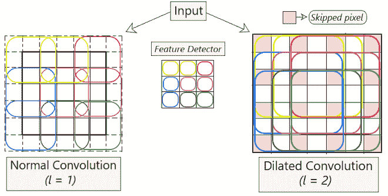
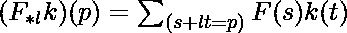
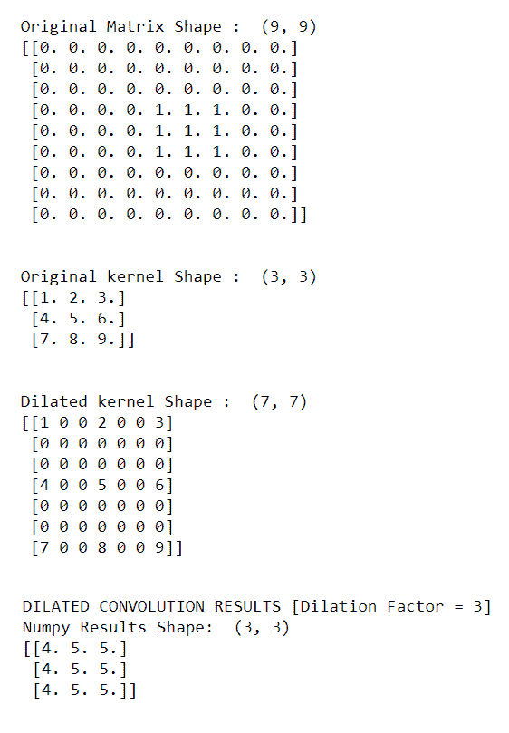

# 扩张卷积

> 原文:[https://www.geeksforgeeks.org/dilated-convolution/](https://www.geeksforgeeks.org/dilated-convolution/)

先决条件:[卷积神经网络](https://www.geeksforgeeks.org/convolutional-neural-network-cnn-in-machine-learning/)

**扩张卷积:**是一种通过在其连续元素之间插入孔洞来扩展内核(输入)的技术。简单来说，它与卷积相同，但涉及像素跳过，以便覆盖更大的输入区域。

一个额外的参数 ***l*** (膨胀因子)告诉输入被扩展了多少。换句话说，基于该参数的值， ***(l-1)*** 像素在内核中被跳过。**图 1** 描述了正常卷积和扩张卷积的区别。本质上，正常卷积只是**1-扩张卷积**。



**图 1:正常卷积与扩张卷积**

**直觉:**

扩展卷积有助于扩展输入图像的覆盖区域，而无需合并。目的是从每次卷积运算获得的输出中获取更多信息。这种方法以相同的计算成本提供了更广阔的视野。我们确定膨胀因子**(*****【l】)***的值是通过观察在***【l】***的不同值上每次卷积获得多少信息。

通过使用这种方法，我们能够在不增加内核参数数量的情况下获得更多的信息。在**图 1** 中，左边的图像描绘了扩张的卷积。在保持 *l = 2、*的值时，我们跳过 1 个像素(*l–1*像素)，同时将滤波器映射到输入，从而在每个步骤中覆盖更多信息。

**涉及的配方:**

<center></center>

```
where,
F(s) = Input 
k(t) = Applied Filter
****l*** = *l-*dilated convolution
(F<sub>*lk)(p) =</sub> Output
```

**扩张卷积的优势:**

使用这种方法比正常卷积更好，因为:

1.  ***更大的感受野**(即不丧失覆盖)*
2.  ***计算效率高**(因为它在相同的计算成本下提供了更大的覆盖范围)*
3.  ***【较小的内存消耗】**(因为它跳过了池化步骤)实现*
4.  ***输出图像的分辨率没有损失**(因为我们扩大而不是执行合并)*
5.  ***这种卷积的结构有助于维持数据的顺序。**T3】*

**代码实现:**

## 蟒蛇 3

```
import numpy as np
import tensorflow as tf
import sys
from  scipy.signal import convolve2d

np.random.seed(678)
tf.random.set_seed(6789)
sess = tf.compat.v1.Session()

# Initializing a 9x9 matrix of zeros.
mat_size = 9
matrix = np.zeros((mat_size,mat_size)).astype(np.float32) 

# Assigning 1's in the middle of matrix 
# to create a random input matrix
for x in range(4,7):
    for y in range(3,6):
        matrix[y,x] = 1

# Creating a random kernal for test
kernel = np.array([
    [1,2,3],
    [4,5,6],
    [7,8,9]
]).astype(np.float32) 

print("Original Matrix Shape : ",matrix.shape)
print(matrix)
print('\n')
print("Original kernel Shape : ",kernel.shape)
print(kernel)

# self-initializing a dilated kernal.
# ======[dilation factor = 3]======
dilated_kernel = np.array([
    [1,0,0,2,0,0,3],
    [0,0,0,0,0,0,0],
    [0,0,0,0,0,0,0],
    [4,0,0,5,0,0,6],
    [0,0,0,0,0,0,0],
    [0,0,0,0,0,0,0],
    [7,0,0,8,0,0,9]
])

print('\n')
print("Dilated kernel Shape : ",dilated_kernel.shape)
print(dilated_kernel)

print('\n')
print("DILATED CONVOLUTION RESULTS [Dilation Factor = 3]")
output = convolve2d(matrix,dilated_kernel,mode='valid')
print("Numpy Results Shape: ",output.shape)
print(output)
```

**输出**

下面的输出来自上面的代码。



**输出**

获得的输出是膨胀系数为 3。为了进行更多的实验，您可以使用不同的膨胀因子值初始化 expanded _ kernel，并观察所获得的输出的变化。