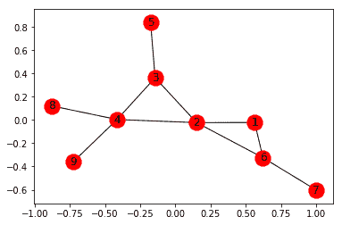
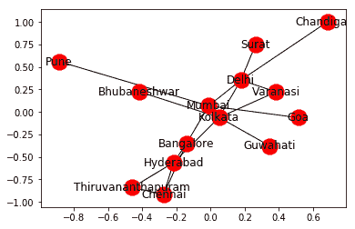
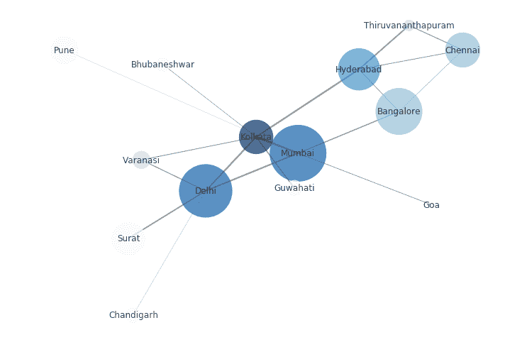
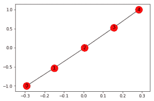
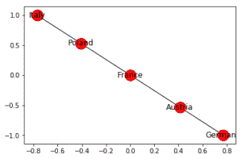
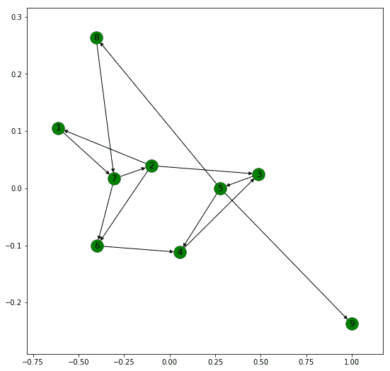
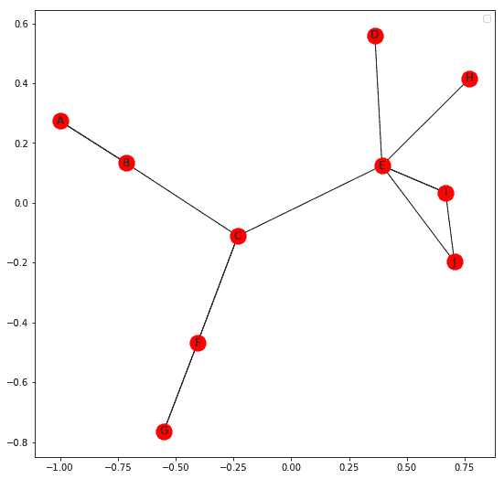

# 网络中的有向图、多重图和可视化

> 原文:[https://www . geesforgeks . org/有向图-多图-和-可视化-in-networkx/](https://www.geeksforgeeks.org/directed-graphs-multigraphs-and-visualization-in-networkx/)

先决条件:[图形的基本可视化技术](https://www.geeksforgeeks.org/python-visualize-graphs-generated-in-networkx-using-matplotlib/)

在[上一篇文章](https://www.geeksforgeeks.org/networkx-python-software-package-study-complex-networks/)中，我们已经学习了 Networkx 模块的基础知识以及如何创建无向图。注意，Networkx 模块很容易输出各种 Graph 参数，如下例所示。

```
import networkx as nx

edges = [(1, 2), (1, 6), (2, 3), (2, 4), (2, 6), 
         (3, 4), (3, 5), (4, 8), (4, 9), (6, 7)]

G.add_edges_from(edges)
nx.draw_networkx(G, with_label = True)

print("Total number of nodes: ", int(G.number_of_nodes()))
print("Total number of edges: ", int(G.number_of_edges()))
print("List of all nodes: ", list(G.nodes()))
print("List of all edges: ", list(G.edges(data = True)))
print("Degree for all nodes: ", dict(G.degree()))

print("Total number of self-loops: ", int(G.number_of_selfloops()))
print("List of all nodes with self-loops: ",
             list(G.nodes_with_selfloops()))

print("List of all nodes we can go to in a single step from node 2: ",
                                                 list(G.neighbors(2)))
```

**输出:**


> 节点总数:9
> 边总数:10
> 所有节点列表:【1，2，3，4，5，6，7，8，9】
> 所有边列表:[(1，2，{})，(1，6，{})，(2，3，{})，(2，4，{})，(2，6，{})，(3，4，{})，(3，5，{})，(4，8，{}) 9: 1}
> 自循环总数:0
> 具有自循环的所有节点列表:[]
> 我们可以从节点 2 一步到达的所有节点列表:[1，3，4，6]

## 创建加权无向图–

**添加所有边的列表以及各种权重–**

```
import networkx as nx
G = nx.Graph()

edges = [(1, 2, 19), (1, 6, 15), (2, 3, 6), (2, 4, 10), 
         (2, 6, 22), (3, 4, 51), (3, 5, 14), (4, 8, 20),
         (4, 9, 42), (6, 7, 30)]

G.add_weighted_edges_from(edges)
nx.draw_networkx(G, with_labels = True)
```

我们可以通过边列表来添加边，边列表需要以`.txt`格式保存(例如 edge_list.txt)

```
G = nx.read_edgelist('edge_list.txt', data =[('Weight', int)])
```

```
1 2 19
1 6 15
2 3 6
2 4 10
2 6 22
3 4 51
3 5 14
4 8 20
4 9 42
6 7 30
```

**边缘列表也可以通过熊猫数据框–**读取

```
import pandas as pd

df = pd.read_csv('edge_list.txt', delim_whitespace = True, 
                   header = None, names =['n1', 'n2', 'weight'])

G = nx.from_pandas_dataframe(df, 'n1', 'n2', edge_attr ='weight')

# The Graph diagram does not show the edge weights. 
# However, we can get the weights by printing all the
# edges along with the weights by the command below
print(list(G.edges(data = True)))
```

**输出:**

```
[(1, 2, {'weight': 19}),
 (1, 6, {'weight': 15}),
 (2, 3, {'weight': 6}),
 (2, 4, {'weight': 10}),
 (2, 6, {'weight': 22}),
 (3, 4, {'weight': 51}),
 (3, 5, {'weight': 14}),
 (4, 8, {'weight': 20}),
 (4, 9, {'weight': 42}),
 (6, 7, {'weight': 30})]

```

我们现在将探索图形的不同可视化技术。

为此，我们创建了一个关于印度各城市及其之间距离的数据集，并将其保存在`.txt`文件`edge_list.txt`中。

```
Kolkata Mumbai 2031
Mumbai Pune 155
Mumbai Goa 571
Kolkata Delhi 1492
Kolkata Bhubaneshwar 444
Mumbai Delhi 1424
Delhi Chandigarh 243
Delhi Surat 1208
Kolkata Hyderabad 1495
Hyderabad Chennai 626
Chennai Thiruvananthapuram 773
Thiruvananthapuram Hyderabad 1299
Kolkata Varanasi 679
Delhi Varanasi 821
Mumbai Bangalore 984
Chennai Bangalore 347
Hyderabad Bangalore 575
Kolkata Guwahati 1031

```

现在，我们将通过以下代码制作一个图表。我们还将向所有城市添加一个节点属性，它将成为每个城市的人口。

```
import networkx as nx

G = nx.read_weighted_edgelist('edge_list.txt', delimiter =" ")

population = {
        'Kolkata' : 4486679,
        'Delhi' : 11007835,
        'Mumbai' : 12442373,
        'Guwahati' : 957352,
        'Bangalore' : 8436675,
        'Pune' : 3124458,
        'Hyderabad' : 6809970,
        'Chennai' : 4681087,
        'Thiruvananthapuram' : 460468,
        'Bhubaneshwar' : 837737,
        'Varanasi' : 1198491,
        'Surat' : 4467797,
        'Goa' : 40017,
        'Chandigarh' : 961587
        }

# We have to set the population attribute for each of the 14 nodes
for i in list(G.nodes()):
    G.nodes[i]['population'] = population[i]

nx.draw_networkx(G, with_label = True)
# This line allows us to visualize the Graph
```

**输出:**


但是，我们可以通过以下步骤自定义网络，以直观的方式提供更多信息:

1.  节点的大小与城市人口成正比。
2.  节点的颜色强度与节点的度数成正比。
3.  边缘的宽度与边缘的重量成正比，在这种情况下，与城市之间的距离成正比。

```
# fixing the size of the figure
plt.figure(figsize =(10, 7))

node_color = [G.degree(v) for v in G]
# node colour is a list of degrees of nodes

node_size = [0.0005 * nx.get_node_attributes(G, 'population')[v] for v in G]
# size of node is a list of population of cities

edge_width = [0.0015 * G[u][v]['weight'] for u, v in G.edges()]
# width of edge is a list of weight of edges

nx.draw_networkx(G, node_size = node_size, 
                 node_color = node_color, alpha = 0.7,
                 with_labels = True, width = edge_width,
                 edge_color ='.4', cmap = plt.cm.Blues)

plt.axis('off')
plt.tight_layout();
```

**输出:**


我们可以在上面的代码中看到，我们已经将布局类型指定为紧密。您可以找到不同的布局技术，并尝试其中一些，如下面的代码所示:

```
print("The various layout options are:")
print([x for x in nx.__dir__() if x.endswith('_layout')])
# prints out list of all different layout options

node_color = [G.degree(v) for v in G]
node_size = [0.0005 * nx.get_node_attributes(G, 'population')[v] for v in G]
edge_width = [0.0015 * G[u][v]['weight'] for u, v in G.edges()]

plt.figure(figsize =(10, 9))
pos = nx.random_layout(G)
print("Random Layout:")

# demonstrating random layout
nx.draw_networkx(G, pos, node_size = node_size, 
                 node_color = node_color, alpha = 0.7, 
                 with_labels = True, width = edge_width,
                 edge_color ='.4', cmap = plt.cm.Blues)

plt.figure(figsize =(10, 9))
pos = nx.circular_layout(G)
print("Circular Layout")

# demonstrating circular layout
nx.draw_networkx(G, pos, node_size = node_size, 
                 node_color = node_color, alpha = 0.7, 
                 with_labels = True, width = edge_width, 
                 edge_color ='.4', cmap = plt.cm.Blues)
```

**输出:**

```
The various layout options are:
['rescale_layout',
 'random_layout',
 'shell_layout',
 'fruchterman_reingold_layout',
 'spectral_layout',
 'kamada_kawai_layout',
 'spring_layout',
 'circular_layout']

Random Layout:

Circular Layout:

```

Networkx 允许我们创建一个路径图，即以下列方式连接多个节点的直线:

```
G2 = nx.path_graph(5)
nx.draw_networkx(G2, with_labels = True)
```



我们可以重命名节点–

```
G2 = nx.path_graph(5)

new = {0:"Germany", 1:"Austria", 2:"France", 3:"Poland", 4:"Italy"}
G2 = nx.relabel_nodes(G2, new)
nx.draw_networkx(G2, with_labels = True)
```



## 创建有向图–

网络允许我们使用有向图。它们的创建、节点和边的添加等。与这里讨论的无向图完全相似。

下面的代码显示了有向图上的基本操作。

```
import networkx as nx
G = nx.DiGraph()
G.add_edges_from([(1, 1), (1, 7), (2, 1), (2, 2), (2, 3), 
                  (2, 6), (3, 5), (4, 3), (5, 4), (5, 8),
                  (5, 9), (6, 4), (7, 2), (7, 6), (8, 7)])

plt.figure(figsize =(9, 9))
nx.draw_networkx(G, with_label = True, node_color ='green')

# getting different graph attributes
print("Total number of nodes: ", int(G.number_of_nodes()))
print("Total number of edges: ", int(G.number_of_edges()))
print("List of all nodes: ", list(G.nodes()))
print("List of all edges: ", list(G.edges()))
print("In-degree for all nodes: ", dict(G.in_degree()))
print("Out degree for all nodes: ", dict(G.out_degree))

print("Total number of self-loops: ", int(G.number_of_selfloops()))
print("List of all nodes with self-loops: ",
             list(G.nodes_with_selfloops()))

print("List of all nodes we can go to in a single step from node 2: ",
                                                list(G.successors(2)))

print("List of all nodes from which we can go to node 2 in a single step: ",
                                                    list(G.predecessors(2)))
```

**输出:**


> 节点总数:9
> 边总数:15
> 所有节点列表:【1，2，3，4，5，6，7，8，9】
> 所有边列表:【(1，1)，(1，7)，(2，1)，(2，2)，(2，3)，(2，3)，(2，6)，(3，5)，(4，3)，(5，8)，(5，9)，(5，4)，(6，4)，(7，2)，(7，6)，(8，7)】
> 所有节点的入度:【1: 2，9】 9: 1}
> 所有节点的出度:{1: 2，2: 4，3: 1，4: 1，5: 3，6: 1，7: 2，8: 1，9: 0}
> 自循环总数:2
> 具有自循环的所有节点列表:[1，2]
> 我们可以从节点 2 一步到达的所有节点列表:[1，2，3，6]
> 我们可以一步到达节点 2 的所有节点列表:[2，2

现在，我们将展示多图的基本操作。网络允许我们创建有向和无向多重图。多重图是多个平行边可以连接相同节点的图。
例如，让我们创建一个由 10 个人组成的网络，A、B、C、D、E、F、G、H、I 和 j。他们之间有四种不同的关系，即朋友、同事、家人和邻居。两个人之间的关系不仅限于一种。

但是网络中多图的可视化还不清楚。它无法单独显示多条边，这些边会重叠。

```
import networkx as nx
import matplotlib.pyplot as plt

G = nx.MultiGraph()
relations = [('A', 'B', 'neighbour'), ('A', 'B', 'friend'), ('B', 'C', 'coworker'),
             ('C', 'F', 'coworker'), ('C', 'F', 'friend'), ('F', 'G', 'coworker'),
             ('F', 'G', 'family'), ('C', 'E', 'friend'), ('E', 'D', 'family'),
             ('E', 'I', 'coworker'), ('E', 'I', 'neighbour'), ('I', 'J', 'coworker'),
             ('E', 'J', 'friend'), ('E', 'H', 'coworker')]

for i in relations:
    G.add_edge(i[0], i[1], relation = i[2])

plt.figure(figsize =(9, 9))
nx.draw_networkx(G, with_label = True)

# getting various graph properties
print("Total number of nodes: ", int(G.number_of_nodes()))
print("Total number of edges: ", int(G.number_of_edges()))
print("List of all nodes: ", list(G.nodes()))
print("List of all edges: ", list(G.edges(data = True)))
print("Degree for all nodes: ", dict(G.degree()))
print("Total number of self-loops: ", int(G.number_of_selfloops()))
print("List of all nodes with self-loops: ", list(G.nodes_with_selfloops()))
print("List of all nodes we can go to in a single step from node E: ",
                                               list(G.neighbors('E")))
```

**输出:**


> 节点总数:10
> 边总数:14
> 所有节点列表:['E '，' I '，' D '，' B '，' C '，' F '，' H '，' A '，' J '，' G']
> 所有边列表:[('E '，' I '，{ ' relationship ':' co worker ' })，(' E '，' I '，{ ' relationship ':' neighbor ' })，(' E '，' H '，{ ' relationship ':' co worker ' })，(' E '，' J '，{ ' relationship ':' friend ' ' { '关系':'同事' })，(' F '，' G '，{ '关系':'家庭' })]
> 所有节点的度:{'E': 6，' I': 3，' B': 3，' D': 1，' F': 4，' A': 2，' G': 2，' H': 1，' J': 2，' C': 4}
> 自循环总数:0
> 具有自循环的所有节点列表:[]
> 我们可以从节点 E 一步到位的所有节点列表:['I '，'

类似地，多向图可以通过使用

```
G = nx.MultiDiGraph()
```