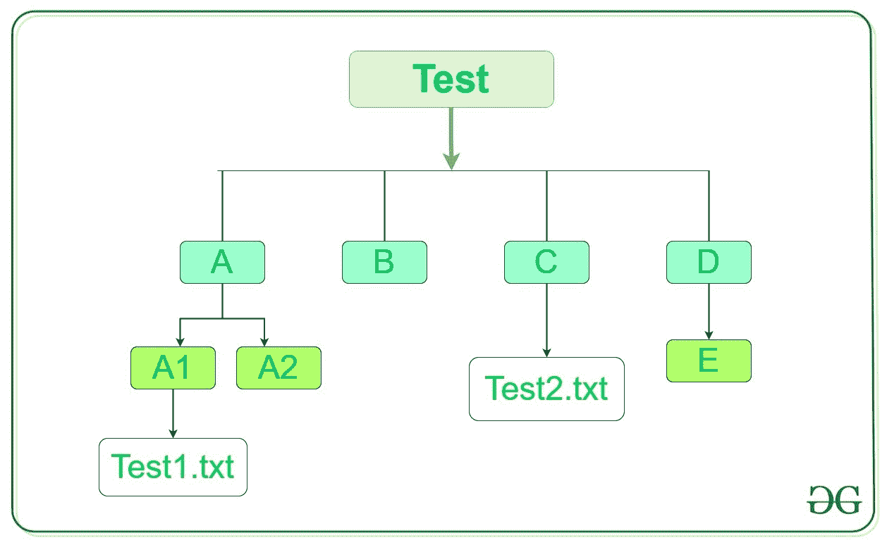

# Python 中的目录遍历工具

> 原文:[https://www . geesforgeks . org/directory-遍历-python 中的工具/](https://www.geeksforgeeks.org/directory-traversal-tools-in-python/)

`[os.walk()](https://www.geeksforgeeks.org/os-walk-python/)`方法的操作系统模块可以用来列出所有的目录。这种方法基本上是在目录树中自顶向下或自底向上生成文件名。对于树中以目录顶部(包括顶部本身)为根的每个目录，它产生一个三元组(目录路径、目录名、文件名)。

*   **目录路径:**目录路径的字符串
*   **目录名:**从根目录开始的所有子目录。
*   **文件名:**根目录下的所有文件。

> **语法:** os.walk(顶部，自上而下=真，一个错误=无，跟随链接=假)
> 
> **参数:**
> **top:** 起始目录为 os.walk()。
> **自上而下:**如果该可选参数为真，则从上而下扫描目录，否则从下而上扫描目录。默认情况下，这是真的。
> **onerror:** 它是一个处理可能出现的错误的函数。
> **跟随链接:**如果设置为真，这将访问符号链接所指向的目录。
> 
> **返回类型:**对于以目录顶部为根的树中的每个目录(包括顶部本身)，它生成一个三元组(目录路径、目录名、文件名)。

**示例:**假设目录如下:



我们想列出目录树中的所有子目录和文件。下面是实现。

```py
# Python program to list out 
# all the sub-directories and files 

import os 

# List to store all  
# directories 
L = []

# Traversing through Test 
for root, dirs, files in os.walk('Test'): 

    # Adding the empty directory to 
    # list 
    L.append((root, dirs, files)) 

print("List of all sub-directories and files:") 
for i in L:
    print(i)
```

**输出:**

```py
List of all sub-directories and files:
('Test', ['B', 'C', 'D', 'A'], [])
('Test/B', [], [])
('Test/C', [], ['test2.txt'])
('Test/D', ['E'], [])
('Test/D/E', [], [])
('Test/A', ['A2', 'A1'], [])
('Test/A/A2', [], [])
('Test/A/A1', [], ['test1.txt'])

```

上面的代码可以使用列表理解来缩短，这是一种更皮通的方式。下面是实现。

```py
# Python program to list out 
# all the sub-directories and files 

import os 

# List comprehension to enter 
# all directories to list 

L = [(root, dirs, files) for root, dirs, files, in os.walk('Test')] 

print("List of all sub-directories and files:") 
for i in L:
    print(i)
```

**输出:**

```py
List of all sub-directories and files:
('Test', ['B', 'C', 'D', 'A'], [])
('Test/B', [], [])
('Test/C', [], ['test2.txt'])
('Test/D', ['E'], [])
('Test/D/E', [], [])
('Test/A', ['A2', 'A1'], [])
('Test/A/A2', [], [])
('Test/A/A1', [], ['test1.txt'])

```