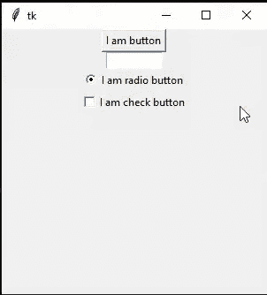
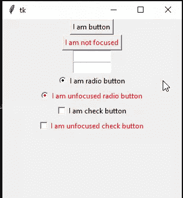

# 禁用 tkinter 小部件的焦点–Python

> 原文:[https://www . geesforgeks . org/disable-focus-for-tkinter-widgets-python/](https://www.geeksforgeeks.org/disable-focus-for-tkinter-widgets-python/)

**先决条件:** [**巨蟒-Tkinter**](https://www.geeksforgeeks.org/create-first-gui-application-using-python-tkinter/)

在本文中，我们将讨论如何在 Tkinter 框架中禁用小部件的焦点。为了禁用焦点，我们在小部件中使用 **takefocus** 选项，并将其值指定为 0。

### 逐步实施:

**步骤 1:** 导入 tkinter 并初始化 Tkinter 窗口

## 蟒蛇 3

```py
# import tkinter 
import tkinter as tk

# initialize a tkinter window
root = tk.Tk()

# Creating the geometry with width and height of 300px
root.geometry("300x300")

# creating the body loop
root.mainloop()
```

**步骤 2:** 向应用程序添加一些小部件

> **#创建按钮部件**
> 
> btn = tk。按钮(根，text =“Button”)#初始化小部件。
> 
> btn.pack() #在应用程序中调用小部件

**代码:**

## 蟒蛇 3

```py
import tkinter as tk

# initialize a tkinter window
root = tk.Tk()

# Creating the geometry with width and height of 300px
root.geometry("300x300")

# create a button
btn = tk.Button(root, text ="I am button")
btn.pack()

# text widget
txt = tk.Entry(root, width=10)
txt.pack()

# create a radio button
rb = tk.Radiobutton(root, text ="I am radio button") 
rb.pack() 

# create a check button
cb = tk.Checkbutton(root, text = "I am check button")
cb.pack()

root.mainloop()
```

**输出:**

在这里，我们注意到，在按下 TAB 键后，我们开始关注每个小部件。



**步骤 3:** 在我们的程序中添加禁用聚焦功能。

我们使用 **takefocus** 参数来禁用焦点

```py
Syntax: takefocus = 0

# for button
btn = tk.Button(root, text="Button", takefocus=0)
```

该程序的方法是在 takefocus 参数的帮助下禁用小部件的焦点。为此，我们将其值设置为 0。其他小部件启用了焦点。

**代码:**

## 蟒蛇 3

```py
import tkinter as tk

root = tk.Tk()
root.geometry("300x300")

# creating button
btn = tk.Button(root, text ="I am button")
btn.pack()

# takefocus is set to 0 for disabling the TAB key
# focus in widget
btn_no_focus = tk.Button(root, text ="I am not focused",
                         takefocus = 0,foreground = "red")
btn_no_focus.pack()

# created an entry widget with width 10
txt = tk.Entry(root, width = 10)
txt.pack()

# creating a entry widget with width 10 and focus is
# 0 hence disabled 
txt = tk.Entry(root, width = 10, takefocus = 0)
txt.pack()

# Creating radiobutton
rb = tk.Radiobutton(root, text ="I am radio button") 
rb.pack() 

# putting an takefocus=0 for disabling focus
rb_unfocus = tk.Radiobutton(root, text ="I am unfocused radio button", 
                            takefocus = 0,foreground = "red") 
rb_unfocus.pack()

# creating the checkbutton
cb = tk.Checkbutton(root, text = "I am check button")
cb.pack()

cb_unfocused = tk.Checkbutton(root, text = "I am unfocused check button", 
                              takefocus = 0, foreground = "red")
cb_unfocused.pack()

root.mainloop()
```

**输出:**

红色小部件有 **takefocus=0** ，其他没有这个说法。红色只是为了清晰起见，你也可以去掉它。

