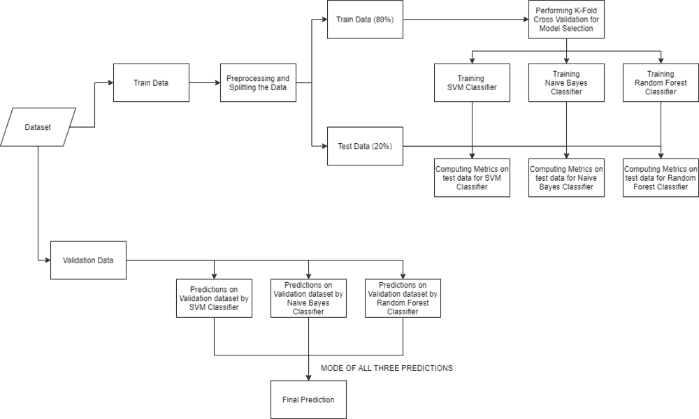
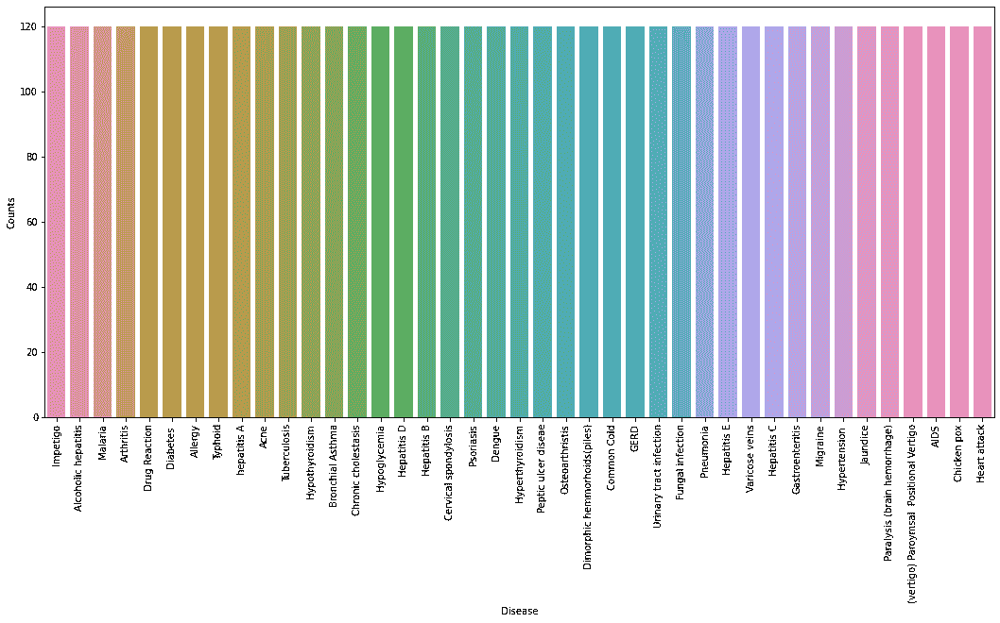

# 使用机器学习的疾病预测

> 原文:[https://www . geesforgeks . org/疾病-预测-使用-机器学习/](https://www.geeksforgeeks.org/disease-prediction-using-machine-learning/)

本文旨在实现一个健壮的机器学习模型，该模型可以根据人类所具有的症状有效地预测人类的疾病。让我们看看如何解决这个机器学习问题:

## **进场:**

*   **收集数据:**数据准备是任何机器学习问题的首要步骤。我们将使用来自卡格尔的[数据集](https://www.kaggle.com/kaushil268/disease-prediction-using-machine-learning)来解决这个问题。这个数据集由两个 CSV 文件组成，一个用于训练，一个用于测试。数据集中总共有 133 列，其中 132 列代表症状，最后一列是预后。
*   **清理数据:**清理是机器学习项目中最重要的一步。我们数据的质量决定了我们机器学习模型的质量。因此，在将数据输入模型进行训练之前，总是需要对数据进行清理。在我们的数据集中，所有的列都是数字的，目标列即预测是字符串类型，并使用[标签编码器](https://www.geeksforgeeks.org/ml-label-encoding-of-datasets-in-python/)编码为数字形式。
*   **模型构建:**数据采集、清理后，数据准备就绪，可以用来训练机器学习模型。我们将使用这些清理过的数据来训练支持向量分类器、朴素贝叶斯分类器和随机森林分类器。我们将使用[混淆矩阵](https://www.geeksforgeeks.org/confusion-matrix-machine-learning/)来确定模型的质量。
*   **推断:**在训练三个模型之后，我们将通过组合所有三个模型的预测来针对输入症状预测疾病。这使得我们的整体预测更加稳健和准确。

最后，我们将定义一个函数，该函数以逗号分隔的症状作为输入，使用训练好的模型基于症状预测疾病，并以 JSON 格式返回预测。

## **实施工作流程:**



确保下载[训练](https://media.geeksforgeeks.org/wp-content/cdn-uploads/20210826192554/Training.csv)和[测试](https://media.geeksforgeeks.org/wp-content/cdn-uploads/20210826192633/Testing.csv)，并将 train.csv、test.csv 放入数据集文件夹。打开 jupyter 笔记本，单独运行代码，以便更好地理解。

## 蟒蛇 3

```py
# Importing libraries
import numpy as np
import pandas as pd
from scipy.stats import mode
import matplotlib.pyplot as plt
import seaborn as sns
from sklearn.preprocessing import LabelEncoder
from sklearn.model_selection import train_test_split, cross_val_score
from sklearn.svm import SVC
from sklearn.naive_bayes import GaussianNB
from sklearn.ensemble import RandomForestClassifier
from sklearn.metrics import accuracy_score, confusion_matrix

%matplotlib inline
```

## **读取数据集**

首先，我们将使用熊猫库从文件夹中加载数据集。在读取数据集时，我们将删除空列。这个数据集是一个干净的数据集，没有空值，所有的特征都由 0 和 1 组成。每当我们解决一个分类任务时，都有必要检查我们的目标列是否平衡。我们将使用条形图来检查数据集是否平衡。

## 蟒蛇 3

```py
# Reading the train.csv by removing the
# last column since it's an empty column
DATA_PATH = "dataset/Training.csv"
data = pd.read_csv(DATA_PATH).dropna(axis = 1)

# Checking whether the dataset is balanced or not
disease_counts = data["prognosis"].value_counts()
temp_df = pd.DataFrame({
    "Disease": disease_counts.index,
    "Counts": disease_counts.values
})

plt.figure(figsize = (18,8))
sns.barplot(x = "Disease", y = "Counts", data = temp_df)
plt.xticks(rotation=90)
plt.show()
```

**输出:**



从上面的图中，我们可以观察到数据集是一个平衡的数据集，即每种疾病正好有 120 个样本，不需要进一步平衡。我们可以注意到，我们的目标列，即预测列是对象数据类型，这种格式不适合训练机器学习模型。因此，我们将使用标签编码器将预测列转换为数字数据类型。标签编码器通过为标签指定唯一的索引，将标签转换为数字形式。如果标签的总数是 n，那么分配给每个标签的数字将在 0 到 n-1 之间。

## 蟒蛇 3

```py
# Encoding the target value into numerical
# value using LabelEncoder
encoder = LabelEncoder()
data["prognosis"] = encoder.fit_transform(data["prognosis"])
```