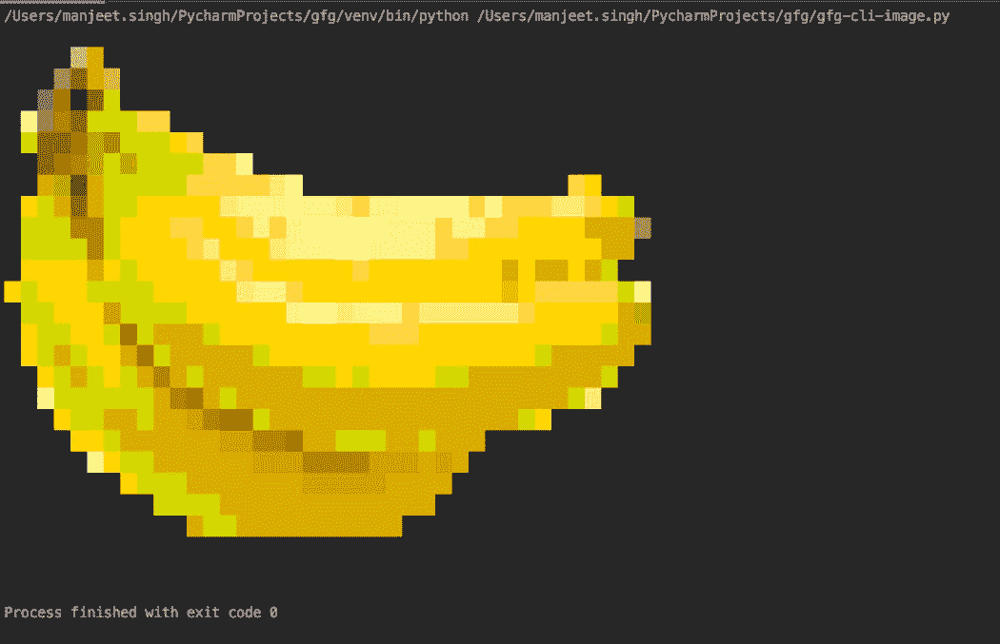
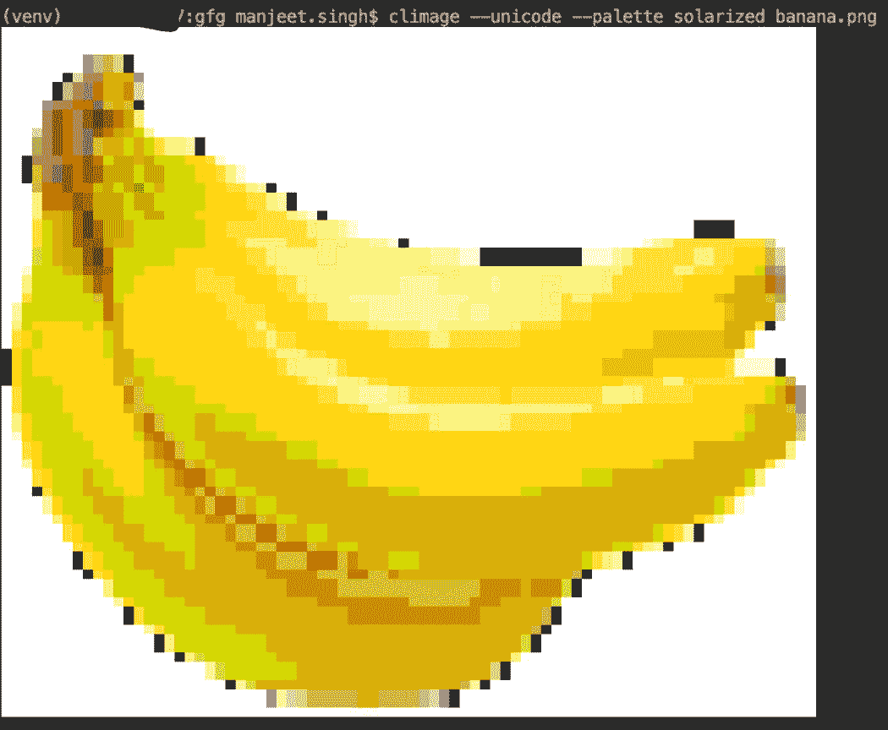
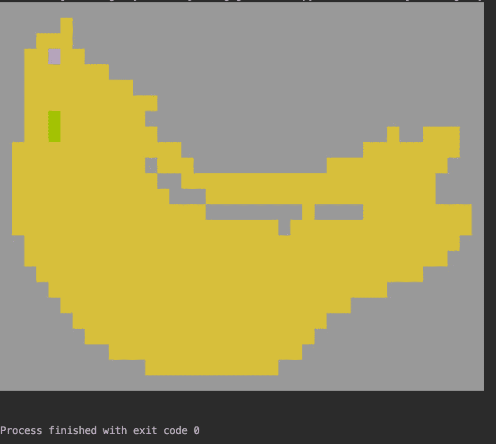

# 使用 Python 在终端上显示图像

> 原文:[https://www . geesforgeks . org/display-images-on-terminal-use-python/](https://www.geeksforgeeks.org/display-images-on-terminal-using-python/)

在本文中，我们将讨论如何使用 Python 在终端上显示图像。我们将使用**气候**模块进行同样的操作。本模块具有以下功能–

*   它有助于将图像转换为其 ANSI 转义码，以便能够在命令行界面上进行转换和打印。
*   它允许 8/16/256 位彩色编码，以获得生动的图像。
*   它为更多细节提供 ASCII/Unicode 支持，并为不同的终端主题提供可调托盘

### 装置

这个模块没有内置 Python。要安装此软件，请在终端中键入以下命令。

```py
pip install climage
```

安装完成后，下一步是导入 convert()和 to_file()函数，前者执行转换任务，后者执行转换任务，并在需要时保存到输出文件。

**语法:**

> 转换(文件名，is _ unicode =假，is _ truecolor =假，is _ 256color =真，is _ 16color =假，is _ 8color =假，宽度=80，调色板=“默认”)
> 
> **参数:**
> **文件名:**图像文件名称。
> **为 _unicode :** 如果为真，则以 unicode 格式进行转换，否则将使用 ASCII 字符。
> **is_truecolor :** 是否在生成时使用 RGB 颜色，如果终端支持。默认值为假。
> **is_256color :** 是否使用 256 色编码。默认值为真。
> **is_16color :** 是否使用 16 色编码。默认值为假。
> **is_8color :** 是否使用前 8 个系统颜色。默认值为假。
> **宽度:**要使用的控制台块数。默认为 80。
> **调色板:**设置 RGB 颜色方案到系统颜色的映射。选项有:["default "、" xterm "、" linuxconsole "、" solarized 化"、" rxvt "、" tango "、" gruvbox "、" grub box dark "]。默认为“默认”。

> to_file(infile，outfile，is_unicode=False，is_truecolor=False，is_256color=True，is_16color=False，is_8color=False，宽度=80，调色板=“默认”)
> 
> **参数:**
> **中缀:**图像文件的名称/路径。
> **输出文件:**存储 ANSI 编码字符串的文件。

**例 1:终端打印**

**使用的图像:**


## 蟒蛇 3

```py
import climage

# converts the image to print in terminal
# inform of ANSI Escape codes
output = climage.convert('banana.png')

# prints output on console.
print(output)
```

**输出:**



**示例 2:将编码保存到文件。**

## 蟒蛇 3

```py
import climage

# saves the converted encoded string
# to banana_ansi file.
output = climage.to_file('banana.png', 'banana_ansi')
```

**输出:**

> [48;5;15m[48；5;15m[48；5;15m[48；5;15m[48；5;15m[48；5;15m[48；5;15m[48；5;15m[48；5;15m[48；5;15m[48；5;15m[48；5;15m[48；5;15m[48；5;15m[48；5;15m[48；5;15m[48；5;15m[48；5;15m[48；5;15m[48；5;15m[48；5;15m[48；5;15m[48；5;15m[48；5;15m[48；5;15m[48；5;15m[48；5;15m[48；5;15m[48；5;15m[48；5;15m[48；5;15m[48；5;15m[48；5;15m[48；5;15m[48；5;15m[48；5;15m[48；5;15m[48；5;15m[48；5;15m[48；5;15 米[0 米...

**示例 3:使用命令行工作**

类似的函数也可以使用类似的结构和参数来处理命令行，如前所述。

**语法:**

> climate[-h][-v][-unicode |-ascii][-true color |-256 color |-16 color |-8 color][-palette { default，xterm，linuxconsole，solarized，xvt，tango，gruvbox，gruvboxdark }][-w width][-o file]input file

**工作:**


**示例 4:使用命令行的自定义示例**

以下示例显示了如何使用自定义示例设置不同的可能参数。



**示例 5:使用 Python 代码的自定义示例。**

延伸到上一部分，本节展示了如何从代码中使用自定义参数来构造不同的图像。

## 蟒蛇 3

```py
import climage

# converts the image to print in terminal
# with 8 color encoding and palette tango
output = climage.convert('banana.png', is_8color=True, 
                         palette='tango', is_256color=False)

# prints output on console.
print(output)
```

**输出:**

