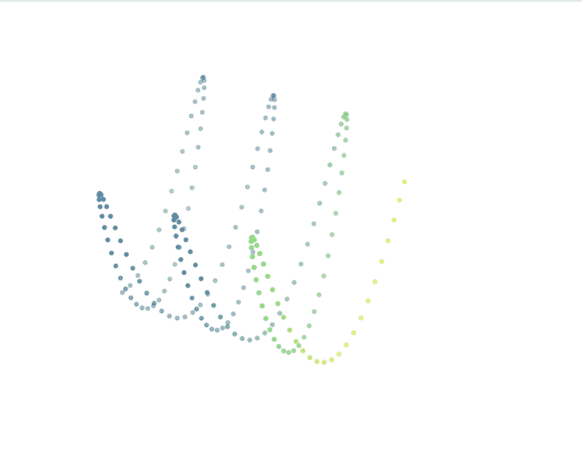
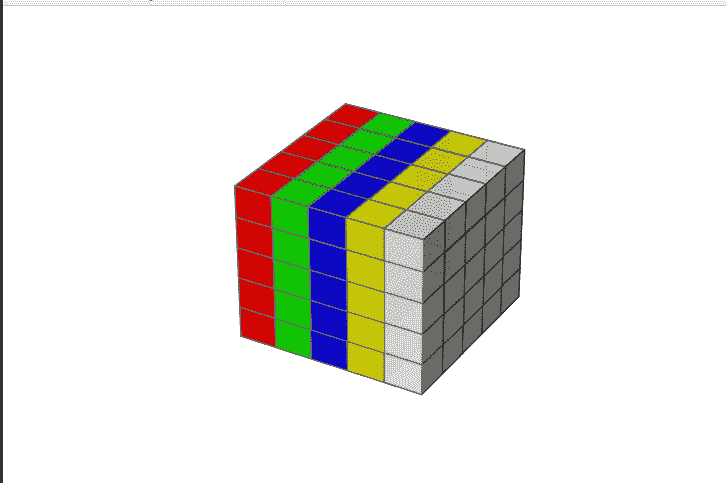
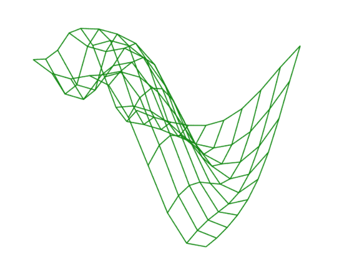
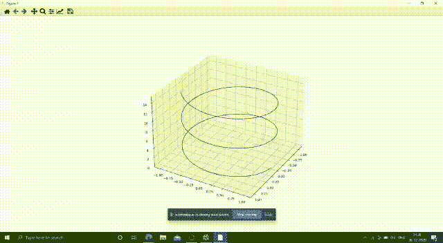

# 用 Python 显示 3D 图像

> 原文:[https://www . geeksforgeeks . org/displaying-3d-images-in-python/](https://www.geeksforgeeks.org/displaying-3d-images-in-python/)

在本文中，我们将讨论如何在 Python 中使用不同的方法(即 3d 投影、view_init()方法和使用循环)显示 3D 图像。

### 需要模块

*   [Matplotlib:](https://www.geeksforgeeks.org/python-introduction-matplotlib/) 这是一个 Python 编程的绘图库，它作为可视化实用程序库，Matplotlib 构建在 NumPy 数组上，旨在与更广泛的 SciPy 堆栈一起工作。
*   [Numpy:](https://www.geeksforgeeks.org/python-numpy/) 是一个通用的数组处理包。它提供了高性能多维数组和矩阵以及大量高级数学函数。
*   mpl_toolkits:它提供了一些基本的 3d 绘图(散点、冲浪、线、网格)工具。

**例 1:**

在这个例子中，我们创建了散射正弦波的 3d 图像。在这里，我们使用“NP . array”和“np.sin”创建了一个点数组。NumPy.sin:这个数学函数帮助用户计算所有 x(作为数组元素)的三角正弦，另一个函数是散点图()方法，这是用于绘制散点图的 matplotlib 库。

> **语法:**NP . array(开始、停止、步进) :返回一个数组，数组中的元素按照间隔均匀分布。
> 
> **参数:**
> 
> *   开始:间隔范围的开始。
> *   停止:间隔范围结束。
> *   步长:间隔的步长。

## 蟒蛇 3

```py
# Import libraries
import numpy as np
import matplotlib.pyplot as plt
from mpl_toolkits.mplot3d import Axes3D

# Change the Size of Graph using
# Figsize
fig = plt.figure(figsize=(10, 10))

# Generating a 3D sine wave
ax = plt.axes(projection='3d')

# Creating array points using
# numpy
x = np.arange(0, 20, 0.1)
y = np.sin(x)
z = y*np.sin(x)
c = x + y

# To create a scatter graph
ax.scatter(x, y, z, c=c)

# trun off/on axis
plt.axis('off')

# show the graph
plt.show()
```

**输出:**



**例 2:**

在这个例子中，我们选择的是维度 X =5，Y=5，Z=5 的 3D 轴，在[NP . one()](https://www.geeksforgeeks.org/numpy-ones-python/)中，我们传递的是立方体的维度。np.ones()函数返回一个给定形状和类型的新数组，带有 1。

> **语法:**numpy . one(shape，dtype = None)

完成上述步骤后，我们选择颜色不透明度为 alpha = 0.9(从 0.0–1.0 变化)。在下一步中，我们将在 [np.empty()](https://www.geeksforgeeks.org/numpy-empty-python/) 函数中传递轴的尺寸(即 5，5，5) +立方体的面的数量(即 0-4)，然后我们将传递立方体的每个面的颜色组合和不透明度，最后，体素用于定制大小、位置和颜色。np.empty()函数返回给定形状和类型的新数组，而不初始化条目。

> **语法:** numpy.empty(shape)

## 蟒蛇 3

```py
# Import libraries
import matplotlib.pyplot as plt
from mpl_toolkits.mplot3d import Axes3D
import numpy as np

# Change the Size of Graph using
# Figsize
fig = plt.figure(figsize=(10, 10))

# Generating a 3D sine wave
ax = plt.axes(projection='3d')

# Create axis
axes = [5, 5, 5]

# Create Data
data = np.ones(axes)

# Controll Tranperency
alpha = 0.9

# Control colour
colors = np.empty(axes + [4])

colors[0] = [1, 0, 0, alpha]  # red
colors[1] = [0, 1, 0, alpha]  # green
colors[2] = [0, 0, 1, alpha]  # blue
colors[3] = [1, 1, 0, alpha]  # yellow
colors[4] = [1, 1, 1, alpha]  # grey

# trun off/on axis
plt.axis('off')

# Voxels is used to customizations of
# the sizes, positions and colors.
ax.voxels(data, facecolors=colors, edgecolors='grey')
```

**输出:**



**例 3:**

在这个例子中，我们使用 [numpy.linspace()](https://www.geeksforgeeks.org/numpy-linspace-python/) 创建一个由 10 个线性放置的元素组成的数组，这些元素在-1 和 5 之间，包括 1 和 5，然后网格函数返回两个二维数组，之后为了可视化三维线框的图像，我们需要传递 X，Y，Z，color 的坐标(可选)。

## 蟒蛇 3

```py
#Import libraries
import numpy as np
import matplotlib.pyplot as plt
from mpl_toolkits.mplot3d import Axes3D

#Change the Size of Graph using Figsize
fig = plt.figure(figsize=(10,10))

#Generating a 3D sine wave
ax = plt.axes(projection='3d')

# assigning coordinates
x = np.linspace(-1, 5, 10)
y = np.linspace(-1, 5, 10)
X, Y = np.meshgrid(x, y)
Z = np.sin(np.sqrt(X ** 2 + Y ** 2))

# creating the visualization
ax.plot_wireframe(X, Y, Z, color ='green')

# trun off/on axis
plt.axis('off')
```

**输出:**



**例 4:**

在这个例子中，我们绘制了一个螺旋图，我们将使用一个循环看到它的 360 度视图。这里， **view_init(elev=，azim=)** 这可用于以编程方式旋转轴。elev '存储 z 平面上的仰角。“azim”存储 x，y 平面中的方位角。构造函数。matplotlib 库 pyplot 模块中的 draw()函数用于以 0.001 的暂停时间间隔重绘当前图形。

## 蟒蛇 3

```py
from numpy import linspace
import numpy as np
import matplotlib.pyplot as plt
from mpl_toolkits import mplot3d

# Creating 3D figure
fig = plt.figure(figsize=(8, 8))
ax = plt.axes(projection='3d')

# Creating Dataset
z = np.linspace(0, 15, 1000)
x = np.sin(z)
y = np.cos(z)
ax.plot3D(x, y, z, 'green')

# 360 Degree view
for angle in range(0, 360):
    ax.view_init(angle, 30)
    plt.draw()
    plt.pause(.001)

plt.show()
```

**输出:**

