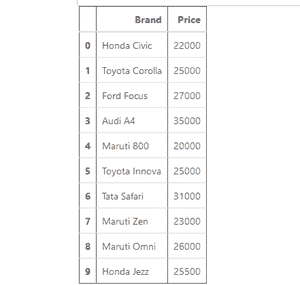
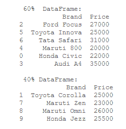
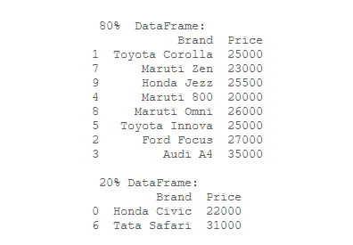

# 按比例划分数据帧

> 原文:[https://www . geesforgeks . org/divide-a-data frame in-a-ratio/](https://www.geeksforgeeks.org/divide-a-dataframe-in-a-ratio/)

[**【熊猫】**](https://www.geeksforgeeks.org/pandas-tutorial/) 是建立在 numpy 库之上的开源库。A [**数据框**](https://www.geeksforgeeks.org/python-pandas-dataframe/) 是一个二维数据结构，就像数据是以表格的方式排列成行和列一样。**[**DataFrame . sample()**](https://www.geeksforgeeks.org/python-pandas-dataframe-sample/)方法可以用来划分 data frame。**

> ****语法:**数据帧.样本(n =无，frac =无，替换=假，权重=无，random _ state =无，轴=无)**

**frac 属性是定义要使用的数据帧部分的属性。例如，frac = 0.25 表示将使用 25%的数据帧。**

**现在，让我们创建一个数据框架:**

## **蟒蛇 3**

```
# importing pandas as pd 
import pandas as pd

# dictionary
cars = {
  'Brand': ['Honda Civic', 'Toyota Corolla', 
            'Ford Focus', 'Audi A4', 'Maruti 800',
            'Toyota Innova', 'Tata Safari', 'Maruti Zen', 
            'Maruti Omni', 'Honda Jezz'],
   'Price': [22000, 25000, 27000, 35000,
             20000, 25000, 31000, 23000,
             26000, 25500]
 }

# create the dataframe 
df = pd.DataFrame(cars, 
                  columns = ['Brand',
                             'Price'])
# show the dataframe
df
```

****输出:****

****

****示例 1:** 将给定的数据帧分成 60%和 40%。**

## **蟒蛇 3**

```
# importing pandas as pd 
import pandas as pd

# dictionary
cars = {
  'Brand': ['Honda Civic', 'Toyota Corolla', 
            'Ford Focus', 'Audi A4', 'Maruti 800',
            'Toyota Innova', 'Tata Safari', 'Maruti Zen', 
            'Maruti Omni', 'Honda Jezz'],
   'Price': [22000, 25000, 27000, 35000,
             20000, 25000, 31000, 23000,
             26000, 25500]
 }

# create the dataframe 
df = pd.DataFrame(cars, 
                  columns = ['Brand',
                             'Price'])

# Print the 60% of the dataframe 
part_60 = df.sample(frac = 0.6)
print("\n 60%  DataFrame:")
print(part_60)

# Print the 40% of the dataframe 
part_40 = df.drop(part_60.index)
print("\n 40% DataFrame:")
print(part_40)
```

****输出:****

****

****示例 2:** 将给定的数据帧分成 80%和 20%。**

## **蟒蛇 3**

```
# importing pandas as pd 
import pandas as pd

# dictionary
cars = {
  'Brand': ['Honda Civic', 'Toyota Corolla', 
            'Ford Focus', 'Audi A4', 'Maruti 800',
            'Toyota Innova', 'Tata Safari', 'Maruti Zen', 
            'Maruti Omni', 'Honda Jezz'],
   'Price': [22000, 25000, 27000, 35000,
             20000, 25000, 31000, 23000,
             26000, 25500]
 }

# create the dataframe 
df = pd.DataFrame(cars, 
                  columns = ['Brand',
                             'Price'])

# Print the 80% of the dataframe 
part_80 = df.sample(frac = 0.8)
print("\n 80%  DataFrame:")
print(part_80)

# Print the 20% of the dataframe 
part_20 = df.drop(part_80.index)
print("\n 20% DataFrame:")
print(part_20)
```

****输出:****

****