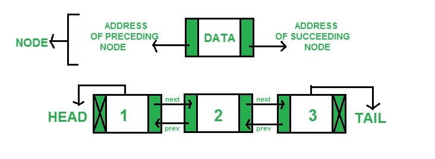

# Python 中 llist 模块的 dllist 类

> 原文:[https://www . geesforgeks . org/dllist-class-of-llist-module-in-python/](https://www.geeksforgeeks.org/dllist-class-of-llist-module-in-python/)

llist 是 CPython 的扩展模块，提供了基本的链表结构。它们出列的速度比标准列表快得多。

### 双向链表

这是一种链表，其中每个节点存储数据和两个地址(前后节点的地址)。一个简单得多的定义是，在双向链表中，每个节点都指向它前面的节点以及紧接其后的节点。
下图解释的更好:


在 llist 中，有一个 dllist 对象可以帮助成功实现双链表。

### 数据列表对象

**class llist . dllist([iterable])**
返回从提供的 iterable 初始化的新双链表。如果没有给定 iterables，则生成链表，但链表是空的。

```py
import llist
from llist import dllist

lst = llist.dllist(['first', 'second', 'third'])
print(lst)
```

**输出:**

```py
dllist([first, second, third])
```

dllist 支持以下属性:

*   **first** : read only attribute, prints the first attribute of the list and None if the list is empty

    ```py
    print(lst.first)
    ```

    **输出:**

    ```py
    dllistnode(first)
    ```

*   **last** : read only property, returns the last element of the list(tail) and None if the list is empty.

    ```py
    print(lst.last)
    ```

    **输出:**

    ```py
    dllistnode(third)
    ```

*   **size** : read only attribute that returns the size of the list

    ```py
    print(lst.size)
    ```

    **输出:**

    ```py
    3
    ```

dllist 还支持以下方法:

*   **append(x)** : adds x to the right side of the list and returns a inserted dllist node. If x already is a dlist node then a new node is created and initialized with the value extracted from x.

    ```py
    lst.append('fourth')
    print(lst)
    ```

    **输出:**

    ```py
    dllist([first, second, third, fourth])
    ```

*   **appendleft(x)** : adds x to the left side of the list and returns a inserted dllist node. If x already is a dllist node then a new node is created and initialized with the value extracted from x.

    ```py
    lst.appendleft('fourth')
    print(lst)
    ```

    **输出:**

    ```py
    dllist([fourth, first, second, third])
    ```

*   **appendright(x)** : adds x to the right side of the list and returns a inserted dllist node. If x already is a dllist node then a new node is created and initialized with the value extracted from x.

    ```py
    lst.appendright('fourth')
    print(lst)
    ```

    **输出:**

    ```py
    dllist([first, second, third, fourth])
    ```

*   **clear()** : removes all nodes from the list

    ```py
    lst.clear()
    print(lst)
    ```

    **输出:**

    ```py
    dllist()
    ```

*   **extend([iterable])** : adds elements from the iterable to the right side of the list.

    ```py
    lst.extend(['fourth', 'fifth'])
    print(lst)
    ```

    **输出:**

    ```py
    dllist([first, second, third, fourth, fifth])
    ```

*   **extendleft([iterable])** : adds elements from the iterable to the left side of the list

    ```py
    lst.extendleft(['fourth', 'fifth'])
    print(lst)
    ```

    **输出:**

    ```py
    dllist([fifth, fourth, first, second, third])
    ```

*   **extendright([iterable])** : adds elements from the iterable to the right side of the list

    ```py
    lst.extendright(['fourth', 'fifth'])
    print(lst)
    ```

    **输出:**

    ```py
    dllist([first, second, third, fourth, fifth])
    ```

*   **insert()** : adds provided element to the right side of the list. It is usually used to insert element at any point in the list and for that the element it should be inserted before should be provided.

    ```py
    lst.insert('fourth')
    node = lst.nodeat(2)
    lst.insert('fifth', node)
    print(lst)
    ```

    **输出:**

    ```py
    dllist([first, second, fifth, third, fourth])
    ```

*   **nodeat(index)** : returns node at a the specified index. Negative addresses are allowed.

    ```py
    print(lst.nodeat(2))
    print(lst.nodeat(-2))
    ```

    **输出:**

    ```py
    dllistnode(third)
    dllistnode(second)
    ```

*   **pop()** : removes and returns an element’s value from the right side of the list.

    ```py
    lst.pop()
    print(lst)
    ```

    **输出:**

    ```py
    dllist([first, second])
    ```

*   **popleft()** : removes and returns an element’s value from the left side of the list.

    ```py
    lst.popleft()
    print(lst)
    ```

    **输出:**

    ```py
    dllist([second, third])
    ```

*   **popright** : removes and returns an element’s value from the right side of the list.

    ```py
    lst.popright()
    print(lst)
    ```

    **输出:**

    ```py
    dllist([first, second])
    ```

*   **remove()** : removes the specified node form the list and returns the element stored in it.

    ```py
    node = lst.nodeat(1)
    lst.remove(node)
    print(lst)
    ```

    **输出:**

    ```py
    dllist([first, third])
    ```

*   **rotate(n)** : if n is positive rotates the list n steps to the right but if it is negative rotate it n steps to the left

    ```py
    lst.rotate(4)
    print(lst)
    ```

    **输出:**

    ```py
    dllist([third, first, second])
    ```

除了这些方法之外，dllist 还支持迭代、cmp(lst1，lst2)、富比较运算符、常数时间 len(lst)、hash(lst)和下标引用 lst[1234]，用于按索引访问元素。

**让我们进一步讨论 llist 中更多与 dllist 相关的对象:**

**1） dllistnode**

在双向链表中实现一个节点，如果提供了值，可以选择初始化这个节点。

```py
node = llist.dllistnode('zeroth')
print(node)
```

**输出:**

```py
dllistnode(zeroth)
```

此对象还支持以下属性:

*   **下一个**:只读属性，打印列表中的下一个节点
*   **prev** :只读属性，打印列表中的上一个节点
*   **值**:打印列表中存储的值

```py
node = lst.nodeat(1)
print(node.next)
print(node.prev)
print(node.value)
```

**输出:**

```py
dllistnode(third)
dllistnode(first)
second
```

**2) dllistiterator**

返回一个新的双向链表迭代器。这些对象不是由用户创建的，而是由 dllist 返回的。__iter__()方法来保存迭代状态。迭代 dllistiterator 接口将直接产生存储在节点中的值。

```py
import llist
from llist import dllist

lst = llist.dllist(['first', 'second', 'third'])

for value in lst:
  print(value)
```

**输出:**

```py
first
second
third
```