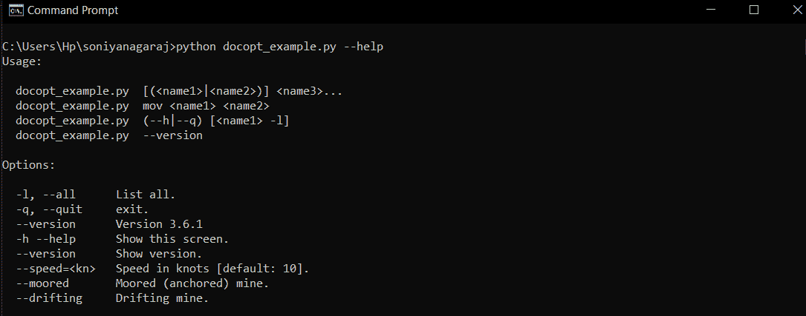

# Python 中的 Docopt 模块

> 原文:[https://www.geeksforgeeks.org/docopt-module-in-python/](https://www.geeksforgeeks.org/docopt-module-in-python/)

**Docopt** 是命令行界面描述模块。它帮助您为命令行应用程序定义接口，并为其生成解析器。 **docopt** 中的界面消息是正式的帮助消息。

## 装置

你可以通过各种方式安装 docopt 模块，pip 是安装 docopt 的最佳方式之一。

```
$pip install docopt
```

**注意:** **docopt** 也是用 Python 2.5、2.6、2.7、3.2、3.3 和 PyPy 测试的。

## 初始化

**docopt** 最常用于显示帮助消息，并通过-h 或–help 选项调用。您可以使用以下命令导入和调用该模块。

```
from docopt import docopt

docopt(doc, argv = None, version = None,
       help = True, options = False)
```

该模块的参数如下所示:

*   **doc :** 是包含帮助消息的 docstring (__doc__)。
*   **argv :** 是包含字符串列表的可选参数向量。
*   **版本:**是提到程序版本的可选参数。
*   **帮助:**负责显示帮助信息。默认情况下为真。
*   **options_first :** 这不允许混合位置参数和可选参数。默认情况下，它为假。

## 使用模式

**docopt** 让你对你的帮助页面有很强的控制力，它包括用法关键字*不区分大小写*，后跟你的 program_name。使用模式可以用下面提到的各种元素来描述:

```
usage =
'''
Usage : 
  program_name.py command --option
  program_name.py [optional argument]
  program_name.py --another-option =<argument>
  program_name.py (--option1 | --option2 )
  program_name.py  <argument>...

'''
```

**<引数>引数:**以“<”开头，以“>”结尾的元素称为位置引数。它是位置敏感的。

**–option-o:**以“-”或“-”开头的元素称为长选项或短选项。可以称之为`--option`或`-o`。

```
  -h, --help     Display help
  -o, --option   Display options
  -l, --all      List all
  -q, --quit     exit
  --version      Version 3.6.1 

```

**【可选参数】:**以“[”开头、以“]”结尾的元素称为可选参数。它被认为是可选的。

**<引数>……:**当出现在左边的元素可以重复多次时，使用省略号“…”。

**(必需参数):**以“(”开头、以“)”结尾的元素是必需元素。`(--option1 | --option2)`表示需要–选项 1 或–选项 2。

**示例:**

```
# filename ='docopt_example.py"

usage ='''
Usage:

  docopt_example.py  [(<name1>|<name2>)] <name3>...
  docopt_example.py  mov <name1> <name2>
  docopt_example.py  (--h|--q) [<name1> -l]
  docopt_example.py  --version

Options:

  -l, --all      List all.
  -q, --quit     exit.
  --version      Version 3.6.1 
  -h --help      Show this screen.
  --version      Show version.
  --speed =<kn>   Speed in knots [default: 10].
  --moored       Moored (anchored) mine.
  --drifting     Drifting mine.   

'''  

from docopt import docopt
args = docopt(usage)
print(args)
```

**输出:**

