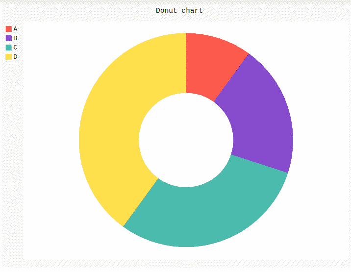
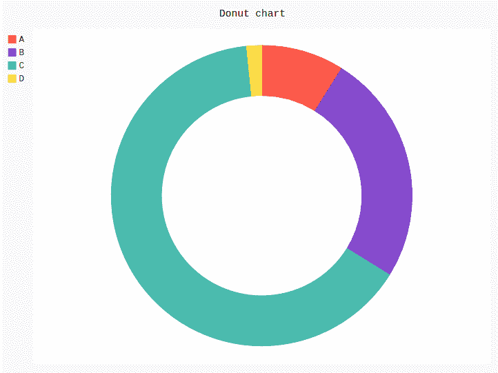

# 皮戈尔甜甜圈图

> 原文:[https://www.geeksforgeeks.org/donut-chart-in-pygal/](https://www.geeksforgeeks.org/donut-chart-in-pygal/)

**Pygal** 是一个 Python 模块，主要用于构建 SVG(标量矢量图形)图形和图表。SVG 是一种基于矢量的 XML 格式的图形，可以在任何编辑器中编辑。Pygal 可以用最少的代码行创建易于理解的图形。

## 圆环图

一张**甜甜圈饼图**本质上是一张饼图，它在饼图的中心有一个洞，这个洞决定了饼图和甜甜圈饼的区别。这可以使用传递参数内半径的 pygal 模块的 Pie()方法来创建。内半径参数应设置为 0 到 1 之间的数字，与孔和图表之间的半径比相称。

**语法:**

```
pie_chart = pygal.Pie(inner_radius=.4)
```

**例 1:**

```
# importing pygal
import pygal

# creating line chart object
pie_chart = pygal.Pie(inner_radius = .4)

# naming the title
pie_chart.title = 'Donut chart'

# random data
pie_chart.add('A', 10)
pie_chart.add('B', 20)
pie_chart.add('C', 30)
pie_chart.add('D', 40)

pie_chart
```

**输出:**



**例 2:**

```
# importing pygal
import pygal

# creating line chart object
pie_chart = pygal.Pie(inner_radius = .6)

# naming the title
pie_chart.title = 'Donut chart'

# adding lines
pie_chart.add('A', 115)
pie_chart.add('B', 322)
pie_chart.add('C', 834)
pie_chart.add('D', 21)

pie_chart
```

**输出:**

