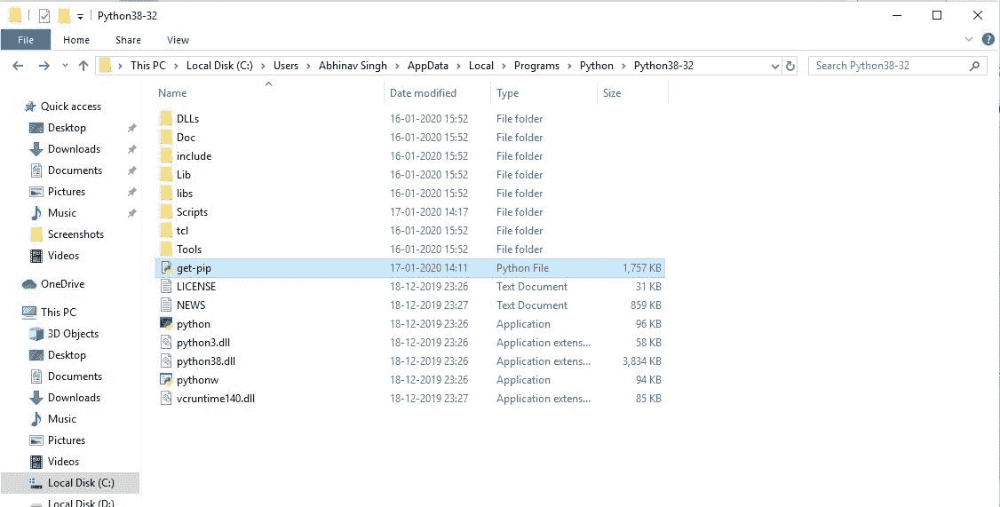
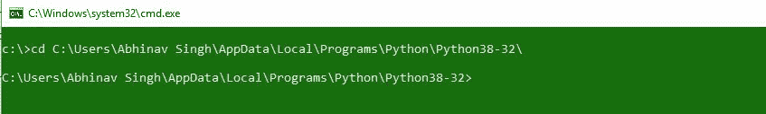
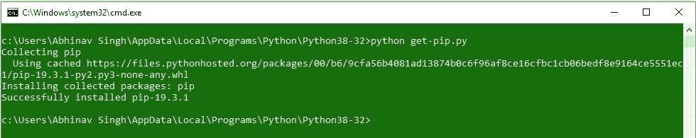
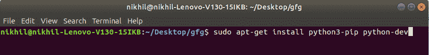
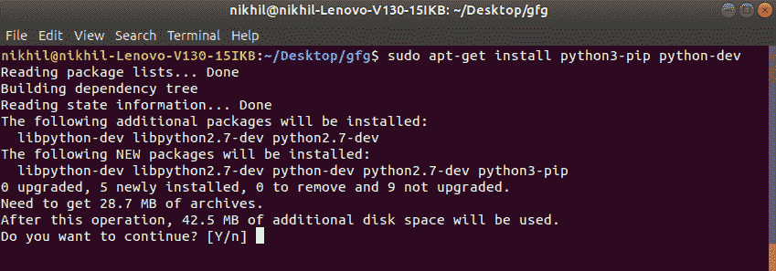
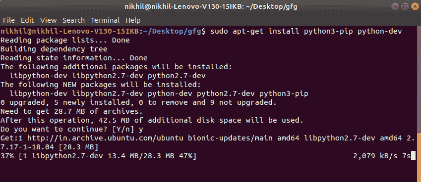
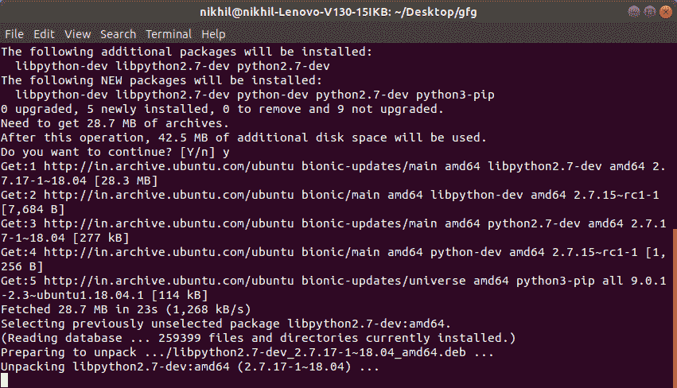
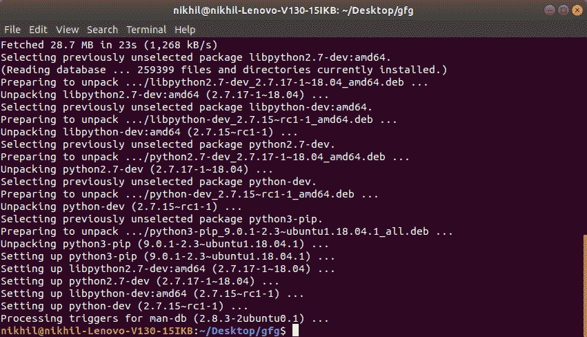
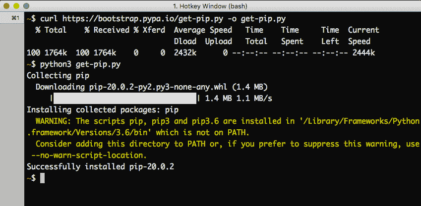
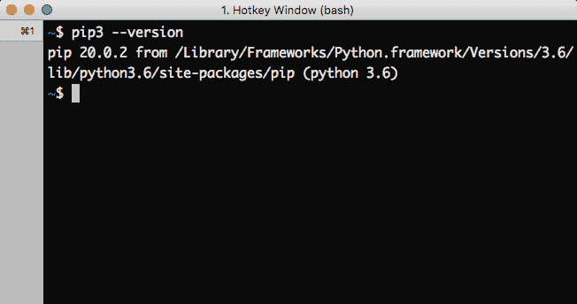

# 下载安装 pip 最新版本

> 原文:[https://www . geesforgeks . org/下载并安装-pip-最新-版本/](https://www.geeksforgeeks.org/download-and-install-pip-latest-version/)

PIP 是一个包管理系统，用于安装和管理用 Python 编写的软件包/库。这些文件存储在一个被称为 Python 包索引(PyPI)的大型“在线存储库中”。成功安装 Python 后，显然需要 pip 才能在操作系统上安装软件包，如 Numpy、Django 等。

#### Pip 安装

*   [窗户](#windows)
*   Linux
*   柔软
*   [验证](#verification)

#### Windows 操作系统

通过以下步骤，可以使用命令行下载和安装 pip:

*   下载 [**get-pip.py**](https://bootstrap.pypa.io/get-pip.py) 文件，并将其存储在安装 python 的同一个目录中。
    
*   将命令行中目录的当前路径更改为上述文件所在目录的路径。
    
*   Run the command given below:

    ```
    python get-pip.py
    ```

    并等待安装过程。
    

*   瞧啊。pip 现已安装在您的系统上。

更多信息，请访问–[如何在 Windows 上安装 PIP？](https://www.geeksforgeeks.org/how-to-install-pip-on-windows/)

#### Linux 操作系统

通过以下命令，可以在 Linux 中使用终端下载和安装 pip:

```
sudo apt-get install python3-pip python-dev
```

**开始安装:**

*   **入门:**
    
*   **提供磁盘空间:**
    
*   **下载库:**
    
*   **打开文件包:**
    
*   **完成安装:**
    

更多信息，请访问–[如何在 Linux 中安装 PIP？](https://www.geeksforgeeks.org/how-to-install-pip-in-linux/)

#### 苹果电脑

通过以下步骤，可以使用命令行下载和安装 macOS 中的 pip:

*   下载 [**get-pip.py**](https://bootstrap.pypa.io/get-pip.py) 文件，并将其存储在安装 python 的同一个目录中。
    或
    使用以下命令直接下载 pip，

    ```
    curl https://bootstrap.pypa.io/get-pip.py -o get-pip.py

    ```

*   Now execute the downloaded file using below command

    ```
    python3 get-pip.py
    ```

    并等待安装过程。
    

*   瞧啊。pip 现已安装在您的系统上。

#### 安装过程的验证:

通过对 pip 执行版本检查，可以轻松验证 pip 是否已正确安装。只需转到命令行并执行以下命令:

```
pip3 --version
```

