# 下载并安装 Python 3 最新版本

> 原文:[https://www . geesforgeks . org/下载并安装-python-3-最新版本/](https://www.geeksforgeeks.org/download-and-install-python-3-latest-version/)

如何下载安装 Python 3 最新版本？在本文中，您将获得与在 Windows/Linux/macOS 上安装 Python 相关的所有问题的答案。Python 是吉多·范·罗苏姆在 20 世纪 90 年代初开发的，其最新版本是 3.7.4，我们可以简单地称之为 Python3。

要了解如何安装 Python，您需要知道*Python 是什么*以及它实际安装在您的系统中的什么位置。

让我们考虑几点:

*   Python 是一种广泛使用的通用高级编程语言。
*   Python 的每个版本都是开源的。Python 版本也与 GPL 兼容。
*   任何版本的 Python 都可以从[python.org](http://python.org)的 **Python 软件基金会**网站下载。
*   大多数语言，特别是 Linux，都提供了一个包管理器，通过它你可以直接在你的操作系统上安装 Python

在本安装和设置的 Python 教程中，您将看到如何在 Windows、macOS、Linux、iOS 和 Android 上安装 Python。

## Python 最新版本安装和设置

> 您可以在这里选择您的操作系统并查看相应的教程，
> 
> *   [窗户](#windows)*   Linux*   MAC OS xMAC OS/MAC OS*   [安卓](#android)*   [iOS (iPhone / iPad)](#ios-iphone-ipad)*   [Python 在线解释器](#online-ide)

### 如何在 Windows 上安装 Python？

由于 windows 没有预装 Python，所以需要显式安装。在这里，我们将逐步定义如何在 Windows 上安装 Python 的教程。

请遵循以下步骤:

#### 从 python.org 下载 Python 最新版本

*   First and foremost step is to open a browser and open [https://www.python.org/downloads/windows/](https://www.python.org/downloads/windows/)

    

*   在**视窗 Python 版本**下找到**最新 Python 3 版本–Python 3.7.4**(目前最新的稳定版本是 Python 3 . 7 . 4)。
*   On this page move to **Files** and click on **Windows x86-64 executable installer** for 64-bit or **Windows x86 executable installer** for 32-bit.

    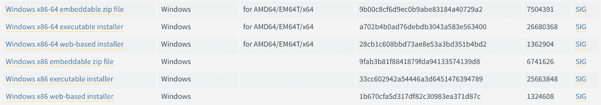

#### 在 Windows 上安装 Python 3.7.4 最新版本

*   从下载文件夹
    运行 Python 安装程序
*   确保标记**将 Python 3.7 添加到路径**中，否则您将不得不显式执行。
    将开始在 windows 上安装 python。
    
*   After installation is complete click on **Close**.
    Bingo..!! Python is installed. Now go to windows and type IDLE.

    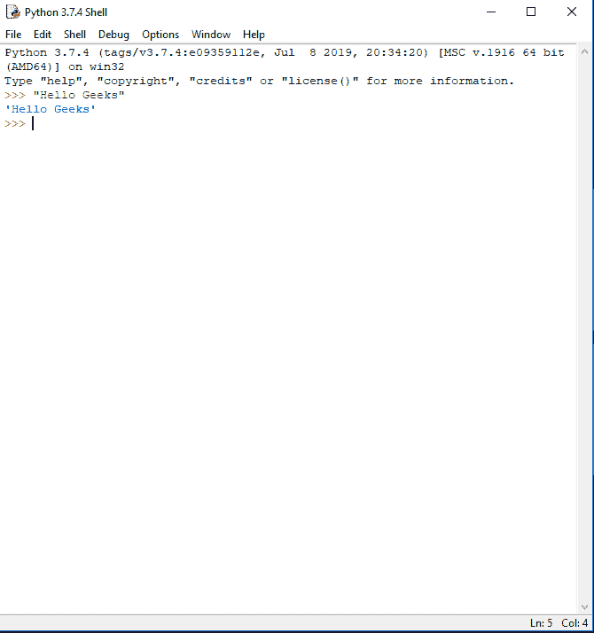
    这里是 Python 解释器。我打印了 Hello 极客，python 工作很顺利。

### 如何在 Linux 上安装 Python？

在包括以下操作系统在内的每个 linux 系统上，

*   人的本质*   Linux 作为*   一种自由操作系统*   openSUSE*   CentOS*   一种男式软呢帽*   and my favourite one, Arch Linux.

    你会发现 Python 已经安装好了。您可以从终端使用以下命令进行检查

    ```py
    $ python --version
    ```

    要检查 python 2.x.x 的最新版本:

    ```py
    $ python2 --version
    ```

    要检查最新版本的 python 3.x.x:

    ```py
    $ python3 --version
    ```

    
    明明不会是最新版本的 python。可以有多种方法在 linux 基础系统上安装 python，这完全取决于您的 linux 系统。
    对于几乎每一个 Linux 系统，下面的命令肯定会起作用。

    ```py
    $ sudo add-apt-repository ppa:deadsnakes/ppa
    $ sudo apt-get update
    $ sudo apt-get install python3.7

    ```

    #### 在 Linux 上下载并安装 Python 最新版本

    要从 Python 源代码安装最新版本，请执行以下步骤

    ##### 从 python.org 下载 Python 最新版本

    *   首先，打开浏览器，打开
        [【https://www.python.org/downloads/source/】](https://www.python.org/downloads/source/)
        
    *   Underneath the **Stable Releases** find **Download Gzipped source tarball** (latest stable release as of now is Python 3.7.4).

        您可以在一个命令中完成上述所有步骤

        ```py
        $ wget https://www.python.org/ftp/python/3.7.4/Python-3.7.4.tgz
        ```

        ##### 在 Linux 上安装 Python 3.7.4 最新版本

        要在 Linux 上成功安装 Python，请输入以下命令获取先决条件和其他源文件

        ```py
        $ sudo apt-get update
        $ sudo apt-get upgrade
        $ sudo apt-get install -y make build-essential libssl-dev zlib1g-dev libbz2-dev libreadline-dev libsqlite3-dev wget curl llvm libncurses5-dev  libncursesw5-dev xz-utils tk-dev

        ```

        现在我们都准备好打开从 python 官网‘
        下载的文件，使用终端
        中的 cd 下载移动到下载目录，然后输入以下命令

        ```py
        $ tar xvf Python-3.6.5.tgz
        $ cd Python-3.6.5
        $ ./configure --enable-optimizations --with-ensurepip=install
        $ make -j 8
        $ sudo make altinstall
        ```

        宾果游戏..！！最新版本的 Python 语言安装在您的 Linux 系统上。您可以使用以下命令进行确认。

        ```py
        python --version
        ```

        ### 如何在 macOS / Mac OS X 上安装 Python？

        和 Linux 一样，macOS 也附带了预装在系统上的 Python。它可能是 Python 版本 2 或一些类似的过时版本。为了更新到最新版本，我们将使用自制软件包管理器。在 macOS 上安装 Python 是最好也是最方便的方法之一。
        要了解更多关于家酿包装管理器的信息，[请访问此处](https://brew.sh/)

    *   #### 下载并安装自制软件包管理器

        如果您的系统上没有安装自制程序，请按照下面的步骤
        从应用程序- >实用程序中打开 macOS 的终端应用程序。Bash 终端将打开，您可以在其中输入命令
        在 macOS 终端中输入以下命令

        ```py
        /usr/bin/ruby -e "$(curl -fsSL https://raw.githubusercontent.com/Homebrew/install/master/install)"

        ```

        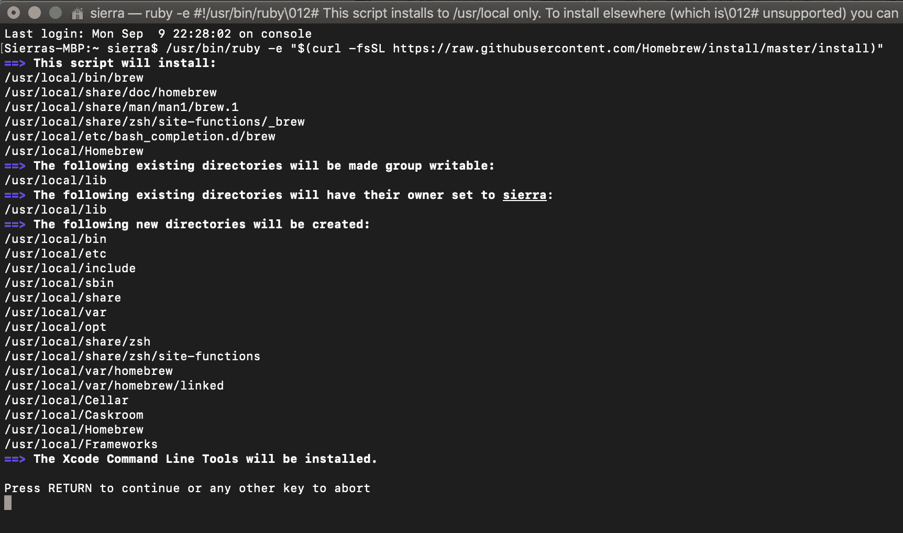

        如果出现提示，请输入系统密码。这将在您的操作系统上安装自制软件包管理器。
        看到“安装成功”的消息后。您已经准备好在您的 macOS 上安装 python 版本 3 了。
        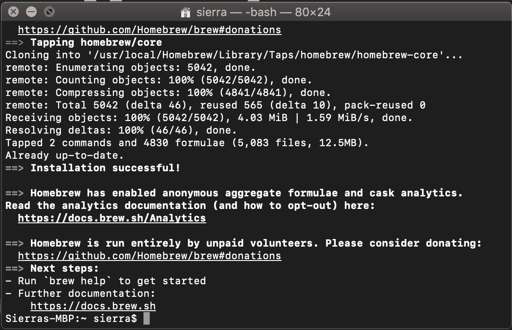

    *   #### 在 macOS / macOS X 上安装 Python 最新版本

        要从应用程序->实用程序
        安装 python 简单的打开终端应用程序，并输入以下命令

        ```py
        brew install python3
        ```

        命令处理完成后，Python 的第 3 版将安装在你的 mac 上。
        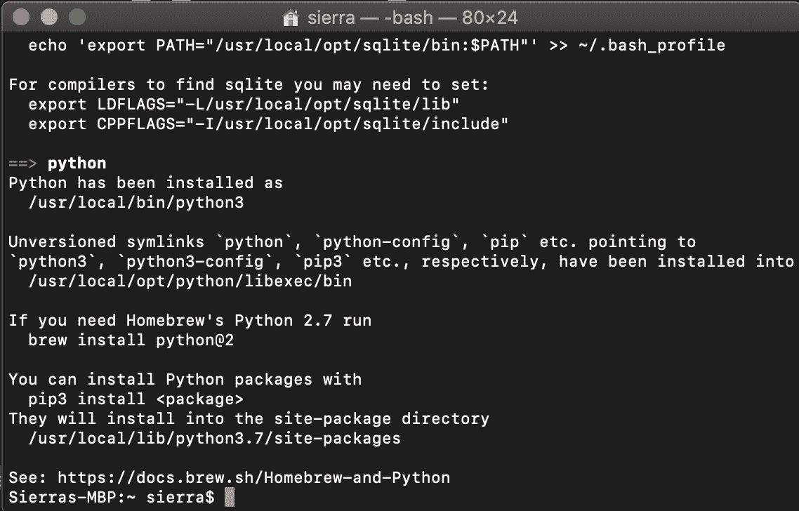
        要验证安装，请在终端应用程序中输入以下命令

        ```py
        python
        ```

        ```py
        pip3
        ```

        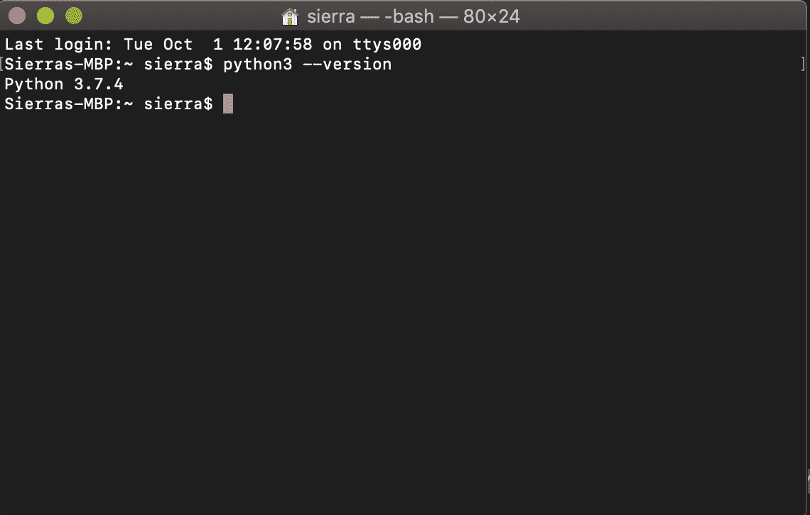
        答对了..！！Python 安装在您的计算机上。您可以在这里探索更多关于蟒蛇[的信息](https://www.geeksforgeeks.org/python-programming-language/)

        ### 如何在 Android 上安装 Python？

        Python 可以通过 play store 库中的各种应用在 Android 上运行。
        本教程将解释如何使用[Pydroid 3–python 3](https://play.google.com/store/apps/details?id=ru.iiec.pydroid3)应用的 IDE 在 Android 上运行 Python。
        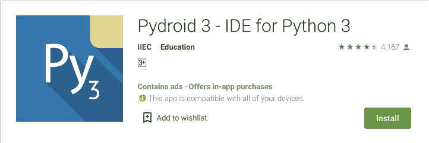
        **特色:**

    *   离线 Python 3.7 解释器:运行 Python 程序不需要互联网。
    *   Pip 包管理器和一个为增强的科学图书馆，如 numpy，scipy，matplotlib，scikit-learn 和 jupyter 预构建的轮子包的自定义存储库。
    *   张量流现在也可用。
    *   现成的示例可用于更快的学习。
    *   完成对图形用户界面的 Tkit 支持。
    *   全功能终端仿真器，支持读线(画中画)。

        #### 从玩商店下载 pydroid 3–Python 3 应用的 IDE

    *   To install Pydroid app go to play store link here – [Pydroid 3 – IDE for Python 3](https://play.google.com/store/apps/details?id=ru.iiec.pydroid3)

        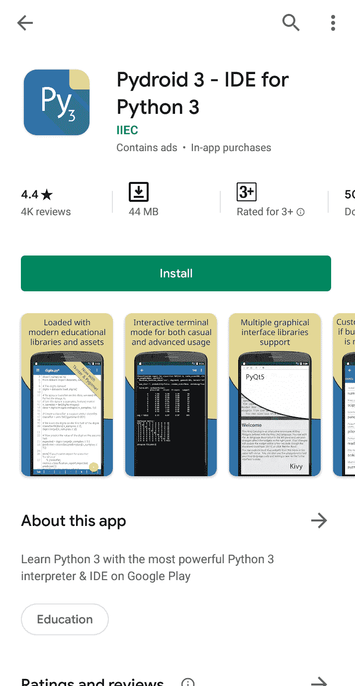

    *   After installation is complete, run the app and it will show as installing python.

        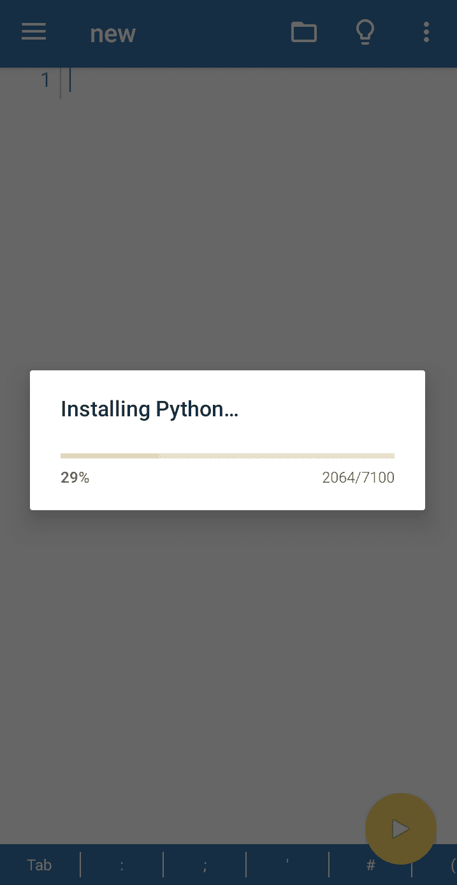

    *   Wait for a minute and it will show the ide. Here you can enter the Python code.

        

    *   Click on the yellow button to run the code.

        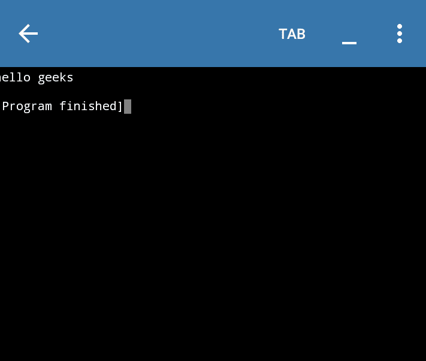
        Python 安装成功。你可以在这里查看这个应用[的更多功能](https://play.google.com/store/apps/details?id=ru.iiec.pydroid3)

        ### 如何在 iOS (iPhone / iPad)上安装 Python？

        在 iOS 平台上，可以使用应用商店的各种应用安装 Python。最受欢迎的应用之一是[皮达涅塔](http://omz-software.com/pythonista/)。Python 是一个完整的开发环境，用于在您的 iPad 或 iPhone 上编写 Python 脚本。包括了很多例子——从游戏和动画到绘图、图像处理、自定义用户界面和自动化脚本。
        你可以从[这里](https://apps.apple.com/in/app/pythonista-3/id1085978097?mt=8&ign-mpt=uo%3D4)下载并购买皮达妮塔 app

        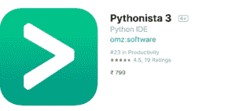

        因为大多数应用都是在 IOS 上付费的，官方不允许任何翻译。你可以从网上的 IDEs 和 ide.geeksforgeeks.org 运行 Python。

        ### Python 在线解释器

        在这个数字技术的现代时代，人们可以直接从浏览器运行 Python，而无需在操作系统上明确安装 Python。
        这里有一个 python 著名 ide 的列表。

        *   geeksforgeeks ide–[ide . geeksforgeeks . org](https://ide.geeksforgeeks.org/Fou4Yl6uPe)
        *   蟒蛇提琴:[pythonfiddle.com](http://pythonfiddle.com/)
        *   python Anywhere:[www.pythonanywhere.com](https://www.pythonanywhere.com/)
        *   在线 gdp 编译器–[onlinegdb.com](https://www.onlinegdb.com/online_python_compiler)

        对于像 TensorFlow 这样的深度学习库的昂贵计算，可以使用以下 ide

        *   卡格尔–[kaggle.com](https://www.kaggle.com/)
        *   JuPyter/IPython Notebook – [jupyter.org](https://jupyter.org/)
        *   谷歌可乐–[colab.research.google.com](https://colab.research.google.com/)

        这些解释器可以很容易地运行 Python 代码，除了复杂的 Django 代码或 TensorFlow 库。要运行这样的高级应用程序，需要显式安装 Python。