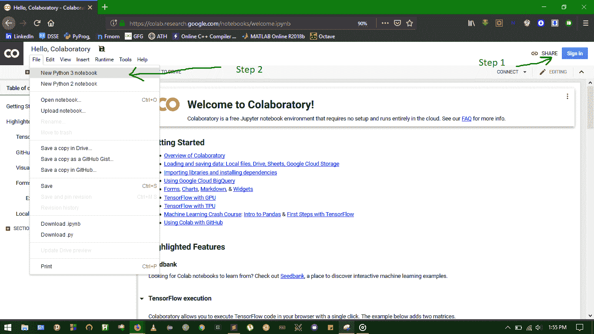
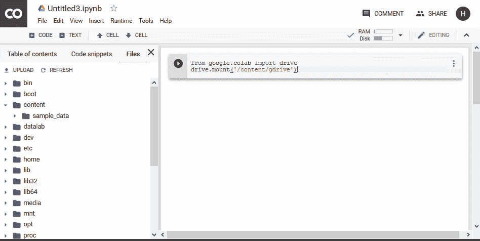
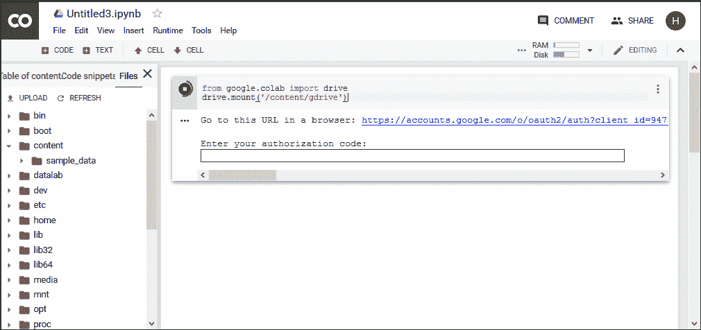
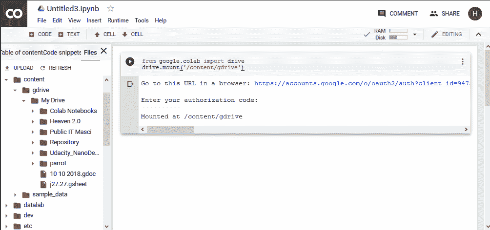
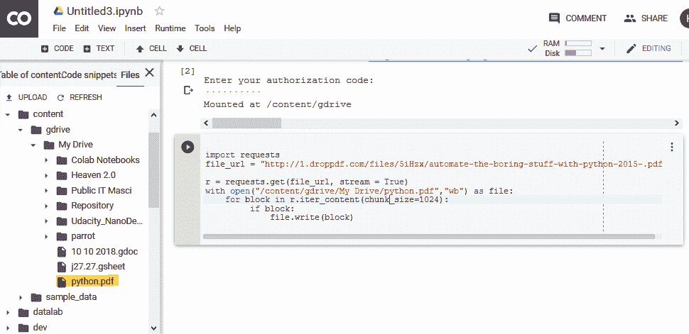

# 使用 Google colab

下载任何东西到 Google Drive

> 原文:[https://www . geesforgeks . org/download-any-to-Google-drive-use-Google-colab/](https://www.geeksforgeeks.org/download-anything-to-google-drive-using-google-colab/)

当我们从云服务器下载/上传一些东西时，与普通服务器相比，它提供了更高的传输速率。我们可以使用**谷歌驱动**进行存储和快速下载。问题是如何从网上直接上传东西到 G-Drive。所以，这里我们将看到一个解决方案，直接从互联网上传任何东西到谷歌驱动器。

我们只需要谷歌账号和几行代码。

**[谷歌可乐](https://colab.research.google.com/notebooks/welcome.ipynb)** :

谷歌 Colab 是一款支持 GPU 的免费云服务。它就像 Jupyter 笔记本，使用起来非常简单。在本教程中，我们将使用谷歌可乐下载任何东西到我们的谷歌驱动器。

**第一步:**登录 Google Colab，创建一个新的 Python3 笔记本。



**第二步:将谷歌驱动导入 colab**

若要导入 google drive，请将此代码写入 colab 的代码部分，并由`*Ctrl+Enter*`运行。

```py
from google.colab import drive
drive.mount('/content/gdrive')
```




在运行代码时，会出现一个蓝色链接和一个文本框，我们需要提供一个权限文本。因此，点击链接，一个新的标签将会打开，在那里你将被要求允许访问谷歌驱动器。提供权限后，将显示一个文本，我们需要复制并粘贴在 colabs 文本框。


在框中粘贴文本，然后按回车键。这一切都要导入 gdrive。我们可以在左侧面板上看到谷歌驱动器。


**第三步:下载东西到 Google Drive**

要下载一些东西，我们只需要一个可下载文件的网址。

```py
import requests 
file_url = "http://1.droppdf.com/files/5iHzx/automate-the-boring-stuff-with-python-2015-.pdf"

r = requests.get(file_url, stream = True) 

with open("/content/gdrive/My Drive/python.pdf", "wb") as file: 
    for block in r.iter_content(chunk_size = 1024):
         if block: 
             file.write(block) 
```

运行此代码下载 gdrive 中的文件(用您的**文件的 url** 更改*文件 _url* )。

我们可以在左侧面板看到，pdf 文件正在下载。

**结论:**
我们可以使用 google colab 下载 google drive 上的任何文件。你可以看到一个文件夹*鹦鹉*(3.7 GB 的鹦鹉操作系统)，使用 Colab 下载到 gdrive。