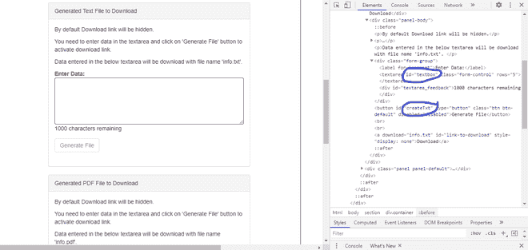

# 使用 Python 在 Selenium 中下载文件

> 原文:[https://www . geesforgeks . org/download-file-in-selenium-use-python/](https://www.geeksforgeeks.org/download-file-in-selenium-using-python/)

**先决条件:** [**硒**](https://www.geeksforgeeks.org/selenium-python-basics/)

Selenium 是通过程序控制网络浏览器和执行浏览器自动化的强大工具。它适用于所有浏览器，在所有主要操作系统上工作，其脚本是用各种语言编写的，即 [Python](https://www.geeksforgeeks.org/python-programming-language/) 、 [Java](https://www.geeksforgeeks.org/java/) 、 [C#](https://www.geeksforgeeks.org/csharp-programming-language/) 等。我们将使用 Python。硒教程涵盖了所有主题，如-网络驱动程序，网络元素，单元测试与硒。在本文中，我们将看到如何使用 Python 中的 Selenium 从网页下载文件。

下载文件时，我们将使用 [**点击()**](https://www.geeksforgeeks.org/click-element-method-selenium-python/) 的方法。这里是我们的自动化，我们将下载一个生成的文本文件。

**遵循以下步骤–**

*   输入数据
*   点击生成，它将生成一个文本文件
*   点击下载，它将下载文本文件

这里我们将使用 **id** 来输入和生成文本文件。



当一个文件生成时，它会给出一个下载选项，点击它，下载就会开始。

**进场:**

*   导入模块。
*   为 chromedriver 制作一个对象。
*   使用 Get()方法获取网址。
*   创建自动化文本。
*   创建用于下载的链接自动化。

**以下是完整实现:**

## 蟒蛇 3

```py
# Import Module
from selenium import webdriver
from selenium.webdriver.common.keys import Keys

# Open Chrome
driver = webdriver.Chrome(
    'C:/Users/HP/Desktop/Drivers/chromedriver_win32/chromedriver.exe')

# Open URL
driver.get(
    'http://demo.automationtesting.in/FileDownload.html')

# Enter text
driver.find_element_by_id('textbox').send_keys("Hello world")

# Generate Text File
driver.find_element_by_id('createTxt').click()

# Click on Download Button
driver.find_element_by_id('link-to-download').click()
```

**输出:**

<video class="wp-video-shortcode" id="video-528630-1" width="640" height="360" preload="metadata" controls=""><source type="video/mp4" src="https://media.geeksforgeeks.org/wp-content/uploads/20201213161123/FreeOnlineScreenRecorderProject4.mp4?_=1">[https://media.geeksforgeeks.org/wp-content/uploads/20201213161123/FreeOnlineScreenRecorderProject4.mp4](https://media.geeksforgeeks.org/wp-content/uploads/20201213161123/FreeOnlineScreenRecorderProject4.mp4)</video>

同样，我们可以下载一个 PDF 文件或任何其他文档。