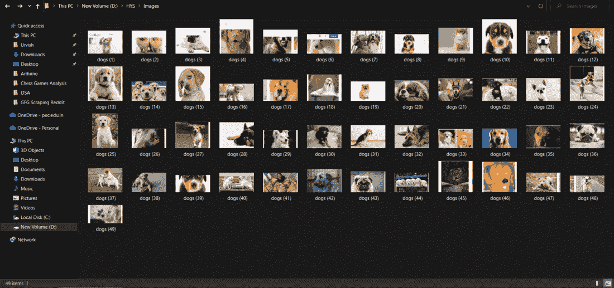

# 使用 Python 和 Selenium 下载谷歌图片

> 原文:[https://www . geesforgeks . org/download-Google-image-using-python-and-selenium/](https://www.geeksforgeeks.org/download-google-image-using-python-and-selenium/)

在本文中，我们将看到如何使用 Python 和 Selenium 下载谷歌图像。

### 装置

在电脑终端上，键入以下命令。

```
pip install selenium
```

我们还需要安装一个**网络驱动**，帮助我们自动运行网络浏览器。您可以安装火狐网络驱动程序，互联网浏览器网络驱动程序，或铬网络驱动程序。在本文中，我们将使用 Chrome 网络驱动程序。

自动化脚本通过找到我们指定的元素与网页进行交互。有各种方法可以找到网页中的元素。最简单的方法是选择所需元素的 HTML 标记并复制其 XPath。为此，只需右键单击网页，单击“检查”，并复制所需元素的 XPath。如果需要，也可以使用元素的名称或 CSS。


谷歌图片的结果

**下面是实现:**

## 蟒蛇 3

```
from selenium import webdriver
from selenium.webdriver.common.keys import Keys
import time

# What you enter here will be searched for in
# Google Images
query = "dogs"

# Creating a webdriver instance
driver = webdriver.Chrome('Enter-Location-Of-Your-Webdriver')

# Maximize the screen
driver.maximize_window()

# Open Google Images in the browser
driver.get('https://images.google.com/')

# Finding the search box
box = driver.find_element_by_xpath('//*[@id="sbtc"]/div/div[2]/input')

# Type the search query in the search box
box.send_keys(query)

# Pressing enter
box.send_keys(Keys.ENTER)

# Fumction for scrolling to the bottom of Google
# Images results
def scroll_to_bottom():

    last_height = driver.execute_script('\
    return document.body.scrollHeight')

    while True:
        driver.execute_script('\
        window.scrollTo(0,document.body.scrollHeight)')

        # waiting for the results to load
        # Increase the sleep time if your internet is slow
        time.sleep(3)

        new_height = driver.execute_script('\
        return document.body.scrollHeight')

        # click on "Show more results" (if exists)
        try:
            driver.find_element_by_css_selector(".YstHxe input").click()

            # waiting for the results to load
            # Increase the sleep time if your internet is slow
            time.sleep(3)

        except:
            pass

        # checking if we have reached the bottom of the page
        if new_height == last_height:
            break

        last_height = new_height

# Calling the function

# NOTE: If you only want to capture a few images,
# there is no need to use the scroll_to_bottom() function.
scroll_to_bottom()

# Loop to capture and save each image
for i in range(1, 50):

    # range(1, 50) will capture images 1 to 49 of the search results
    # You can change the range as per your need.
    try:

      # XPath of each image
        img = driver.find_element_by_xpath(
            '//*[@id="islrg"]/div[1]/div[' +
          str(i) + ']/a[1]/div[1]/img')

        # Enter the location of folder in which
        # the images will be saved
        img.screenshot('Download-Location' +  
                       query + ' (' + str(i) + ').png')
        # Each new screenshot will automatically
        # have its name updated

        # Just to avoid unwanted errors
        time.sleep(0.2)

    except:

        # if we can't find the XPath of an image,
        # we skip to the next image
        continue

# Finally, we close the driver
driver.close()
```

**结果:**



捕获的图像

这是创建自动化脚本最简单的方法。这个小程序可以成为你有趣的小项目。这可能是你硒之旅的起点。你可以用硒做不同的事情，比如从谷歌新闻上刮新闻。因此，对新的想法保持开放的心态，你可能最终会用 Selenium 和 Python 创建一个伟大的项目。