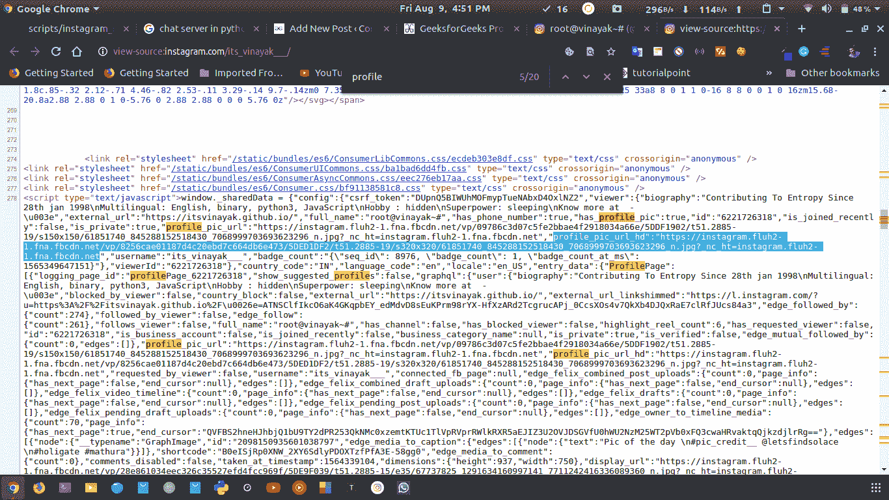
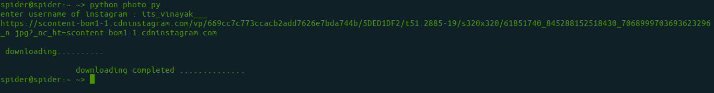

# 使用 Python 下载 Instagram 个人资料图片

> 原文:[https://www . geesforgeks . org/download-insta gram-profile-pic-using-python/](https://www.geeksforgeeks.org/download-instagram-profile-pic-using-python/)

Instagram 是脸书旗下的照片和视频分享社交网络服务，Python 为 Instagram 的网页抓取提供了强大的工具。

### **所需模块和安装:**

**请求:**

```py
pip install requests
```

**概念–**
对于给定的用户档案，打开*视图-来源*，找到*“档案 _ pic _ URL _ HD”*。要查找，请按 ctrl+f 并键入*“profile _ pic _ URL _ HD”*与之相关的链接是我们的数据或 profile pic。
链接看起来像:

> https://scontent-bom1-1.cdninstagram.com/vp/d2df9b2d162969e87200984ee763cc27/5DC590F2/t51.2885-19/s320x320/61851740_845288152518430_7068999703693623296_n.jpg?_nc_ht=scontent-bom1-1.cdninstagram.com



以下是项目的逐步实施情况:

**第一步:**导入所有依赖

## 蟒蛇 3

```py
import requests
from bs4 import BeautifulSoup as bs
import json
import random
import os.path
```

**第二步:**询问用户名，向 Instagram 发送回复。

## 蟒蛇 3

```py
insta_url='https://www.instagram.com'
inta_username= input('enter username of instagram : ')

response = requests.get(f"{insta_url}/{inta_username}/")
```

**第三步:**如果回答正常，找到个人资料照片链接

(**注意:**将 string_url 中的“\\u0026”替换为“&”，以删除错误的 url 时间戳或错误的 URL 哈希错误)

## 蟒蛇 3

```py
if response.ok:
    html=response.text

    bs_html=bs(html, features="lxml")
    bs_html=bs_html.text
    index=bs_html.find('profile_pic_url_hd')+21

    remaining_text=bs_html[index:]
    remaining_text_index=remaining_text.find('requested_by_viewer')-3
    string_url=remaining_text[:remaining_text_index].replace("\\u0026","&")

    print(string_url, "\n \n downloading..........")
```

**第四步:**现在，创建一个循环并下载照片。

## 蟒蛇 3

```py
while True:
    filename='pic'+str(random.randint(1, 100000))+'.jpg'
    file_exists = os.path.isfile(filename)

    if not file_exists:
        with open(filename, 'wb+') as handle:
            response = requests.get(string_url, stream=True)
            if not response.ok:
                print(response)
            for block in response.iter_content(1024):
                if not block:
                    break
                handle.write(block)
    else:
        continue
    break
print("\n                downloading completed ..............")
```

**输出:**



**其他方法:**
只需给用户 Instagram 句柄，我们就可以使用 instaloader 模块下载任意 Instagram 账号的简介图片。

首先，我们需要安装 instaloader 模块:

```py
pip install instaloader 
```

**示例:**

## 蟒蛇 3

```py
import instaloader

ig = instaloader.Instaloader()
dp = input("Enter Insta username : ")

ig.download_profile(dp , profile_pic_only=True)
```

**输出:**当我们输入输入的用户 id 时，Profile pic 将被下载到同一个目录中。