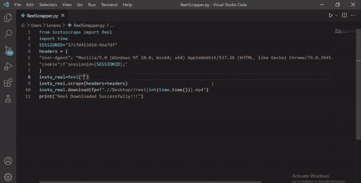

# 使用 Python 下载 Instagram 卷轴

> 原文:[https://www . geesforgeks . org/download-insta gram-reel-use-python/](https://www.geeksforgeeks.org/download-instagram-reel-using-python/)

在本文中，我们将讨论如何使用 Python 下载 Instagram 卷轴。

Instagram 是脸书旗下的一个社交网络平台。在 Python 中，有许多库可以用来解决一些现实问题，它还提供了一些工具来从 Instagram 中抓取信息。工具之一是 Instascrape Python 包。Instascrape 是强大的 Instagram 数据报废工具包。

## **安装**:

从 PyPI 安装**insta-刮削**库

> pip 安装 insta-刮擦

要从 Instagram 下载卷轴，首先导入所有需要的库。在我们的例子中，我们正在导入时间模块，因为在保存文件时，我们将把时间和文件名连接起来，以避免命名冲突。现在添加会话标识和标题。会话标识在您注销之前有效。所以当你下次会的时候，你需要再次传递一个新的会话 id。(通过检查页面，您将在会话存储中获得您的会话标识)。由于 Instagram 的更新策略，直接抓取数据并不那么容易，所以我们必须将会话 id 传递到头中。使用卷轴模块和提供下载位置，我们可以完成这项工作。

**语法:**

> install _ reel = reel(" insta gram link ")
> 
> insta_reel .刮擦(标题=标题)
> 
> insta _ reel . download(download _ path . MP4 ")

按照上述步骤，您将在指定的目录中获得下载的卷轴。

**示例:**使用 Python 下载 Instagram 卷轴

## 蟒蛇 3

```
from instascrape import Reel
import time

# session id
SESSIONID = "Paste session Id Here"

# Header with session id
headers = {
    "User-Agent": "Mozilla/5.0 (Windows NT 10.0; Win64; x64)\
    AppleWebKit/537.36 (KHTML, like Gecko) Chrome/79.0.3945.74 \
    Safari/537.36 Edg/79.0.309.43",
    "cookie": f'sessionid={SESSIONID};'
}

# Passing Instagram reel link as argument in Reel Module
insta_reel = Reel(
    'https://www.instagram.com/reel/CKWDdesgv2l/?utm_source=ig_web_copy_link')

# Using  scrape function and passing the headers
insta_reel.scrape(headers=headers)

# Giving path where we want to download reel to the
# download function
insta_reel.download(fp=f".\\Desktop\\reel{int(time.time())}.mp4")

# printing success Message
print('Downloaded Successfully.')
```

**输出:**

