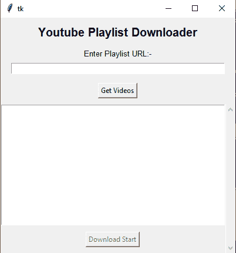

# 使用 Python 下载 Youtube 视频或整个播放列表

> 原文:[https://www . geesforgeks . org/download-YouTube-videos-or-all-playlist-with-python/](https://www.geeksforgeeks.org/download-youtube-videos-or-whole-playlist-with-python/)

**先决条件:**

*   tkinter
*   [pyyoutube](https://pypi.org/project/python-youtube/)
*   [pytube](https://www.geeksforgeeks.org/pytube-python-library-download-youtube-videos/)
*   [拧入 Tkit](https://www.geeksforgeeks.org/how-to-use-thread-in-tkinter-python/)
*   YouTube API

Python 为开发图形用户界面提供了多个选项。在所有的 GUI 方法中，Tkinter 是最常用的方法。它是 Python 附带的 Tk 图形用户界面工具包的标准 Python 接口。Python 搭配 Tkinter 是创建 GUI 应用程序最快最简单的方法。

在本文中，我们将讨论如何使用 python 创建一个 GUI 应用程序来下载 YouTube 视频或完整的 YouTube 播放列表。

在我们开始之前，我们先来讨论一下 **pyyoutube** 模块。**youtube**模块提供了一种使用 YouTube 数据应用编程接口 V3 的简单方法。

**安装:**

```py
pip install python-youtube
```

## 从 YouTube 播放列表下载选定的视频

在本节中，我们将学习如何使用 Python 中的 Tkinter 从 YouTube 播放列表中仅下载选定的视频。

**进场:**

*   首先，我们将使用 **pyyoutube** 模块从 YouTube 播放列表中获取所有视频链接。
*   然后我们将选择我们想要下载的视频链接。
*   然后我们会使用 **pytube** 模块逐个下载每个视频。

**下面是 GUI 的样子:**



**我们来了解一下分步实施:**

*   创建一个 Tkinter 窗口，并添加按钮，标签，滚动条等…

## 蟒蛇 3

```py
# Import Required Modules
from tkinter import *

# Create Object
root = Tk()

# Set geometry
root.geometry('400x400')

# Add Label
Label(root, text="Youtube Playlist Downloader",
      font="italic 15 bold").pack(pady=10)
Label(root, text="Enter Playlist URL:-", font="italic 10").pack()

# Add Entry box
playlistId = Entry(root, width=60)
playlistId.pack(pady=5)

# Add Button
get_videos = Button(root, text="Get Videos")
get_videos.pack(pady=10)

# Add Scorllbar
scrollbar = Scrollbar(root)
scrollbar.pack(side=RIGHT, fill=BOTH)
list_box = Listbox(root, selectmode="multiple")
list_box.pack(expand=YES, fill="both")
list_box.config(yscrollcommand=scrollbar.set)
scrollbar.config(command=list_box.yview)

download_start = Button(root, text="Download Start", state=DISABLED)
download_start.pack(pady=10)

# Execute Tkinter
root.mainloop()
```