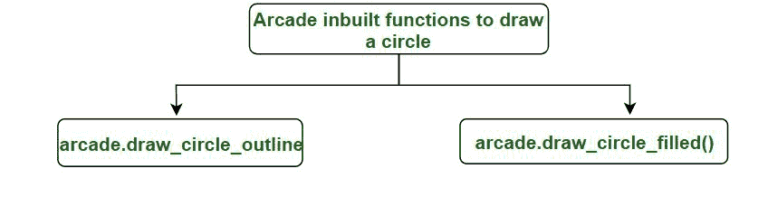
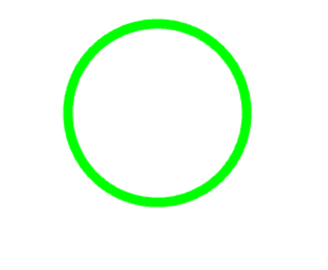
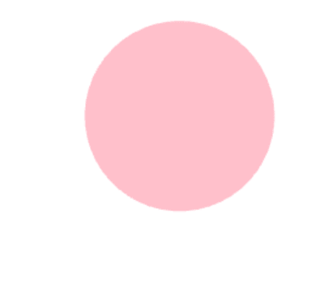
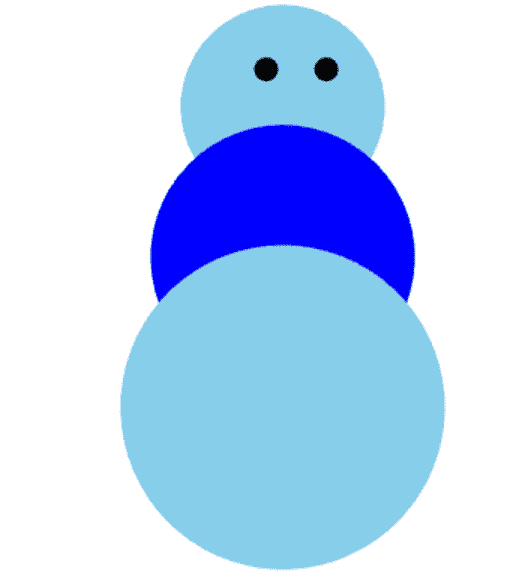

# 在 Python3 中使用 Arcade 绘制一个圆

> 原文:[https://www . geeksforgeeks . org/画一个使用街机的圆圈-in-python3/](https://www.geeksforgeeks.org/draw-a-circle-using-arcade-in-python3/)

街机图书馆是一个高科技的 Python 包，有一套先进的工具来制作具有引人入胜的图形和声音的 2D 游戏。它是面向对象的，特别是为 Python 3.6 和更高版本构建的。

拱廊内置画圆功能:-



**1。****arcade . draw _ circle _ outline():**此功能用于绘制圆的轮廓。

> **语法:**arcade . draw _ circle _ outline(center _ x，center_y，半径，颜色，边框 _ 宽度，num_segments)
> 
> **参数:**
> 
> *   **中心 _ x**–作为圆心的 x 位置。
> *   **center _ y**–作为圆心的 y 位置。
> *   **半径**–圆的宽度。
> *   **颜色**–将绘制轮廓的颜色。
> *   **边框 _ 宽度**–圆形轮廓的宽度，以像素为单位。
> *   **num _ segments**–段数越高，质量越高，但渲染时间越慢。默认值为-1，这意味着 arcade 将尝试根据圆的大小计算合理的线段数量。

让我们举个例子-

## 蟒蛇 3

```py
#import module
import arcade

# Open the window. Set the window title and
# dimensions (width and height)
arcade.open_window(600, 600, "Draw  an arc  for GfG ")

#set background
arcade.set_background_color(arcade.color.WHITE)

# Start the render process.
arcade.start_render()

#function to draw a circle
arcade.draw_circle_outline(300, 285, 88, arcade.color.GREEN, 9,-1)

#finish drawing
arcade.finish_render()

#to display everything
arcade.run()
```

**输出:**



既然，现在你知道如何画一个简单的圆的轮廓了。让我们用这个拱廊来画奥林匹克旗。

## 蟒蛇 3

```py
#import module
import arcade

# Open the window. Set the window title and
# dimensions (width and height)
arcade.open_window(600, 600, "Draw  an arc  for GfG ")

# set background color
arcade.set_background_color(arcade.color.WHITE)

# Start the render process.
arcade.start_render()

# function for designing olympic flag
arcade.draw_circle_outline(100, 285, 88, arcade.color.BLUE, 9, -1)
arcade.draw_circle_outline(300, 285, 88, arcade.color.BLACK, 9, -1)
arcade.draw_circle_outline(500, 285, 88, arcade.color.RED, 9, -1)
arcade.draw_circle_outline(200, 185, 88, arcade.color.YELLOW, 9, -1)
arcade.draw_circle_outline(400, 185, 88, arcade.color.GREEN, 9, -1)

# finished drawing
arcade.finish_render()

# to display everything
arcade.run()
```

**输出:**


**2。****arcade . draw _ circle _ filled():**此功能用于绘制颜色填充的圆形。

> **语法:arcade . draw _ circle _ outline(center _ x，center_y，半径，颜色，num_segments)**
> 
> **参数:**
> 
> *   center _ x–作为圆心的 x 位置。
> *   center _ y–作为圆心的 y 位置。
> *   半径–圆的宽度。
> *   颜色–将绘制轮廓的颜色。
> *   num _ segments–段数越高，质量越高，但渲染时间越慢。默认值为-1，这意味着 arcade 将尝试根据圆的大小计算合理的线段数量。

让我们举个例子-

## 蟒蛇 3

```py
#import module
import arcade

# Open the window. Set the window title and dimensions (width and height)
arcade.open_window(600, 600, "Draw  a circle  for GfG ")

# set background
arcade.set_background_color(arcade.color.WHITE)

# Start the render process.
arcade.start_render()

# draw circle
arcade.draw_circle_filled(300, 450, 78, arcade.color.PINK, 0)

# finish drawing
arcade.finish_render()

# to display everything
arcade.run()
```

**输出:**



既然，现在你知道如何画一个简单的圆的轮廓了。让我们用这个街机画一个雪人。

## 蟒蛇 3

```py
#import module
import arcade

# Open the window. Set the window title and
# dimensions (width and height)
arcade.open_window(600, 600, "Draw  a circle  for GfG ")

# set background
arcade.set_background_color(arcade.color.WHITE)

# Start the render process.
arcade.start_render()

# snowman upper part
arcade.draw_circle_filled(300, 450, 68, arcade.color.SKY_BLUE, 0)

# snowman eyes
arcade.draw_circle_filled(289, 475, 8, arcade.color.BLACK, 0)
arcade.draw_circle_filled(329, 475, 8, arcade.color.BLACK, 0)

# snowman lower part
arcade.draw_circle_filled(300, 350, 88, arcade.color.BLUE, 0)
arcade.draw_circle_filled(300, 250, 108, arcade.color.SKY_BLUE, 0)

# finish drawing
arcade.finish_render()

# to display everything
arcade.run()
```

**输出:**

