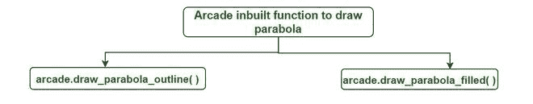
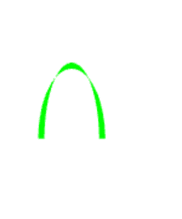
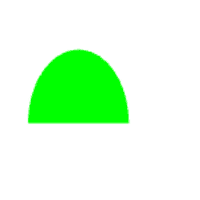

# 在 Python3 中使用 Arcade 绘制抛物线

> 原文:[https://www . geeksforgeeks . org/绘制抛物线-使用-街机-在-python3/](https://www.geeksforgeeks.org/draw-a-parabola-using-arcade-in-python3/)

[街机](https://www.geeksforgeeks.org/arcade-library-in-python/)是一个 Python 库，用于开发二维游戏。街机需要 OpenGL 3.3+的支持。在 arcade 中，基本的绘图不需要知道如何定义函数或类，也不需要知道如何进行循环，只是我们有用于绘制图元的内置函数。

用于绘制抛物线的拱廊内置功能:-



**1。arcade.draw _ 抛物线 _outline( ):** 这个函数绘制抛物线的轮廓。

> **语法:**arcade . draw _ 抛物线 _outline(start_x，start_y，end_x，高度，颜色，边框 _ 宽度，倾斜 _ 角度)
> 
> **参数:**
> 
> *   **start_x** :抛物线的起始 x 位置
> *   **起始 y** :抛物线的起始 y 位置
> *   **end_x :** 抛物线的结束 x 位置
> *   **高度**:抛物线的高度
> *   **颜色:**抛物线的颜色
> *   **边框宽度:**抛物线的宽度
> *   **倾斜角:**抛物线的倾斜角。

**示例:**

## 蟒蛇 3

```py
# import module
import arcade

# Open the window. Set the window title and dimensions (width and height)
arcade.open_window(600, 600, "Draw  a parabola  for GfG ")

# set background
arcade.set_background_color(arcade.color.WHITE)

# Start the render process.
arcade.start_render()

# function to draw a parabola
arcade.draw_parabola_outline(50, 80, 100, 120, arcade.color.GREEN, 10, 0)

# finish drawing
arcade.finish_render()
```

**输出:**



**2。arcade.draw _ 抛物线 _filled( ):** 此函数用于绘制一个彩色场抛物线。

> **语法:**arcade . draw _ 抛物线 _outline(start_x，start_y，end_x，高度，颜色，倾斜角)
> 
> **参数:**
> 
> *   **起始 x :** 抛物线的起始 x 位置
> *   **起始 y** :抛物线的起始 y 位置
> *   **end_x** :抛物线的结束 x 位置
> *   **高度:**抛物线的高度
> *   **颜色:**抛物线的颜色
> *   **倾角**:抛物线倾斜的角度。

**示例:**

## 蟒蛇 3

```py
# import module
import arcade

# Open the window. Set the window title and dimensions (width and height)
arcade.open_window(600, 600, "Draw  a parabola  for GfG ")

# set background
arcade.set_background_color(arcade.color.WHITE)

# Start the render process.
arcade.start_render()

# function to draw a parabola
arcade.draw_parabola_filled(25, 80, 100, 110, arcade.color.GREEN ,0)

# finish drawing
arcade.finish_render()

# to display everything
arcade.run()
```

**输出:**



**示例:**使用一系列抛物线绘制彩虹的程序

## 蟒蛇 3

```py
# import module
import arcade

# Open the window. Set the window title and dimensions (width and height)
arcade.open_window(600, 600, "Draw  a parabola  for GfG ")

#set background
arcade.set_background_color(arcade.color.WHITE)

# Start the render process.
arcade.start_render()

# function to draw a rainbow parabola
arcade.draw_parabola_filled(25, 80, 500, 300, arcade.color.RED ,0)
arcade.draw_parabola_filled(50, 80, 470, 280, arcade.color.ORANGE ,0)
arcade.draw_parabola_filled(75, 80, 440, 260, arcade.color.YELLOW ,0)
arcade.draw_parabola_filled(100, 80, 410, 240, arcade.color.GREEN ,0)
arcade.draw_parabola_filled(125, 80, 380, 220, arcade.color.SKY_BLUE ,0)
arcade.draw_parabola_filled(150, 80, 350, 200, arcade.color.VIOLET ,0)
arcade.draw_parabola_filled(175, 80, 325, 180, arcade.color.INDIGO ,0)

# finish drawing
arcade.finish_render()

# to display everything
arcade.run()
```

**输出:**

