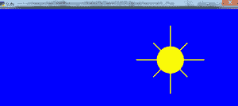

# 使用街机库 Python 绘制太阳

> 原文:[https://www . geesforgeks . org/draw-a-sun-use-arcade-library-python/](https://www.geeksforgeeks.org/draw-a-sun-using-arcade-library-python/)

您可能已经使用著名的 Python 模块，如[海龟](https://www.geeksforgeeks.org/turtle-programming-python/)绘制了孙，但是在这里我们讨论如何使用街机模块实现相同的方法。街机库是一个现代 Python 模块，广泛用于开发具有引人注目的图形和声音的 2D 视频游戏。街机是一个面向对象的库。它可以像任何其他 Python 包一样安装。

### 装置

要安装此模块，只需在命令提示符下运行以下命令:

```py
pip install arcade

```

**进场:**

以下步骤说明了如何使用 arcade 模块创建基本图形:

*   导入模块。
*   指定输出屏幕的参数，如宽度、高度等。
*   使用街机中内置的 open_window()打开窗口。该命令打开一个给定大小的窗口，即宽度和高度以及屏幕标题。
*   设置背景颜色(可选)。这可以使用街机内置的 set_background_color()方法来完成
*   告诉您的模块使用 start_render()命令开始绘图，该命令再次内置于 arcade 中。
*   开始设计，你可以使用街机已经有的功能来完成。
*   告诉 arcade 模块，您已经使用 finish_render()完成了绘图。
*   使用 Run()运行代码。

## 蟒蛇 3

```py
# import module
import arcade

# set parameters 
Width= 700
Height=700
Title="SUN"

# open window
arcade.open_window(Width, Height, Title)

# Set the background color
arcade.set_background_color(arcade.csscolor.BLUE)

# Get ready to draw
arcade.start_render()

# Draw a sun
arcade.draw_circle_filled(500, 550, 40, arcade.color.YELLOW)

# Rays to the left, right, up, and down
arcade.draw_line(500, 550, 400, 550, arcade.color.YELLOW, 3)
arcade.draw_line(500, 550, 600, 550, arcade.color.YELLOW, 3)
arcade.draw_line(500, 550, 500, 450, arcade.color.YELLOW, 3)
arcade.draw_line(500, 550, 500, 650, arcade.color.YELLOW, 3)

# Diagonal ray
arcade.draw_line(500, 550, 550, 600, arcade.color.YELLOW, 3)
arcade.draw_line(500, 550, 550, 500, arcade.color.YELLOW, 3)
arcade.draw_line(500, 550, 450, 600, arcade.color.YELLOW, 3)
arcade.draw_line(500, 550, 450, 500, arcade.color.YELLOW, 3)

# Finish drawing
arcade.finish_render()

# Keep the window up until someone closes it.
arcade.run()
```

**输出:**

