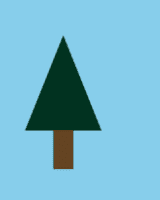
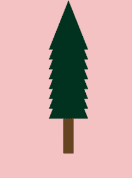

# 使用 Python 中的街机库绘制一棵树

> 原文:[https://www . geesforgeks . org/draw-a-tree-use-arcade-library-in-python/](https://www.geeksforgeeks.org/draw-a-tree-using-arcade-library-in-python/)

使用[海龟](https://www.geeksforgeeks.org/turtle-programming-python/)模块在 Python 中绘制一棵树并不是一件难事。但是，如果你也可以用街机模块画出来呢。街机是一个面向对象的库。它可以像任何其他 Python 包一样使用导入拱廊进行安装。

**进场:**

*   进口拱廊。
*   定义一个绘制树的函数。这里，我们正在画一棵由矩形和三角形组成的松树。所以，你可以使用内置的街机功能来矩形和三角形。

```
def draw_tree(x, y):

   # Draw the triangle on top of the trunk
   arcade.draw_triangle_filled(x + 40, y,
                               x, y - 100,
                               x + 80, y - 100,
                               arcade.color.DARK_GREEN)
   # Draw the trunk
   arcade.draw_lrtb_rectangle_filled(x + 30, x + 50, y - 100, y - 140,
                                     arcade.color.DARK_BROWN)
```

*   现在，既然我们已经将函数定义为 tree，那么让我们定义主函数，并在该函数下定义 arcade.open_window()来指定屏幕宽度、高度和标题。另外，使用 arcade.start_render()和 arcade.finish_render 来指示 arcade 模块何时开始和停止绘图。最后，添加 arcade.run()来指定结尾。

```
def main():
   # Open the window
   arcade.open_window(600, 600,"TREE")
   arcade.set_background_color(arcade.color.SKY_BLUE)

# Start the render process. 
   arcade.start_render()

 # Call our drawing functions.
   draw_tree(50, 250)

  # Finish the render.
   arcade.finish_render()

 # keep the window up .
   arcade.run()
   main()
```

**例 1:**

## 蟒蛇 3

```
import arcade

def draw_tree(x, y):

    # Draw the triangle on top of the trunk
    arcade.draw_triangle_filled(x + 40, y,
                                x, y - 100,
                                x + 80, y - 100,
                                arcade.color.DARK_GREEN)

    # Draw the trunk
    arcade.draw_lrtb_rectangle_filled(x + 30, x + 50, y - 100, y - 140,
                                      arcade.color.DARK_BROWN)

def main():

    # Open the window
    arcade.open_window(600, 600, "TREE")
    arcade.set_background_color(arcade.color.SKY_BLUE)

    # Start the render process.
    arcade.start_render()

    # Call our drawing functions.
    draw_tree(50, 250)

    # Finish the render.
    arcade.finish_render()

    # Keep the window up.
    arcade.run()

main()
```

**输出:**



**例 2:**

## 蟒蛇 3

```
#import module
import arcade

# specify spacing
Column_spacing = 20
Row_spacing = 20
Left_margin = 110
Bottom_margin = 400

# Open the window and set the background
arcade.open_window(700, 700, "BOX")

# set background color
arcade.set_background_color(arcade.color.BABY_PINK)

# Start the render process. This must be done before any drawing commands.
arcade.start_render()

# Loop for each row
for row in range(8):
    # Loop for each column
    for column in range(8):
        # Calculate our location
        x = column * Column_spacing + Left_margin
        y = row * Row_spacing + Bottom_margin

        # Draw the item
    arcade.draw_triangle_filled(x + 40, y,
                                x, y - 100,
                                x + 80, y - 100,
                                arcade.color.DARK_GREEN)

arcade.draw_lrtb_rectangle_filled(x + 30, x + 50, 300, 230,
                                      arcade.color.DARK_BROWN)

# Finish the render.
arcade.finish_render()

# Keep the window up until someone closes it.
arcade.run()

# This code is contributed by pulkitagarwal03pulkit
```

**输出:-**

