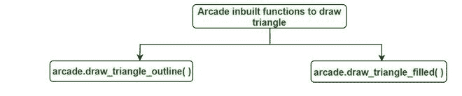
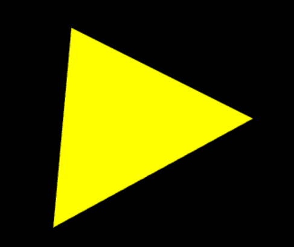

# 使用 Python 中的 Arcade 绘制三角形

> 原文:[https://www . geesforgeks . org/绘制三角形-使用 python 中的 arcade/](https://www.geeksforgeeks.org/draw-a-triangle-using-arcade-in-python/)

街机是一个 Python 库，用于开发二维游戏。街机需要 OpenGL 3.3+的支持。在街机中，基本的绘图不需要关于如何定义函数或类或如何循环的知识，简单地说，我们有用于绘制图元的内置函数。

用于绘制三角形的街机内置功能:



**1:****arcade . draw _ trainegle _ outline():**此功能用于绘制三角形的轮廓。

> **语法:**arcade . draw _ triangle _ outline(x1，y1，x2，y2，x3，y3，颜色，边框 _width)
> 
> **参数:**
> 
> *   **x1:** 第一个坐标的 x 值。
> *   **y1:** 第一个坐标的 y 值。
> *   **x2:** 第二坐标 x 值。
> *   **y2:** 第二坐标 y 值。
> *   **x3:** 第三坐标 x 值。
> *   **y3:** 第三坐标 y 值。
> *   **颜色:**三角形的轮廓颜色。
> *   **边框 _ 宽度:**边框的宽度，以像素为单位。默认为 1。

让我们看一个例子来更好地理解它的功能。

## 蟒蛇 3

```
#import module
import arcade

# Open the window. Set the window title and
# dimensions (width and height)
arcade.open_window(600, 600, "Draw  a triangle for GfG ")

# set background color
arcade.set_background_color(arcade.color.BLACK)

# Start the render process.
arcade.start_render()

# triangle function
arcade.draw_triangle_outline(300, 200,
                             80, 80,
                             100, 300,
                             arcade.color.YELLOW, 1)

# finished drawing
arcade.finish_render()

# display everything
arcade.run()
```

**输出:**


**2:****arcade . draw _ triangle _ filled():**此功能用于绘制一个用颜色填充的三角形。

> **语法:**arcade . draw _ triangle _ filled(x1，y1，x2，y2，x3，y3，color)
> 
> **参数:**
> 
> *   **x1:** 第一个坐标的 x 值。
> *   **y1:** 第一个坐标的 y 值。
> *   **x2:** 第二坐标 x 值。
> *   **y2:** 第二坐标 y 值。
> *   **x3:** 第三坐标 x 值。
> *   **y3:** 第三坐标 y 值。
> *   **颜色:**要用三角形填充的颜色。

**示例:**

## 蟒蛇 3

```
# import
import arcade

# Open the window. Set the window title and 
# dimensions (width and height)
arcade.open_window(600, 600, "Draw  a triangle for GfG ")

# set background color
arcade.set_background_color(arcade.color.BLACK)

# Start the render process.
arcade.start_render()

# draw triangle
arcade.draw_triangle_filled(300, 200,
                            80, 80,
                            100, 300,
                            arcade.color.YELLOW)

# finish drawing
arcade.finish_render()

# display everything
arcade.run()
```

**输出:**

