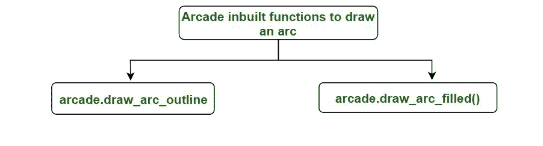
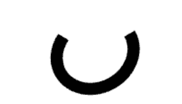

# 使用 Python 中的 Arcade 绘制弧线

> 原文:[https://www . geeksforgeeks . org/用 python 中的 arc 绘制弧线/](https://www.geeksforgeeks.org/draw-an-arc-using-arcade-in-python/)

[街机库](https://www.geeksforgeeks.org/arcade-library-in-python/)是一个高科技 Python 包，拥有一套先进的工具，可以制作具有扣人心弦的图形和声音的 2D 游戏。它是面向对象的，是专门为 Python 3.6 及以上版本构建的。

街机有两个绘制弧线的内置功能:



**1:arcade . draw _ arc _ outline():**此功能用于绘制弧线，对于绘制曲线很有用

> **语法:**arcade . draw _ arc _ outline(center _ x，center_y，宽度，高度，颜色，start_angle，end_angle，边框 _width，tilt_angle，num_segments)
> 
> **参数:**
> 
> *   **center_x :** x 弧中心的位置。
> *   **center_y :** 作为弧中心的 y 位置。
> *   **宽度**:圆弧的宽度。
> *   **高度:**弧的高度。
> *   **颜色**:弧线的轮廓颜色。
> *   **起始角度**:弧的起始角度，单位为度。
> *   **结束角度**:弧的结束角度，单位为度。
> *   **边框 _ 宽度**:以像素为单位的线条宽度。
> *   **tilt_angle** :弧线倾斜的角度。
> *   **num_segments :** 段数越高，质量越好。

让我们看看下面的例子

## 蟒蛇 3

```py
import arcade

# Open the window. Set the window title and
# dimensions (width and height)
arcade.open_window(600, 600, "Draw  an arc  for GfG ")

arcade.set_background_color(arcade.color.WHITE)

# Start the render process.
arcade.start_render()

arcade.draw_arc_outline(150, 81, 15, 36,
                        arcade.color.BLACK, 90, 360)

arcade.finish_render()

arcade.run()
```

**输出:**



**2:****arcade . draw _ arc _ filled():**此功能用于绘制填充有颜色的弧线，这对于绘制饼图或吃豆人很有用。

> **语法:**arcade . draw _ arc _ outline(center _ x，center_y，宽度，高度，颜色，开始 _ 角度，结束 _ 角度，倾斜 _ 角度，num_segments)
> 
> **参数:**
> 
> *   **center_x :** x 弧中心的位置。
> *   **中心 _y** :作为弧中心的 y 位置。
> *   **宽度**:圆弧的宽度。
> *   **高度:**弧的高度。
> *   **颜色**:弧内要填充的颜色。
> *   **起始角度**:弧的起始角度，单位为度。
> *   **结束角度**:弧的结束角度，单位为度。
> *   **tilt_angle :** 弧线倾斜的角度。
> *   **num_segments** :用于绘制圆弧的线段数。

让我们举个例子来清楚地了解这个功能。

## 蟒蛇 3

```py
# import arcade module
import arcade

# Open the window. Set the window title and
# dimensions (width and height)
arcade.open_window(600, 600, "Draw  an arc  for GfG ")

# set a background color
arcade.set_background_color(arcade.color.WHITE)

# Start the render process.
arcade.start_render()

# function for drawing arc
arcade.draw_arc_filled(150, 144, 85, 86,
                       arcade.color.BOTTLE_GREEN, 90, 360, 45, 54)

# finished drawing
arcade.finish_render()

# to display everything
arcade.run()
```

**输出:**

