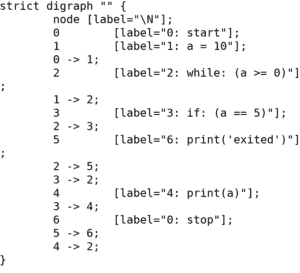

# 使用 pycfg | Python 绘制控制流图

> 原文:[https://www . geesforgeks . org/draw-control-flow-graph-use-py CFG-python/](https://www.geeksforgeeks.org/draw-control-flow-graph-using-pycfg-python/)

Prerequisites: [Control Flow Graph](https://www.geeksforgeeks.org/software-engineering-control-flow-graph-cfg/), [Cyclomatic Complexity](https://www.geeksforgeeks.org/cyclomatic-complexity/) 

通常，我们通过分析程序的控制流程，用笔和纸绘制手动*控制流程图*。CFG 帮助我们找到独立的路径([圈复杂度](https://www.geeksforgeeks.org/cyclomatic-complexity/)，这导致了测试程序所需的测试用例数量。我们可以使用名为 [pycfg](https://pypi.org/project/pycfg/) 的 Python 库来自动化 CFG 任务。该库以 Python 脚本为输入，以图形为输出。

我们可以通过以下两种方式使用 [pycfg](https://pypi.org/project/pycfg/)

1.  [直接使用文件](#first)
2.  [通过在程序中导入库](#second)

## 通过直接使用文件

1.  [下载 pycfg tar 文件](https://files.pythonhosted.org/packages/1b/56/e837ca7330163dd5834c0223adf8057513105081b0f7966bed305edac114/pycfg-0.1.tar.gz)
2.  拉开拉链
3.  使用`pycfg.py`文件

**注意:**解压后的 pycfg.py 文件位置为`pycfg-0.1/pycfg/pycfg.py`。

我们拿**white test . py**文件去拿 CFG。

```
a= 10
while(a <= 0):
    if a == 5:
        print(a)
    a += 1
print("exited")
```

在终端上运行以下命令。

```
python path_to/pycfg.py path_to/whiletest.py -d

```

**输出:**


这种方法以图的形式给出输出，图中有节点、标记的句子、节点间的边。

## 通过在程序中导入库

借助导入 linrary 和 [tkinter](https://www.geeksforgeeks.org/python-gui-tkinter/) ，我们可以比单独使用 **pycfg.py** 文件做得更好。

*   代表 CFG 而不是终端。
*   还可以找到圈复杂度

运行以下命令

```
sudo pip install pycfg

```

一旦完成，使用相同的**同时测试**进行测试。我们可以在**上运行下面的 python 程序，同时测试**。

```
 python /path_to/this_file.py /path_to/whiletest.py

```

以下是代码–

```
from pycfg.pycfg import PyCFG, CFGNode, slurp
import argparse
import tkinter as tk
from PIL import ImageTk, Image

if __name__ == '__main__':
    parser = argparse.ArgumentParser()

    parser.add_argument('pythonfile', help ='The python file to be analyzed')
    args = parser.parse_args()
    arcs = []

    cfg = PyCFG()
    cfg.gen_cfg(slurp(args.pythonfile).strip())
    g = CFGNode.to_graph(arcs)
    g.draw(args.pythonfile + '.png', prog ='dot')

    # Draw using tkinter.
    root = tk.Tk()
    root.title("Control Flow Graph")
    img1 = Image.open(str(args.pythonfile) + ".png")  # PIL solution
    img1 = img1.resize((800, 600), Image.ANTIALIAS)
    img = ImageTk.PhotoImage(img1)

    background ="gray"

    panel = tk.Label(root, height = 600, image = img)
    panel.pack(side = "top", fill ="both", expand = "yes")
    nodes = g.number_of_nodes()     # no. of nodes.
    edges = g.number_of_edges()     # no. of Edges.
    complexity = edges - nodes + 2         # Cyclomatic complexity

    frame = tk.Frame(root, bg = background)
    frame.pack(side ="bottom", fill ="both", expand = "yes")

    tk.Label(frame, text ="Nodes\t\t"+str(nodes), bg = background).pack()
    tk.Label(frame, text ="Edges\t\t"+str(edges), bg = background).pack()
    tk.Label(frame, text ="Cyclo Complexity\t"+
             str(complexity), bg = background).pack()

    root.mainloop()
```

**输出:**


**参考:**T2】https://pypi.org/project/pycfg/