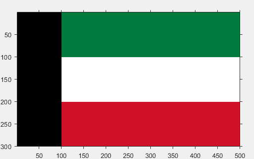
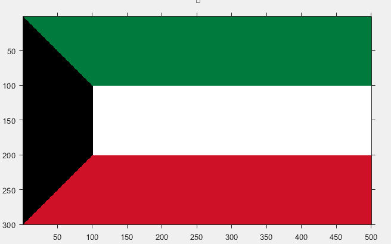

# 用 MATLAB 绘制科威特国旗

> 原文:[https://www . geesforgeks . org/draw-Kuwait-flag-use-MATLAB/](https://www.geeksforgeeks.org/draw-kuwait-flag-using-matlab/)

彩色图像可以表示为三阶矩阵。第一顺序用于行，第二顺序用于列，第三顺序用于指定相应像素的颜色。这里我们使用的是 RGB 颜色格式，所以第三阶将分别取红、绿、蓝三个值。行和列的值取决于图像的大小。

先决条件: [RGB 图像表示](https://www.geeksforgeeks.org/matlab-rgb-image-representation/)

**进场:**

*   制作一个尺寸为 300X500X3 的三阶零矩阵。300 表示行的像素数，500 表示列的像素数，3 表示 RGB 格式的颜色编码。图像从完全黑色开始，因为所有像素的颜色代码都是(0，0，0)。
*   将第 1 行到第 100 行之间以及第 101 列到第 500 列之间的水平条涂成绿色。科威特国旗上的绿色代码是(0，122，61)。
*   将第 101 行到第 200 行之间以及第 101 列到第 500 列之间的水平条涂成白色。白色的颜色代码是(255，255，255)。
*   将第 201 行到第 300 行之间以及第 101 列到第 500 列之间的水平条涂成红色。科威特国旗的红色代码是(206，17，38)
*   此时，我们有一个像这样的图像:
    
    现在我们必须画 2 个三角形。
*   对于上面的绿色三角形。在行从 1 到 100，列从 1 到 100 的矩阵中，将右上三角形涂成绿色。
*   对于下方的红色三角形。在行从 201 到 300，列从 1 到 100 的矩阵中，将右下三角形涂成红色。

下面是实现:

```py
% MATLAB code to draw Kuwait flag

% initialising a zero matrix of 300X500X3
I=uint8(zeros(300, 500, 3));

% green horizontal bar
I(1:100, 101:500, 1)=0;
I(1:100, 101:500, 2)=122;
I(1:100, 101:500, 3)=61;

% white horizontal bar
I(101:200, 101:500, :)=255;
%red bar
I(201:300, 101:500, 1)=206;
I(201:300, 101:500, 2)=17;
I(201:300, 101:500, 3)=38;

% green upper triangle
for i = 1:100
    for j=1:100
        if i<=j
            I(i, j, 1)=0;
            I(i, j, 2)=122;
            I(i, j, 3)=61;
        end
    end
end

% red lower triangle
for i = 201:300
    for j = 1:100
        if (i-200)+j>=101
            I(i, j, 1)=206;
            I(i, j, 2)=17;
            I(i, j, 3)=38;
        end
    end
end

% displaying the matrix as image
figure, imshow(I);
```

**输出:**

