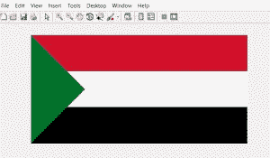

# 用 MATLAB 绘制苏丹国旗

> 原文:[https://www.geeksforgeeks.org/draw-sudan-flag-using-matlab/](https://www.geeksforgeeks.org/draw-sudan-flag-using-matlab/)

在数字图像处理中，彩色图像以三维矩阵表示。图像可以用各种颜色模型来表示，例如 RGB(红、绿、蓝)模型、HSV(色调、饱和度、值)模型、YQ(亮度-同相正交)模型、CMYK(青色、品红色、黄色、黑色)模型。通常，图像以 RGB 模型表示。矩阵的第一个通道是红色，第二个通道是绿色，第三个通道是蓝色。

**绘制苏丹国旗的方法:**

*   创建一个零矩阵 300X600X3.300 是行数，600 是列数，3 代表 RGB 颜色通道。用(255，255，255)填充矩阵。255 代表白色像素，0 代表黑色像素。

    ```py
    img(:, :, :)=255
    ```

*   从 1 到 100 的行之间和从 151:600 的列之间用深红色(210，16，42)填充矩阵。
*   在 200 到 300 的行之间和 151:600 的列之间用黑色(0，0，0)填充矩阵。
*   After these operations, our image looks like this

    

*   现在，我们要画一个上三角形和一个下三角形。
*   对于下三角形，从第 1 行到第 150 行，从第 1 列到第 150 列，用绿色填充矩阵(0，114，14)
*   类似地，对于上三角形，从第 150 行到第 300 行和第 1 列到第 150 列用绿色填充矩阵(0，114，14)

实现如下:

```py
% MATLAB code to draw Sudan flag

% initialising a zero matrix of 300X600X3
img=uint8(zeros(300, 600, 3));
img(:, :, :)=255;
%Red Color
img(1:100, 151:600, 1)=210;
img(1:100, 151:600, 2)=16;
img(1:100, 151:600, 3)=42;
%black Color 
img(200:300, 150:600, :)=0;
% Lower Triangle
for i=1:150
    for j=1:150
        if(j<i)
            img(i, j, 1)=0;
            img(i, j, 2)=114;
            img(i, j, 3)=41;
        elseif(i<=100)
            img(i, j, 1)=210;
            img(i, j, 2)=16;
            img(i, j, 3)=42;

        end
    end
end
% Upper Triangle
for i=150:300
    for j=1:150
        if(i+j<=300)
            img(i, j, 1)=0;
            img(i, j, 2)=114;
            img(i, j, 3)=41;

        elseif(i>=200)
            img(i, j, :)=0;            
        end
    end
end

% displaying the matrix as image
figure, imshow(img);
```

**输出:**

