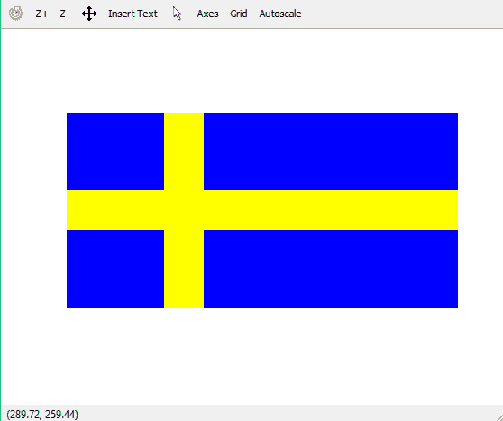

# 用 matlab 绘制瑞典国旗

> 原文:[https://www . geesforgeks . org/draw-Sweden-flag-use-MATLAB/](https://www.geeksforgeeks.org/draw-sweden-flag-using-matlab/)

彩色图像可以表示为三阶矩阵。第一顺序用于行，第二顺序用于列，第三顺序用于指定相应像素的颜色。这里我们使用的是 RGB 颜色格式，所以第三阶将分别取红、绿、蓝三个值。行和列的值取决于图像的大小。

先决条件: [RGB 图像表示](https://www.geeksforgeeks.org/matlab-rgb-image-representation/)

**进场:**

*   制作一个尺寸为 300X600X3 的三阶零矩阵。300 表示行的像素数，600 表示列的像素数，3 表示 RGB 格式的颜色编码。
*   用蓝色画出完整的图像。蓝色的 RGB 代码是(0，0，255)
*   制作黄色横条。黄色的 RGB 代码是(255，255，0)
*   制作垂直的黄色条。

下面是实现:

```py
% matlab code to draw Sweden flag

I = zeros(300, 600, 3);

%painting the whole image blue
I(:, :, 3) = 255; 

%yellow bar
I(120:180, :, 1:2) = 255; I(120:180, :, 3) = 0;

%yellow column
I(:, 150:210, 1:2) = 255;I(:, 150:210, 3) = 0; 

%print the matrix as image
imshow(I) 
```

**输出:**
