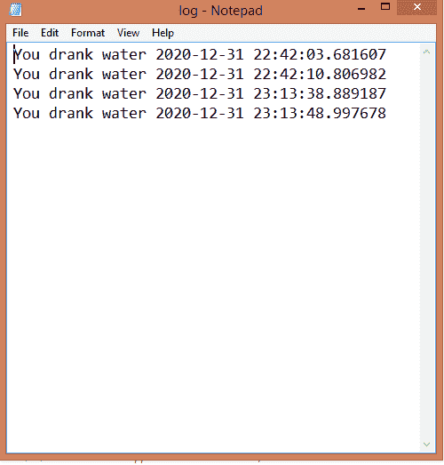

# Python 中的喝水通知系统

> 原文:[https://www . geesforgeks . org/饮用水-通知-python 中的系统/](https://www.geeksforgeeks.org/drink-water-notification-system-in-python/)

本文背后的想法是创建一个通知系统，提醒用户在固定的时间间隔后喝水。下面编码的程序首先要求用户输入通知的时间间隔。然后直到用户结束脚本，它会反复通知用户喝水。每隔一段时间，它会创建一个文本文件，其中包含用户喝水的日志。

### 使用的模块:

*   **时间:**管理间隔时间。
*   **win10Toast :** 发送快速通知。
*   **日期时间:**在日志中记录时间和日期。

### 方法

*   导入模块
*   从用户处获取时间间隔，它要求用户输入小时、分钟和秒
*   将它们转换为秒，并将时间返回到主功能。
*   添加循环以启动计时器，并在计时器到达设定时间时生成一条吐司消息
*   发送通知后程序会调用函数来写日志文件。该功能将获取当前时间和日期
*   创建一个. txt 文件，并在其中添加饮用水日志。

**程序:**

## 蟒蛇 3

```
import time
from win10toast import ToastNotifier
import datetime

def getTimeInput():
    hour = int(input("hours of interval :"))
    minutes = int(input("Mins of interval :"))
    seconds = int(input("Secs of interval :"))
    time_interval = seconds+(minutes*60)+(hour*3600)
    return time_interval

def log():
    now = datetime.datetime.now()
    start_time = now.strftime("%H:%M:%S")
    with open("log.txt", 'a') as f:
        f.write(f"You drank water {now} \n")
    return 0

def notify():
    notification = ToastNotifier()
    notification.show_toast("Time to drink water")
    log()
    return 0

def starttime(time_interval):
    while True:
        time.sleep(time_interval)
        notify()

if __name__ == '__main__':
    time_interval = getTimeInput()
    starttime(time_interval)
```

**输出:**

<video class="wp-video-shortcode" id="video-535886-1" width="640" height="360" preload="metadata" controls=""><source type="video/mp4" src="https://media.geeksforgeeks.org/wp-content/uploads/20201231233905/op.mp4?_=1">[https://media.geeksforgeeks.org/wp-content/uploads/20201231233905/op.mp4](https://media.geeksforgeeks.org/wp-content/uploads/20201231233905/op.mp4)</video>