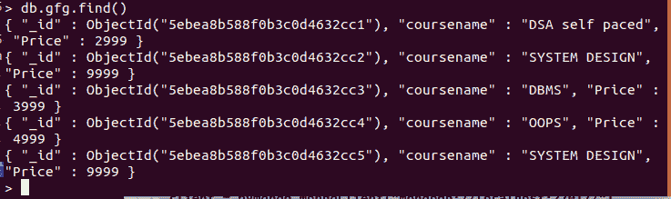
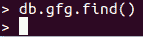

# 使用 Python 删除 MongoDB 中已经存在的集合

> 原文:[https://www . geesforgeks . org/drop-collection-if-exists-in-MongoDB-using-python/](https://www.geeksforgeeks.org/drop-collection-if-already-exists-in-mongodb-using-python/)

使用 **drop()** 方法，如果数据已经存在，我们可以丢弃收集数据。如果找不到数据，则返回假，否则如果放弃收集，则返回真。

**语法:**

```
drop()

```

**例 1:**

**样本数据库:**



## 蟒蛇 3

```
import pymongo

client = pymongo.MongoClient("mongodb://localhost:27017/")

# Database name
db = client["mydatabase"]

# Collection name
col = db["gfg"]

# drop collection col1
print(col.drop())
```

**输出:**



**例 2:** 如果集合不存在。

## 蟒蛇 3

```
import pymongo

client = pymongo.MongoClient("mongodb://localhost:27017/")

# Database name
db = client["mydatabase"]

# Collection name
col = db["gfg"]

# drop collection col1
if col.drop():
    print('Deleted')
else:
    print('Not Present')
```

**输出**:

```
Not Present
```