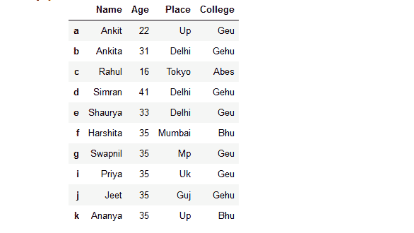
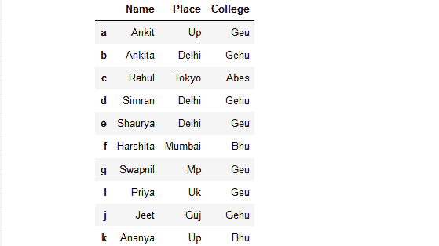
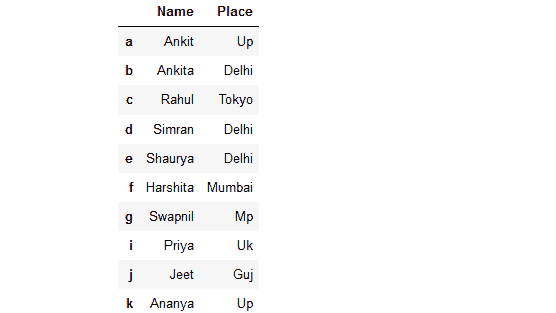
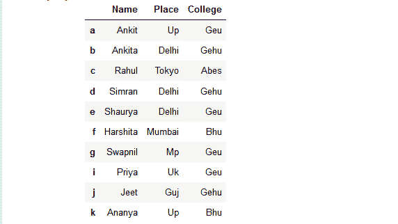

# 通过标签名称或索引位置删除数据框中的列

> 原文:[https://www . geesforgeks . org/drop-columns-in-data frame-by-label-name-or-by-index-positions/](https://www.geeksforgeeks.org/drop-columns-in-dataframe-by-label-names-or-by-index-positions/)

在本文中，我们将讨论如何通过标签名称或索引位置来删除熊猫数据框中的列。从数据框中删除列可以通过多种方式实现。

让我们用一个列表字典创建一个简单的数据框，比如列名是:“姓名”、“年龄”、“地点”、“学院”。

```
# import pandas library as pd
import pandas as pd

# List of Tuples
students = [('Ankit', 22, 'Up', 'Geu'),
           ('Ankita', 31, 'Delhi', 'Gehu'),
           ('Rahul', 16, 'Tokyo', 'Abes'),
           ('Simran', 41, 'Delhi', 'Gehu'),
           ('Shaurya', 33, 'Delhi', 'Geu'),
           ('Harshita', 35, 'Mumbai', 'Bhu' ),
           ('Swapnil', 35, 'Mp', 'Geu'),
           ('Priya', 35, 'Uk', 'Geu'),
           ('Jeet', 35, 'Guj', 'Gehu'),
           ('Ananya', 35, 'Up', 'Bhu')
            ]

# Create a DataFrame object from
# list of tuples with columns
# and indices.
details = pd.DataFrame(students,
                       columns =['Name', 'Age', 
                                 'Place', 'College'],
                        index =['a', 'b', 'c', 'd', 'e', 
                                'f', 'g', 'i', 'j', 'k'])
# show the dataframe
details
```

**输出:**


**方法 1:使用`dataframe.drop()` 方法从数据框中删除列。**
**例 1:** 去掉具体的单提列。

```
# import pandas library as pd
import pandas as pd

# List of Tuples
students = [('Ankit', 22, 'Up', 'Geu'),
           ('Ankita', 31, 'Delhi', 'Gehu'),
           ('Rahul', 16, 'Tokyo', 'Abes'),
           ('Simran', 41, 'Delhi', 'Gehu'),
           ('Shaurya', 33, 'Delhi', 'Geu'),
           ('Harshita', 35, 'Mumbai', 'Bhu' ),
           ('Swapnil', 35, 'Mp', 'Geu'),
           ('Priya', 35, 'Uk', 'Geu'),
           ('Jeet', 35, 'Guj', 'Gehu'),
           ('Ananya', 35, 'Up', 'Bhu')
            ]

# Create a DataFrame object from
# list of tuples with columns
# and indices.
details = pd.DataFrame(students, 
                       columns =['Name', 'Age',
                                 'Place', 'College'],
                       index =['a', 'b', 'c', 'd', 'e',
                               'f', 'g', 'i', 'j', 'k'])

# Remove column name 'Age' 
rslt_df = details.drop(['Age'],
                       axis = 1)
# show the dataframe
rslt_df
```

**输出:**


**示例 2 :** 删除特定的多个提及栏。

```
# import pandas library as pd
import pandas as pd

# List of Tuples
students = [('Ankit', 22, 'Up', 'Geu'),
           ('Ankita', 31, 'Delhi', 'Gehu'),
           ('Rahul', 16, 'Tokyo', 'Abes'),
           ('Simran', 41, 'Delhi', 'Gehu'),
           ('Shaurya', 33, 'Delhi', 'Geu'),
           ('Harshita', 35, 'Mumbai', 'Bhu' ),
           ('Swapnil', 35, 'Mp', 'Geu'),
           ('Priya', 35, 'Uk', 'Geu'),
           ('Jeet', 35, 'Guj', 'Gehu'),
           ('Ananya', 35, 'Up', 'Bhu')
            ]

# Create a DataFrame object from
# list of tuples with columns
# and indices.
details = pd.DataFrame(students, 
                       columns =['Name', 'Age', 
                                 'Place', 'College'],
                       index =['a', 'b', 'c', 'd', 'e',
                               'f', 'g', 'i', 'j', 'k'])

# Remove two columns name is 'Age' and 
# 'College' 
rslt_df = details.drop(['Age', 'College'],
                       axis = 1)
# show the dataframe
rslt_df
```

**输出:**


**示例 3:** 根据列索引删除列。

```
# import pandas library as pd
import pandas as pd

# List of Tuples
students = [('Ankit', 22, 'Up', 'Geu'),
           ('Ankita', 31, 'Delhi', 'Gehu'),
           ('Rahul', 16, 'Tokyo', 'Abes'),
           ('Simran', 41, 'Delhi', 'Gehu'),
           ('Shaurya', 33, 'Delhi', 'Geu'),
           ('Harshita', 35, 'Mumbai', 'Bhu' ),
           ('Swapnil', 35, 'Mp', 'Geu'),
           ('Priya', 35, 'Uk', 'Geu'),
           ('Jeet', 35, 'Guj', 'Gehu'),
           ('Ananya', 35, 'Up', 'Bhu')
            ]

# Create a DataFrame object from
# list of tuples with columns
# and indices.
details = pd.DataFrame(students,
                       columns =['Name', 'Age', 
                                 'Place', 'College'],
                       index =['a', 'b', 'c', 'd', 'e',
                               'f', 'g', 'i', 'j', 'k'])

# Remove three columns as index base
# 0, 1, 2
rslt_df = details.drop(details.columns[[0, 1, 2]],
                       axis = 1)

# show the dataframe
rslt_df
```

**输出:**


**方法 2:使用`iloc[]`和`drop()`方法从数据框中删除列。**

**示例:**删除特定列与另一列之间的所有列(排除)

```
# import pandas library as pd
import pandas as pd

# List of Tuples
students = [('Ankit', 22, 'Up', 'Geu'),
           ('Ankita', 31, 'Delhi', 'Gehu'),
           ('Rahul', 16, 'Tokyo', 'Abes'),
           ('Simran', 41, 'Delhi', 'Gehu'),
           ('Shaurya', 33, 'Delhi', 'Geu'),
           ('Harshita', 35, 'Mumbai', 'Bhu' ),
           ('Swapnil', 35, 'Mp', 'Geu'),
           ('Priya', 35, 'Uk', 'Geu'),
           ('Jeet', 35, 'Guj', 'Gehu'),
           ('Ananya', 35, 'Up', 'Bhu')
            ]

# Create a DataFrame object from
# list of tuples with columns
# and indices.
details = pd.DataFrame(students, 
                       columns =['Name', 'Age', 
                                 'Place', 'College'],
                       index =['a', 'b', 'c', 'd', 'e', 
                               'f', 'g', 'i', 'j', 'k'])

# Remove all columns from column
# index 1 to 3(exclude) 
rslt_df = details.drop(details.iloc[:, 1:3],
                       axis = 1)

# show the dataframe
rslt_df
```

**输出:**


**方法 3:使用`loc[]`和`drop()`方法从数据框中删除列。**
**示例:**删除一个特定列名到另一个列名之间的所有列。

```
# import pandas library as pd
import pandas as pd

# List of Tuples
students = [('Ankit', 22, 'Up', 'Geu'),
           ('Ankita', 31, 'Delhi', 'Gehu'),
           ('Rahul', 16, 'Tokyo', 'Abes'),
           ('Simran', 41, 'Delhi', 'Gehu'),
           ('Shaurya', 33, 'Delhi', 'Geu'),
           ('Harshita', 35, 'Mumbai', 'Bhu' ),
           ('Swapnil', 35, 'Mp', 'Geu'),
           ('Priya', 35, 'Uk', 'Geu'),
           ('Jeet', 35, 'Guj', 'Gehu'),
           ('Ananya', 35, 'Up', 'Bhu')
            ]

# Create a DataFrame object from
# list of tuples with columns
# and indices.
details = pd.DataFrame(students, 
                       columns =['Name', 'Age', 
                                 'Place', 'College'],
                       index =['a', 'b', 'c', 'd', 'e', 
                               'f', 'g', 'i', 'j', 'k'])

# Remove all columns from column name 
# 'Name' to 'College' 
rslt_df = details.drop(details.loc[:, 'Name':'College'].columns,
                       axis = 1)

# show the dataframe
# only indexes print
rslt_df
```

**输出:**


**注:**不同`loc()`和`iloc()`是 iloc()排除最后一列范围元素。

**方法 4:通过迭代方式从数据帧中删除列。**
**例:**去掉特定的列。

```
# import pandas library as pd
import pandas as pd

# List of Tuples
students = [('Ankit', 22, 'Up', 'Geu'),
           ('Ankita', 31, 'Delhi', 'Gehu'),
           ('Rahul', 16, 'Tokyo', 'Abes'),
           ('Simran', 41, 'Delhi', 'Gehu'),
           ('Shaurya', 33, 'Delhi', 'Geu'),
           ('Harshita', 35, 'Mumbai', 'Bhu' ),
           ('Swapnil', 35, 'Mp', 'Geu'),
           ('Priya', 35, 'Uk', 'Geu'),
           ('Jeet', 35, 'Guj', 'Gehu'),
           ('Ananya', 35, 'Up', 'Bhu')
            ]

# Create a DataFrame object from
# list of tuples with columns
# and indices.
details = pd.DataFrame(students, 
                       columns =['Name', 'Age', 
                                 'Place', 'College'],
                       index =['a', 'b', 'c', 'd', 'e',
                               'f', 'g', 'i', 'j', 'k'])

# loop throughout all the columns
for column in details.columns :
    if column == 'Age' :

        # delete the column
        del details[column]

# show the dataframe
details
```

**输出:**
