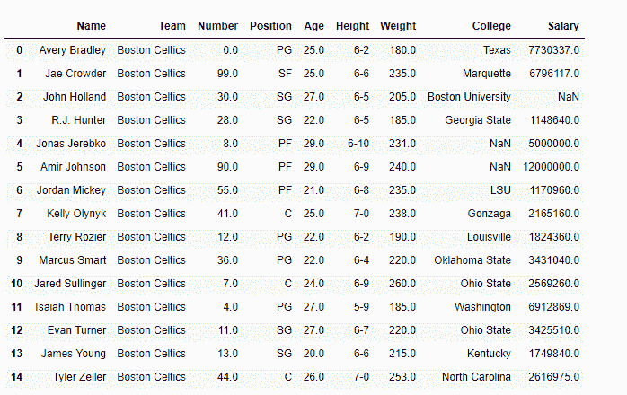
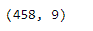
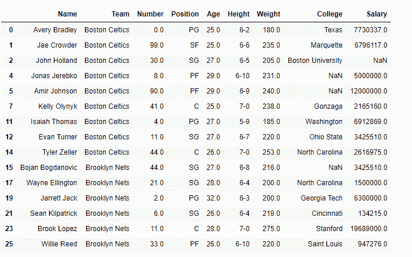
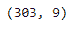

# 根据列上应用的特定条件从数据框中删除行

> 原文:[https://www . geesforgeks . org/drop-row-from-data frame-基于特定条件-应用于列/](https://www.geeksforgeeks.org/drop-rows-from-the-dataframe-based-on-certain-condition-applied-on-a-column/)

Pandas 提供了丰富的函数集合来执行 Python 中的数据分析。在执行数据分析时，我们经常需要过滤数据以删除不必要的行或列。

我们之前已经讨论过[如何根据行或列的标签](https://www.geeksforgeeks.org/python-delete-rows-columns-from-dataframe-using-pandas-drop/)删除行或列。然而，在这篇文章中，我们将讨论几种方法，如何根据应用于列的特定条件从数据框中删除行。保留给定列上的应用条件评估为`True`的所有行。

要下载代码中使用的 CSV，点击这里的。

您将获得“nba.csv”数据集。从数据集中删除所有年龄在 25 岁以下的玩家。

**解决方案#1 :** 我们将使用矢量化从数据集中过滤出满足应用条件的行。

```
# importing pandas as pd
import pandas as pd

# Read the csv file and construct the 
# dataframe
df = pd.read_csv('nba.csv')

# Visualize the dataframe
print(df.head(15)

# Print the shape of the dataframe
print(df.shape)
```

**输出:**



在这个数据框中，目前我们有 458 行 9 列。让我们使用矢量化操作来过滤掉所有满足给定条件的行。

```
# Filter all rows for which the player's
# age is greater than or equal to 25
df_filtered = df[df['Age'] >= 25]

# Print the new dataframe
print(df_filtered.head(15)

# Print the shape of the dataframe
print(df_filtered.shape)
```

**输出:**


在输出中我们可以看到，返回的数据帧只包含那些年龄大于等于 25 岁的玩家。

**解决方案#2 :** 我们可以使用`DataFrame.drop()`函数删除不满足给定条件的行。

```
# importing pandas as pd
import pandas as pd

# Read the csv file and construct the 
# dataframe
df = pd.read_csv('nba.csv')

# First filter out those rows which
# does not contain any data
df = df.dropna(how = 'all')

# Filter all rows for which the player's
# age is greater than or equal to 25
df.drop(df[df['Age'] < 25].index, inplace = True)

# Print the modified dataframe
print(df.head(15))

# Print the shape of the dataframe
print(df.shape)
```

**输出:**


正如我们在输出中看到的，我们已经成功丢弃了所有不满足应用于“年龄”列的给定条件的行。